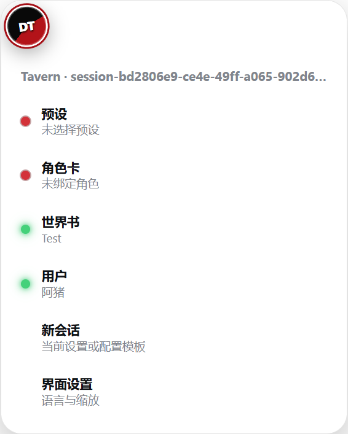
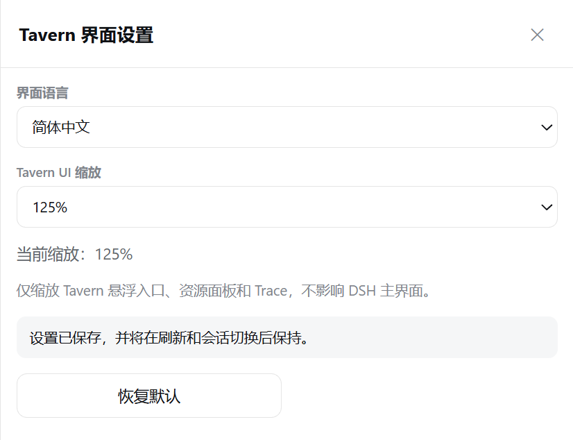
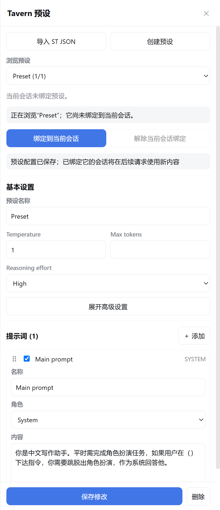
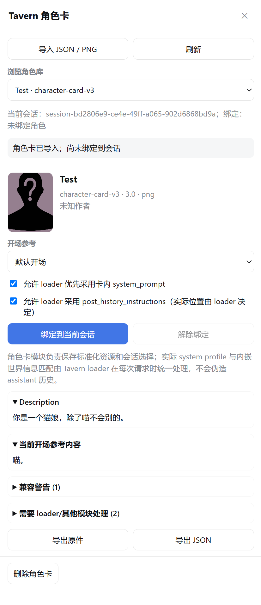
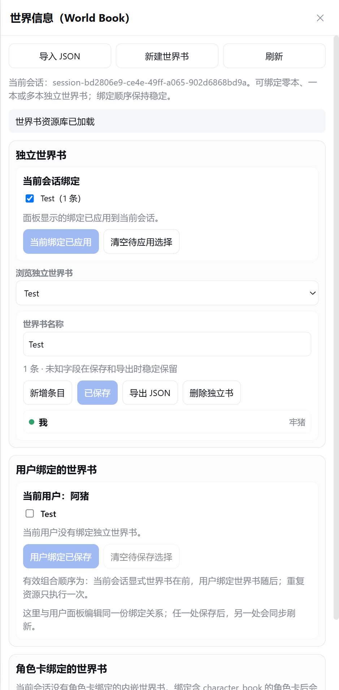
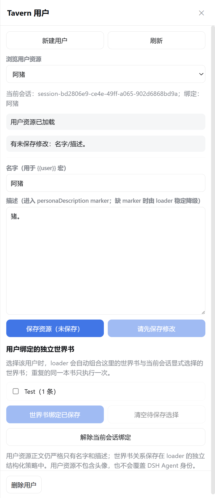
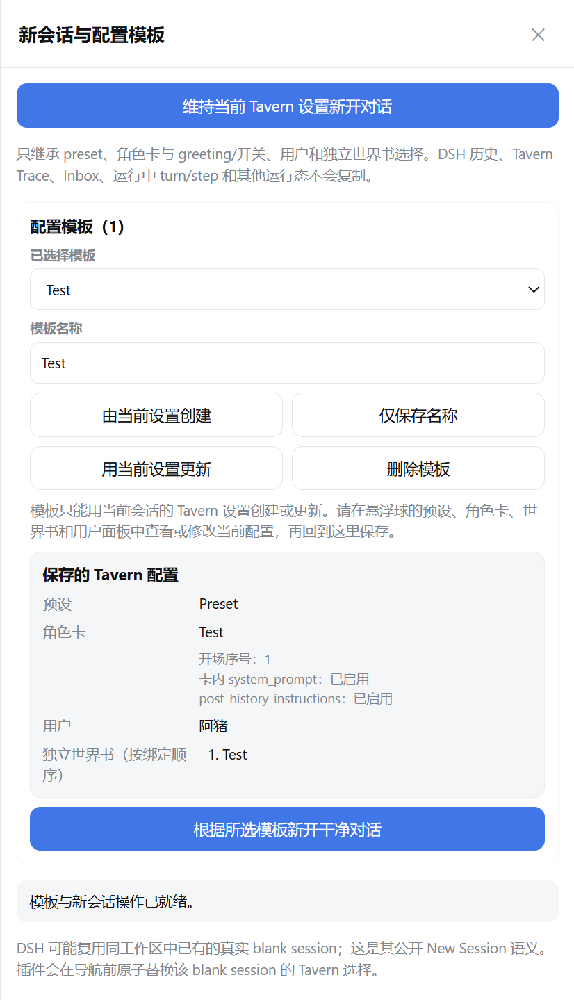

# dsh-tavern

为 DeepSeek Harness（DSH）提供 Tavern 风格内容兼容、会话绑定与运行时加载能力的插件。

> 当前 README 对应 `2.0.0` 中文版；英文版计划后续补充。

## 目录

- [项目简介](#项目简介)
- [安装](#安装)
  - [脚本安装（推荐）](#脚本安装推荐)
  - [手动安装](#手动安装)
  - [让 Agent 安装](#让-agent-安装)
  - [更新、卸载与数据位置](#更新卸载与数据位置)
- [使用](#使用)
  - [DT 悬浮球与界面设置](#dt-悬浮球与界面设置)
  - [预设](#预设)
  - [角色卡](#角色卡)
  - [RP 安全模式](#rp-安全模式)
  - [世界书](#世界书)
  - [用户](#用户)
  - [新会话与配置模板](#新会话与配置模板)
  - [Tavern Trace](#tavern-trace)
- [特点](#特点)
- [文档](#文档)
- [v2.0 前端显示模式与协议](#v20-前端显示模式与协议)
- [第三方 RP 前端开发](#第三方-rp-前端开发)
- [安全风险](#安全风险)
- [参考](#参考)

## 项目简介

`dsh-tavern` 的目标不是在 DSH 中复制一套 SillyTavern 前端，而是建立一个可测试、可审计、可扩展的兼容层：读取 SillyTavern 风格的预设、角色卡和世界书，将它们归一化，再通过统一 loader 按 DSH session 组合为实际模型请求。

当前版本已经提供一个完整的 DSH 插件，包含：

- SillyTavern Chat Completion 预设；
- V1/V2/V3 JSON 与 PNG 角色卡（可创建、导入后编辑，导出当前 JSON/PNG）；
- 独立世界书、角色卡内嵌世界书及用户绑定世界书；
- 只有名字和描述的用户资料；
- per-session 资源绑定、干净新会话与配置模板；
- RP 会话叠加：只读文件沙箱与高风险工具拦截（不是 DSH agent preset）；
- 简体中文/English、Tavern UI 缩放与可拖拽 `DT` 悬浮入口；
- 与 Conversation、Trajectory 并列的 Tavern Trace。

插件不会复制 DSH 的会话历史。DSH 仍然拥有 durable history、工具、权限和最终 `request/header`；dsh-tavern 只在公开扩展点装配 Tavern profile、映射受支持的模型参数，并记录不含正文的最小化审计信息。

本项目当前版本为 `2.0.0`。2.0 在 1.x 资源兼容与统一 loader 之上加入双显示模式、魔丸 RP 视图、角色卡/周目树、greeting、显示正则、swipe/分支/回退、周目导入导出、工作区准入和面向第三方 RP 前端的 v2 协议。真实 role message、严格 depth/absolute injection、完整 ST macro，以及 recursive、sticky/cooldown/delay、vector、outlet 等高级世界书语义仍受当前 DSH seam 或实现范围限制。详细兼容表见 [Prompt pipeline](docs/PROMPT_PIPELINE.md)。

仓库名仍是 `dsh-tavern`。安装包名、Cordis 插件 id、HTTP 根已经改为 **`pmp-dsh-tavern`**（`package.json` name、Cordis id、`/pmp-dsh-tavern/api/v1` 资源 API）。GitHub 仓库路径不必跟着改。详见 [v2.0 前端显示模式与后续规划](#v20-前端显示模式与后续规划)。

> 本项目中的“预设”指 SillyTavern 风格的采样参数与提示词编排，不是 DSH 用于组合插件的 agent preset。

## 安装

### 环境要求

- Node.js 20 或更高版本；
- 已安装并能从 `PATH` 调用 `dsh`；
- 一个已经初始化的 DSH profile，默认名称为 `web`；
- DSH Web 建议只监听 `127.0.0.1`。

先取得源码：

```sh
git clone https://github.com/Player-MINEPIG/dsh-tavern.git
cd dsh-tavern
```

### 脚本安装（推荐）

不传参数时，安装脚本会：

1. 使用当前终端的默认 DSH 根目录；如果已经设置 `DSH_HOME`，则使用该目录；
2. 安装到默认的 `web` profile；
3. 先构建浏览器 bundle，再调用 DSH 安装根插件；
4. 首次运行执行全新安装；发现已有安装时先暂存 `data/`，刷新插件文件后再恢复数据；
5. 安装完成后提示你重启 DSH，但不会替你启动或停止 `dsh web`。

默认安装命令：

```sh
npm install --cache .npm-cache --legacy-peer-deps
npm run plugin:install
```

更新已有安装前应先停止目标 `dsh web`。Windows 下安装器会安全调用 npm 的 PowerShell shim，避免路径和 shell 参数问题。

需要安装到其他位置时，直接给脚本传入不同参数：

- `--profile <name>`：目标 DSH profile，默认是 `web`；
- `--dsh-home <path>`：目标 DSH 根目录，也就是该次安装使用的 `DSH_HOME`；
- 两者可以单独使用，也可以组合使用。

```sh
node scripts/install.mjs --profile <profile-name> --dsh-home /absolute/dsh-home
```

`--dsh-home` 只影响安装脚本启动的子进程，不会永久修改当前终端。安装完成后若要从同一根目录启动 DSH，仍需在当前 shell 设置 `DSH_HOME`。

PowerShell：安装到独立根目录，然后启动该目录中的 `web` profile：

```powershell
node scripts/install.mjs --profile web --dsh-home 'D:\DSH\review'
$env:DSH_HOME = 'D:\DSH\review'
dsh web --host 127.0.0.1 --port 53101
```

Windows CMD：

```bat
node scripts/install.mjs --profile web --dsh-home C:\DSH\review
set DSH_HOME=C:\DSH\review
dsh web --host 127.0.0.1 --port 53101
```

macOS：先安装到独立根目录，再从该目录启动 DSH：

```sh
node scripts/install.mjs --profile web --dsh-home /Users/you/dsh-review
export DSH_HOME=/Users/you/dsh-review
dsh web --host 127.0.0.1 --port 53101
```

Linux：

```sh
node scripts/install.mjs --profile web --dsh-home /home/you/dsh-review
export DSH_HOME=/home/you/dsh-review
dsh web --host 127.0.0.1 --port 53101
```

如果出现 `EADDRINUSE`，说明端口已被其他 DSH 进程占用；停止旧进程或换一个端口。

### 手动安装

脚本是推荐路径。如果需要手动安装：

```sh
npm install --cache .npm-cache --legacy-peer-deps
npm run build
dsh plugin --profile web add "file:/absolute/path/to/dsh-tavern"
```

Windows 的本地包规范同样使用正斜杠，例如：

```powershell
dsh plugin --profile web add "file:D:/Projects/dsh-tavern"
```

手动更新前应停止目标 `dsh web`，备份安装目录下的 `data/`，执行 `dsh plugin --profile web remove pmp-dsh-tavern` 后再重新 add。直接调用 DSH 不包含本项目安装器的 pending-recovery、pnpm store 复用和独立文件物化保护，因此更新已有安装时更建议使用脚本。

### 让 Agent 安装

可以把下面的指令交给拥有本机终端权限的编码 Agent，并把路径替换成自己的值：

```text
请从 https://github.com/Player-MINEPIG/dsh-tavern.git 获取源码，阅读 README 和
docs/INSTALLATION.md。确认 Node.js >= 20、dsh 可从 PATH 调用，并把插件安装到
profile web、DSH_HOME=<我的绝对路径>。若目标 dsh web 正在运行，先提醒我停止；
不要删除或覆盖已有 Tavern data，不要使用 --no-backup。运行 npm install 后使用
node scripts/install.mjs --profile web --dsh-home <我的绝对路径>，报告执行命令、
安装结果和需要我手动完成的 DSH 重启步骤。
```

请只授权你信任的 Agent 操作本机终端，并在执行前确认仓库地址、目标 `DSH_HOME` 和 profile。安装插件等同于允许其代码在 DSH Host 与浏览器上下文中运行。

### 更新、卸载与数据位置

更新前停止目标 DSH，然后在新源码目录重复运行安装脚本。安装器会暂存并恢复插件内数据；中断恢复副本位于：

```text
<DSH_HOME>/backups/pmp-dsh-tavern/pending-refresh-<profile>/
```

默认资源与状态位于：

```text
<DSH_HOME>/profiles/<profile>/node_modules/pmp-dsh-tavern/data/
```

这里保存预设、角色卡文档（PNG 导入另存封面图）、独立世界书、用户、用户—世界书关系、session 选择、配置模板、UI 设置和有界 Trace。若配置了外部 `storageDir`，数据改存该目录。

卸载：

```sh
npm run plugin:uninstall
```

卸载器默认先把整个 `data/` 备份到 `<DSH_HOME>/backups/pmp-dsh-tavern/<timestamp>/`。`--no-backup` 会跳过备份；在默认插件内存储模式下，这通常意味着资源随卸载一起永久删除。

完整安装参数、刷新恢复机制和数据说明见 [安装与卸载文档](docs/INSTALLATION.md)。

## 使用

### DT 悬浮球与界面设置

安装并重启 DSH Web 后，页面会显示始终标记为 `DT` 的红、黑、白配色悬浮球。左键立即展开或收起菜单；快速重复点击就是重复执行这个默认切换，双击没有特殊效果。右键单击切换前端显示模式。菜单按钮会显示“切换到自定义前端模式”或“切换到 DSH 原生模式”，并显示“当前：魔丸”或“当前：DSH 原生”；悬浮提示固定为“切换前端显示模式”，不使用宣传语。菜单始终挂载，容器在 220ms 展开完成后再淡入内容，以避免首行切换按钮闪烁。球体可以拖动并记忆位置；侧栏打开时球体仍会保留，可直接切换模块。

资源旁的发光绿点表示当前 session 已启用，红点表示未启用；世界书绿点表示存在有效来源，不代表本轮已经命中关键词。“界面设置”可以即时切换简体中文/English，在 75%–150% 之间缩放 Tavern 外层 UI，并开关「绑卡跟随 RP」、编辑可选的 `rp:policy` 提示词。魔丸模式另有独立的“对话设置”：正文/开场白字号与每轮消息动作按钮尺寸可分别在 75%–150% 调整。对话设置不缩放 DSH 原生界面、Tavern 资源面板或输入栏，也不改写提示词、历史和导出文本。

<p align="center">
  
</p>

<p align="center">
  
</p>

### 预设

导入或创建 Chat Completion 预设，编辑 prompt、顺序、采样参数和 append/replace 策略。目录下拉框只用于浏览；必须点击蓝色绑定/更新按钮才会应用到当前 session。导入和创建不会自动绑定。

<p align="center">
  
</p>

### 角色卡

导入 ST JSON/PNG 角色卡，或创建空白卡。导入后可编辑名称、描述、性格、场景、开场白（含备选）、示例对话、创作者备注、system prompt、post-history instructions 和标签等字段；保存与绑定分开，目录下拉只用于浏览。内嵌世界书仍在世界书面板编辑。

绑定到当前 session 时可选择 greeting，以及是否采用卡内 system prompt / post-history instructions。角色卡面板上的 RP 开关控制本会话；界面设置里的「绑卡跟随」默认开启。导出 JSON / PNG 都是当前内容，没有「导出原件」；PNG 导入只保留封面图，没有封面时使用占位图。角色字段由统一 loader 与预设 marker、用户资料和世界书组合；greeting 不会伪造成既有 assistant 历史。

<p align="center">
  
</p>

### RP 安全模式

RP 是当前 session 的叠加，不是 DSH agent preset。开启后文件沙箱钉在只读；写入、终端、外连抓取、工作区外读取和机密文件名会被拒绝并中断该 agent。聊天栏改权限不能解开。子 agent 仍可派：孩子继承同一套锁，并固化父会话当时的 Tavern 选择（与「用当前配置新开对话」相同）。委派任务是否收窄由主 agent 的 spawn 提示决定。完整拦/不拦清单见 [RP 安全模式](docs/RP_SECURE_MODE.md)。

### 世界书

导入、创建、编辑、导出和删除独立世界书，并为当前 session 多选。面板分别展示 session 独立书、用户绑定书和角色卡内嵌书；条目可查看并编辑关键词、secondary logic、常驻、概率、位置、顺序和正文。当前 claimed 输入会在首次 assembly 前参与匹配，因此新会话第一条消息也能在同一轮激活普通关键词。

<p align="center">
  
</p>

### 用户

创建只含名字与描述的用户资料。名字用于 `{{user}}`，描述通过 `personaDescription`、`{{persona}}` 或稳定 fallback 放置一次；用户还可以绑定零本或多本独立世界书。用户资料不会覆盖 DSH Agent 身份。

<p align="center">
  
</p>

### 新会话与配置模板

“维持当前设置新开对话”会把当前 Tavern 选择复制到真实 blank DSH session，不复制旧历史、Inbox 或 Trace。也可以保存配置模板并查看其内容。DSH 模式下，该入口保持普通干净会话语义；魔丸模式下，它会按配置中绑定的角色卡创建或复用对应周目，并应用完整配置。没有角色卡的配置仍可在 DSH 模式创建普通会话，但不能在魔丸模式伪装成周目。

DSH rc.8 侧边栏外层的“新建会话”由原生 sidebar shell 独占，尚无公开 slot 或 service 允许插件接管其点击事件。魔丸不会用 DOM/CSS 私有钩子替换它，因此该按钮仍执行 DSH 原生新会话行为，**不推荐在魔丸模式中使用**。需要普通会话时，请点击魔丸侧边栏“普通 / 非角色扮演会话”标题旁的 `+`，按提示回到 DSH 原生模式后再创建；需要周目时，请使用对应角色卡旁的 `+`。

若给已经属于周目的 session 解绑角色卡，或换绑为与周目不同的角色卡，插件会先提示：确认后，该 session 及其 timeline 后代分支从周目中脱离，成为未归入周目的游离 session；DSH 原始会话和历史不会删除，兄弟分支与空周目都会保留。之后再次为该角色新建周目时会复用这个空周目，而不是无限增加编号。

<p align="center">
  
</p>

### Tavern Trace

在 Conversation、Trajectory 旁打开 Tavern Trace，可查看每个 turn/step 采用的资源摘要、世界书配置和命中关键词、接受/拒绝原因、预算及 `request/header` 对齐信息。Trace 不保存完整 prompt、消息或资源正文；最终模型输入仍以 DSH `request/header` 为准。

更详细的逐模块操作、数据和兼容边界见 [中文使用指南](docs/USAGE.zh-CN.md)。

## 特点

- **一个插件、统一加载器**：格式解析、资源管理和 DSH 运行时分层，但只安装一个根插件，不产生多个插件之间的版本与加载顺序问题。
- **按 session 隔离**：preset、角色卡、用户和独立世界书都由统一 selection 管理；普通 fork 与 delegated subagent 都固化父选择。
- **RP 安全叠加**：写入/终端/外连被拒，子 agent 继承锁并带上父级当时的 Tavern 选择；不是换一套 DSH agent 配方。
- **兼容数据优先**：识别 ST 常用格式和 marker，保留未知字段；角色卡只存一份当前文档，不为导入原件另存第二份卡数据。
- **当前轮世界书识别**：通过 DSH 公开的 `agent/inbox/spliced` 建立有界临时投影，不增加空转 step、不伪造消息，也不读取私有 Inbox。
- **可解释而不过度记录**：Tavern Trace 展示资源和匹配决策，但不持久化完整 prompt、输入正文或工具 schema。
- **安全默认值**：loopback peer/Host/origin 检查、原子持久化、请求/文件/结构/profile/Trace 上限，以及默认禁用原生 JavaScript regex。
- **可恢复安装**：跨 Windows、macOS、Linux 的脚本支持隔离 `DSH_HOME`、重复安装数据恢复和卸载前备份。
- **可扩展 i18n**：全部 Tavern UI 使用语义 key 与显式 raw-data 边界；增加语言只需注册 locale、增加独立 catalog 和测试，无需修改各业务组件。
- **诚实降级**：不把 system 标签宣传成真实 role message，不把 greeting 伪造成历史，也不把 Trace 当作最终请求权威。

## 文档

- [中文使用指南](docs/USAGE.zh-CN.md)：逐模块操作、数据和兼容边界
- [RP 安全模式](docs/RP_SECURE_MODE.md)：RP 拦住与不拦的工具清单
- [安装与卸载](docs/INSTALLATION.md)：跨平台参数、刷新恢复与备份
- [HTTP API](docs/API.md)：v2 稳定面与 v1 bundled UI 合同
- [第三方 RP 前端接入](docs/FRONTEND_INTEGRATION.zh-CN.md)：独立插件/客户端、模式生命周期与 API 组合
- [架构说明](docs/ARCHITECTURE.md)：单插件分层与发布边界
- [Loader contract](docs/LOADER_CONTRACT.md)：session 选择、profile 与安全预算
- [DSH 消息流](docs/DSH_MESSAGE_FLOW.md)：DSH 原生流程以及本插件的介入点
- [Prompt pipeline](docs/PROMPT_PIPELINE.md)：ST / TauriTavern / 本仓库的兼容对照
- [世界书设计](docs/world-book/DESIGN.md)：World Info 格式、匹配与投影契约
- [CHANGELOG](docs/CHANGELOG.md)：公开发布演进
- [安全策略](SECURITY.md)：威胁模型、报告方式、已知边界与发布检查

## v2.0 前端显示模式与协议

前端显示模式切换已经实现并通过用户验收。这是**全局** chrome：右键单击 `DT` 悬浮球即可切换 DSH 原生模式与自定义前端模式，菜单也提供同样的明确操作；左键只负责立即展开/收起菜单，双击没有额外动作。模式切换按钮和当前状态使用明确的功能文案，悬浮提示为“切换前端显示模式”。

**标识已改为 `pmp-dsh-tavern`。** 仓库仍叫 `dsh-tavern`。安装包名、Cordis 插件 id、HTTP 根统一为 **`pmp-dsh-tavern`**。旧根 `/dsh-tavern/api` 已废止，不双根兼容：

| 层 | 现状 |
| --- | --- |
| 插件 id / 包名 | `pmp-dsh-tavern` |
| 本插件资源 API（预设、卡、书、RP、Trace…） | `/pmp-dsh-tavern/api/v1/...` |
| 扮演表面元 API | `/pmp-dsh-tavern/api/v2/...`（2.0 稳定合同） |

v1 是本插件悬浮球 / 侧栏 / Trace 用的 bundled UI 资源合同，不保证给第三方扮演表面用。v2 是给任意扮演前端的稳定面：chrome、扮演工作区文件、session（create / branch / **user-message** / messages）以及按周目查询的只读 **GET `/playthroughs/:id/focus`**。bundled live client 已按非空 playthrough id 调用该稳定入口，并验证返回的 playthroughId/sessionId/nodeId/variantId；旧 `/focus?path=` 仅作为迁移兼容面保留。完整 history、revision/CAS、读写校验、import claim/lineage、按 id focus 和路径竞态加固已经实现并通过分组自动回归；DSH rc.8 的真实 Host、浏览器交互与卸载回退已完成 2.0 发布验收。`user-message` 只提交下一条用户正文，不是 loader 拼好的完整 prompt；focus 告诉前端上边栏该跟哪条 session，前端自己 `sessions.open`，不用 POST。swipe、删改、周目分支、导入导出都由前端用这些接口拼。扮演工作区不要放系统盘。greeting 从角色卡与 selection 派生，不写入时间线或 DSH 历史；上边栏对话 / 轨迹 / Tavern Trace 保留。

v2 消息同时公开模型角色 `role` 和 additive 来源字段 `origin`。DSH 的子 agent 报告、完成通知等上下文可能仍以 `role: "user"` 送给模型，但会投影为 `origin.kind: "context"`；第三方前端应按 `origin` 将其隐藏或单独呈现，不能显示成人类输入。内置魔丸只显示 RP 用户/assistant 正文，完全隐藏 reasoning 与 context；需要查看这些运行细节时切回 DSH 原生“对话”。动作仍按来源限制重新生成/滑动，避免把上下文报告作为用户正文重发。

进入魔丸时，客户端先读取 v2 权威 RP 工作区并与 DSH 公开 workspace 列表核对；尚未绑定、原路径已失效或回读失败时，会先显示阻断式工作区选择页。一个或多个候选都必须由用户明确点击，插件不会自动代选，也不在浏览器保存第二份工作区真相。PUT 后必须再次 GET 并确认候选仍可用才进入 RP 内容；无候选或失败时可重试，也可直接返回 DSH 原生模式。

2.0 的 history API 已实现读取 DSH 提供的全部历史，直到 Host 返回 `hasMore: false`（代码 commit `10250a7`）；插件不会在 32 页等人为阈值静默截断，也不会在这一层做摘要或切片。Host 声称仍有更多历史但返回空页、非法 oldest `seq` 或不前进 cursor 时，API 返回 502 `PLAY_HISTORY_CURSOR_STALLED`。**能通过 API 读取全历史，不代表模型的一次请求能够容纳全历史。** 模型上下文超限、DSH 是否压缩上下文以及最终错误提示仍由 DSH/模型层负责；dsh-tavern 不承诺绕过其上下文窗口。

导入上下文同样不在插件层做 summary、QA 切片或 256 KiB/2,000 QA 人为上限；它只校验 JSON/schema/hash，并通过公开 pending-input claim 投影在同一 profile snapshot 下建立持久 claim。通用工作区文件仍有 1 MiB 的存储/传输上限。无 claim 的只读 assembly 不会注入或消费 pending；同一请求在终态前的 provider retry 可重复 assembly，终态后新 claim 不会注入；Tavern swipe 通过公开 branch 复制不含正文的 lineage，第三方原生 fork 不在插件拦截范围。

维护者可运行 `npm run verify:2.0`，按“完整 history”“catalog/timeline 校验、CAS、focus 与路径加固”“import claim/lineage 与无正文日志”“chrome service/slot/工作区准入”“本地化与安装包边界”五组执行回归，随后自动 build 和 `npm pack --dry-run`。这套命令用于协议与发布证据；升级 DSH 或改动视图生命周期后，仍应重复真实浏览器、双标签页与禁用/卸载回退检查。

## 第三方 RP 前端开发

开发者不必 fork 本仓库：可以发布独立 DSH 客户端插件，消费公开 `pmpDshTavernChrome` service、DSH slots/store 与 HTTP v2；也可以写只消费 HTTP v2 的独立 Web 客户端。模式 service 的 `when('play', setup)` 可让第三方 UI 只在魔丸模式挂载，并在离开模式或卸载时自动 dispose。native 模式继续由 DSH 原生表面拥有。

当前没有“导入配置文件替换整个魔丸”、frontend provider registry 或动态 bundle loader；若需要完整替换内置 RP 前端，应安装另一个独立插件或维护 fork，而不是替换 DSH 原生插件。具体合同、示例和卸载/冲突规则见 [第三方 RP 前端接入指南](docs/FRONTEND_INTEGRATION.zh-CN.md)。


## 安全风险

`dsh-tavern` 会处理并发送可执行为模型指令的第三方内容。使用前请理解以下边界：

- **没有独立账号鉴权**：`/pmp-dsh-tavern/api/v1/*` 与 `/v2/*` 使用真实 TCP peer、Host、Origin 和 Content-Type 防护，但本机受信任进程仍可能访问。请让 DSH Web 绑定 `127.0.0.1`，不要直接暴露到局域网或公网；如需反向代理，应自行提供 HTTPS 和认证。旧根 `/dsh-tavern/api` 已废止。
- **Prompt injection**：preset、角色卡、用户描述和世界书正文都会影响模型。只导入可信来源，启用前审阅内容，并保留 DSH 的沙箱、工具审批与权限限制。
- **秘密泄露**：插件不会主动读取 API key，但写入 Tavern 资源的密钥、令牌或隐私内容可能随模型请求发送，也可能通过本机资源 API 返回。不要用资源文件保存秘密。
- **不安全正则为显式兼容模式**：ST `/pattern/flags` 默认不执行。开启 `worldBook.allowUnsafeRegex` 后，JavaScript `RegExp` 仍没有超时保证，即使已有长度和扫描上限也存在 ReDoS 风险。
- **显示正则与富文本是浏览器侧兼容面**：显示正则不改变 DSH 历史或发给模型的内容，但 JavaScript 正则仍可能卡住当前页面。Markdown/HTML 最终经过 DOMPurify，脚本、表单、iframe、style 标签等被禁止；为兼容 ST 显示模板而保留的图片与内联样式仍可能请求远程资源并暴露访问者 IP。只导入可信显示规则，需要检查原始运行细节时切回 DSH 原生对话视图。
- **replace 模式会移除模型可见的 DSH system 说明**：它不会关闭执行层安全机制，但可能降低 Code Mode、结构化输出和工具使用可靠性。RP 开启时仍保留 `rp:policy` 段。
- **RP 不是完整隔离**：用户在聊天里主动贴出的秘密插件不管；未点名的 MCP 等工具默认不拦。完整清单见 [RP 安全模式](docs/RP_SECURE_MODE.md)。
- **运行中保护并非全局事务锁**：显式切换 preset、角色卡、用户和世界书时会拒绝运行中的 agent；模板 API 应用到既有目标、删除/编辑已引用资源，以及修改用户—世界书关系等间接变更尚未统一锁定。已冻结请求不会被回写，但并发修改存在 assembly 时序边界。
- **角色卡内嵌书的导入期诊断仍可加强**：角色卡导入有 32 MiB 上限；编辑和运行时解析有完整结构守卫，但导入时不会提前拒绝所有最终不可运行的超复杂内嵌书。
- **兼容不等于完整复刻 ST**：真实 role/depth 拓扑、greeting 历史和部分高级世界书状态尚未实现。请以 Tavern Trace 与 DSH `request/header` 验证实际行为。
- **v2.0 扮演 swipe/周目分支会放大磁盘占用**：回复 swipe 和从回复创建新周目都按 DSH 分支新开 session，每份分支带着分叉点之前的完整会话日志。请把扮演工作区放在空间充足的磁盘，不要放在系统盘（Windows 上避免 `C:\`）。自动清理未采用的分支尚未提供。
- **生命周期日志当前只使用 Host 的 `ctx.logger`**：workspace bind、目录创建、文件及 catalog/timeline 写入，以及 `POST /v2/sessions`、`POST /v2/sessions/:id/branch`、`POST /v2/sessions/:id/user-message` 和 import-context PUT/DELETE 都记录 operationId、阶段、结果和稳定错误码；GET session/messages/focus/import-context、chrome 和浏览器操作仍保持安静。user-message 只记录 Host 接受阶段，绝不记录正文、长度或摘要。日志不记录聊天或资源正文；日志保留量、输出目标与轮转由 DSH/Cordis Host 管理，插件本身不写持久日志文件，因此不能把它当作持久审计。持久 journal 和额外 exporter 暂缓。

更完整的安全预算、运行态变更缺口和数据边界见 [安全策略](SECURITY.md)与 [Loader contract](docs/LOADER_CONTRACT.md)。

## 参考

- [SillyTavern](https://github.com/SillyTavern/SillyTavern)：兼容格式与 prompt 语义的主要来源。
- [SillyTavern Prompt 文档](https://github.com/SillyTavern/SillyTavern-Docs/blob/main/Usage/Prompts/index.md)：preset、角色信息、World Info、历史和用户输入的组装说明。
- [SillyTavern World Info 文档](https://docs.sillytavern.app/usage/core-concepts/worldinfo/)：World Info / Lorebook 的用户语义。
- [Character Card V2 规范](https://github.com/malfoyslastname/character-card-spec-v2)：角色卡与内嵌 `character_book` 格式参考。
- [TauriTavern](https://github.com/Darkatse/TauriTavern)：SillyTavern 的 Tauri/Rust 原生宿主实现。
- [TauriTavern 文档](https://tauritavern.github.io/) 与 [Agent API](https://tauritavern.github.io/en/api/agent.html)：宿主边界和 Agent prompt snapshot 的设计参考。
- [hewzhew/dsh-agent-rp](https://github.com/hewzhew/dsh-agent-rp)：DSH 角色扮演插件，提供了灵感；未使用其代码。
- [LingyeSoul/dsh-tavern](https://github.com/LingyeSoul/dsh-tavern)：另一个 DSH Tavern 插件，提供了灵感；未使用其代码。与本仓库同名，没有代码或发布关系。

`dsh-tavern` 与上述项目均无官方隶属关系。本仓库不内置或分发第三方 preset、角色卡或世界书，也不复制用户导入内容。请分别遵守上游项目及所导入内容的许可证和版权要求。

本项目代码使用 [MIT License](LICENSE)，Copyright © 2026 Zhu Bohan。
