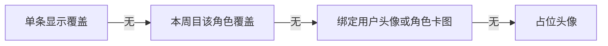
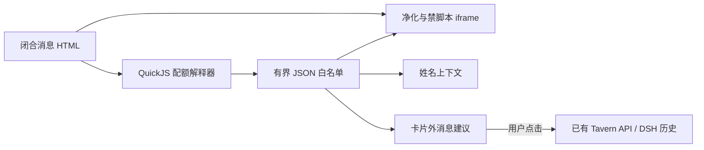
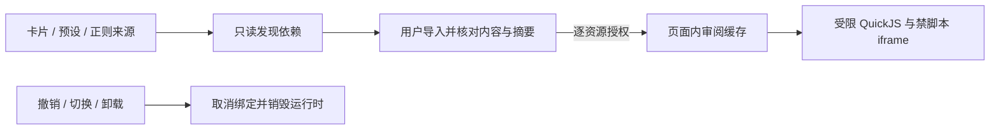

# 数学公式、头像、对话框与受限交互卡

[English](CONVERSATION_PRESENTATION_en.md) · [使用](USAGE_zh-CN.md) · [API](API.md) · [安全](../SECURITY.md)

本合同适用于 Tavern 2.5.1，目标 DSH `0.2.0-rc.2`。通过官方 UI 服务和 slots 嵌入 Web/桌面主页面，不需要另开浏览器。DSH 历史仍为消息权威，以下数据都只是显示元数据。

RP 页面直接显示 DSH 会话/轮次错误的具体信息。若提示活动写入句柄占用，同一数据目录中的会话可能正由另一个网页端或桌面端实例持有；结束其操作并关闭该实例后，再重新打开会话。静态消息的样式表和行内样式均受 Shadow DOM 与外层绘制边界限制，固定定位内容不能覆盖主界面。

## 数学公式

RP 正文、开场白、显示编辑和静态 HTML 导出共用 Markdown → KaTeX MathML → DOMPurify 路径。公式默认开启，不增加 conversation-settings 字段或专门控制按钮，也不改写 DSH 原文、提示词和 JSONL。行内用 `$…$` / `\(…\)`，独立公式用 `$$…$$` / `\[…\]`；多行分隔符各占一行。分数、根号、积分、矩阵和对齐公式使用 KaTeX 语法，浏览器负责原生 MathML 排版，不加载远程字体或脚本。

仅识别 Markdown 文字中的分隔符；代码、HTML 属性/注释、原始 HTML 块、完整文档模板和交互卡片内部保持原语义。行内 HTML 文字与 `<details>` 的 Markdown 正文/标题可使用公式。常见金额不会被当成公式，但字面 `$x$` 必须转义或放进代码。Markdown 强调不会消耗公式内部的 `*` / `_`；公式样式限于 Tavern 内容，普通公式不会为整条消息引入 Shadow DOM。独立长公式横向滚动，流式内容闭合后才排版，未变化的历史消息复用 DOM。

单个公式限制为 4096 字符、200 次宏展开与用户指定尺寸上限 10 em；宏定义不跨公式共享，错误或不支持的 TeX 回退源码。KaTeX 使用 `trust: false`，禁用公式中需要显式授权的外部资源和 HTML 扩展命令；此设置不影响普通 Markdown 链接、图片或现有 HTML 渲染。公式生成内容仍须净化；允许 MathML 及纯文本 `annotation`，禁止 `annotation-xml`。这不是完整 LaTeX 文档运行环境，浏览器布局仍有资源成本；需要支持 MathML 的现代浏览器。详细转义与混排规则见[使用说明](USAGE_zh-CN.md#markdownhtml-与模板样式)。

## 头像

在 **DT → 用户** 上传 PNG/JPEG/WebP，然后保存资源。浏览器接受最多 8 MiB、边长不超过 8192 的图片，中心裁成 256×256 WebP。API 接受至多 128 KiB 的 raster data URI，校验媒体类型、base64 与文件签名；不接受 SVG、外部 URL 或文件路径。

默认用户图取自周目根 session 所绑定的用户资源；角色图使用当前绑定角色卡的现有 PNG 接口，缺图使用占位。名称/描述参与提示词装配，头像不进入提示词。

消息头像位于输入栏外沿两侧：角色在左，用户在右；正文和操作按钮位于中间。气泡按内容宽度收缩，达到中间列最大宽度后换行；用户气泡及正文右对齐。布局使用 Host 的 composer 宽度变量，在显示 Tavern 的 Session 内通过公开 slot 限定 composer 两侧留白；离开 Tavern 视图后恢复 Host 默认留白。设置预览使用相同的气泡布局，按钮尺寸随草稿实时变化，点击“应用并保存”后生效。

点击对话头像可以上传替换图，选择“仅此条”或“此周目所有用户/角色头像”。优先级如下：



- **仅此条**：用户按 QA node ID，角色按 QA node ID + variant ID + 输出段序号保存。开场白按开场序号，导入正文按导入位置保存。流式临时消息不可编辑头像，终态再编辑。
- **整周目替换**：覆盖该角色已有及后续消息，并清除该角色所有单条覆盖。另一个角色保持原样。
- **此条恢复继承**：只删除单条覆盖，继续继承本周目覆盖或资源默认值。
- **此周目全部恢复资源默认图**：清除该角色整周目覆盖及所有单条覆盖。
- 在用户面板修改资源头像，会改变所有继承该资源默认图的周目；对话内编辑不会修改用户资源、角色卡源图或其他周目。
- 新建普通周目从资源默认图开始。分支为新周目时复制当时的显示元数据；此后独立保存，不与原周目联动。更换导入记录后，导入位置覆盖仍跟随该位置；需要时恢复默认。

资源 `avatar` 随用户 JSON 导入/导出。覆盖保存在已有 timeline 的 `ext.pmpDshTavern.appearance`，`schemaVersion:1`，字段为可选 `user`、`assistant` 和 `messages`。图片是有界 data URI，`messages` 最多 500 个键，appearance 总计不超过 512K 字符（JSON 序列化后）；timeline 仍受原来的 1 MiB 总限制。更新使用现有 workspace 文件 API 的 revision/CAS，不写 DSH 日志；超限或冲突失败不会覆盖原文件。

## 对话框样式 v1

进入 **DT → 对话设置**，选择柔和、书页或夜色，或使用颜色、圆角、边距和字体控件编辑；预览后点“应用并保存”。也可展开 JSON 编辑、导入或导出。导入只更新预览，应用才保存。一个自定义样式随当前全局对话设置保存；可导出多个文件作为自己的样式库。

[完整示例](examples/bubble-paper.json)：

```json
{
  "format": "tavern-bubble", "version": 1, "name": "Paper",
  "radius": 4, "padding": 20, "borderWidth": 1, "font": "serif",
  "user": {"background":"#f4ecd9","text":"#483923","border":"#d5c6a9"},
  "assistant": {"background":"#fffaf0","text":"#40392d","border":"#ded3bd"}
}
```

名称 1–80 字符；颜色必须是六位 `#RRGGBB`；圆角 0–32、边距 8–24、边框 0–3（整数像素）；字体为 `sans|serif|mono`。文件最多 16 KiB，未知字段、版本或非法值明确拒绝。没有 CSS、HTML、JS、资源 URL 或任意代码字段。

`PUT /v1/conversation-settings` 在既有 `textScale/actionScale` 外接受可选 `bubbleStyle`（上述完整文档）和 `interactiveCards`（boolean）。省略恢复默认，DELETE 恢复全部默认。设置存于原有 `conversation-settings.json`；不绑定周目，不改变 DSH 原生样式。

## 三种边界与方案选择

1. **静态内容**：Markdown → DOMPurify；样式在 Shadow DOM 与绘制边界内隔离。外部自动资源不开放：图片只接受有界 PNG/JPEG/WebP data URI，移除 srcset、poster 等；含 URL、image/image-set/src 函数、`@import` 或转义的 CSS 块/内联样式整体丢弃。正常布局、颜色、渐变、变量、媒体查询和动画可用。外链需用户主动点击，带 `noopener noreferrer`。
2. **脚本环境**：识别已闭合 `html` 围栏、无语言但以 `<body>`/`<html>` 开头的围栏，以及完整 `<html>…</html>`/`<body>…</body>` 中的控件或脚本。静态 DOM 在 `sandbox="allow-same-origin"`、无 `allow-scripts` 的 iframe 内呈现，CSP 禁止连接、外部图片、脚本、子 frame、表单提交等。卡片 JS 在独立 QuickJS WASM 中运行，不在 iframe 或父页面执行。iframe/Shadow DOM 本身不承担完整权限保证。
3. **能力接口**：唯一的 JSON bridge 白名单提供卡片内部 DOM 与只读姓名上下文，以及“建议消息”。没有通用 RPC、Host API、凭据、文件、网络、父页面或 native eval 入口；模块仅从逐项审核的本地内容映射解析。建议只在卡片外显示，必须经用户点击 Tavern 按钮才调用已有 `user-message` API。

[DSH sandbox 固定版文档](https://github.com/deepseek-ai/deepseek-harness/blob/dsh-v0.2.0-rc.2/packages/sandbox/sandbox/README.md) 隔离的是子进程与文件访问，不能复用为消息 JS 的浏览器隔离。[官方桌面转发](https://github.com/deepseek-ai/deepseek-harness/blob/dsh-v0.2.0-rc.2/apps/desktop/src/web-document.ts) 会剥离 Origin；[桌面请求令牌](API.md#桌面请求令牌) 解决此差异，没有关闭 webSecurity。

[酒馆助手渲染器文档](https://n0vi028.github.io/JS-Slash-Runner-Doc/guide/基本用法/渲染器.html) 与 [固定源码](https://github.com/N0VI028/JS-Slash-Runner/blob/519599bc68247d8e759cc844a983f8f5252941a8/src/panel/render/Iframe.vue) 使用 srcdoc/blob iframe；其构建函数注入公共接口、外部库和头像路径，部分工具桥接父页面。因此复用其显示思路，不能照搬权限模型或声明全量兼容。实现为 Tavern 内可关闭模块，复用已有周目与组件销毁边界；额外插件目前没有独立宿主能力需求，反而需要跨插件生命周期和权限协商。后续若增加通用、独立授权能力，再评估拆分。



## 支持接口与限制

默认关闭脚本，在对话设置明确启用。可从[计数器示例](examples/interactive-counter.html)开始，将完整文件放进 `html` 代码围栏。每次重新挂载/切换周目/修改卡片源码都新建运行时；普通父组件刷新保留状态。生成中的消息不执行脚本，历史卡片不因其他消息的流式更新而重置。卡片局部变量只在内存中，刷新或重挂载后重置。

| 接口 | 支持范围 |
| --- | --- |
| `document.body`, `getElementById`, `querySelector`, `querySelectorAll` | 仅卡片 body 内，返回 facade，不返回真实浏览器对象；净化可能移除 DOM 保留名称 |
| 元素 `textContent`, `innerHTML`, `value`, `checked` | innerHTML 每次重新净化；不激活插入的脚本 |
| `createElement`, `appendChild`, `remove` | 白名单 HTML 标签，禁止创建 script、iframe、style、img、input；现有受限 input 可交互 |
| `setAttribute/getAttribute`, `classList`, `style.setProperty` | 写属性仅 id/class/title/disabled/aria-label/data-action；CSS 仍在 CSP/iframe 内 |
| `addEventListener` | click/input/change；document 仅同步 DOMContentLoaded；不支持定时器、动画回调、网络或浏览器库 |
| `TavernUI.version`, `getContext()` | v1；角色与挂载时复制的 userName/characterName，复制的 JSON，不含 session ID 或凭据 |
| `TavernUI.proposeMessage(text)` | 最多 4000 字符，生成可见建议；不能自行发送 |

外部 `<script src>` 和 ES 模块必须按下述流程逐项审阅；未授权依赖与内联 on* 会停用整卡脚本。外部来源、Helper 和 JSX 使用专用 Worker 内的 QuickJS 与 linkedom。固定官方 jQuery 3.6.0、React 18.3.1、Vue 3.5.13 夹具覆盖插入 DOM、点击和状态更新；这不代表完整浏览器兼容。提供下述卡片内限定布局读值；可变 CSSOM、canvas、父页面与系统接口仍不可用；本渲染器不提供世界书/聊天/生成接口；写变量走下述单独授权的 MVU 桥。未提供的 API 报错并销毁运行时，不静默成功。静态 HTML 导出不运行卡片脚本，也不导出内存中的交互状态。

上表描述小型内嵌 facade；其每卡源码最多 128K UTF-16 字符单元、解释器 8 MiB/256 KiB 栈；每次执行 60 ms 与 500 次中断检查双重上限、1000 bridge 操作、100 Promise jobs；DOM 最多 2048 handles，最多 256 listeners；高度 100–800 px。超限显示错误。浏览器布局/图片解码、WASM 引擎缺陷和复杂 CSS 的拒绝服务不由解释器配额完全覆盖，不能承诺绝对安全；显示正则仍有既有 RegExp 回溯风险。

自动检查见 [TESTING](TESTING.md)。安装到真实 profile 前，仍应对目标官方桌面发行包、实际角色卡与模型完成维护者验收。

## 解释器依赖

`quickjs-emscripten-core` 与 `@jitl/quickjs-singlefile-browser-release-sync` 固定为 `0.31.0`。浏览器变体把 WASM 嵌入客户端包（嵌入生成客户端包），不使用 CDN 或外部脚本加载器。包装库与引擎的 MIT 声明保留在生成包和[源码声明](../packages/presentation/THIRD_PARTY_NOTICES.txt)中。小型内嵌解释器延迟初始化；外部卡各自使用可终止 Worker 和独立 runtime。Worker 内置 linkedom 0.18.12，并用独立 QuickJS context 运行固定 @babel/standalone 7.26.10，只允许 React preset，不接受卡片编译插件。依赖发现使用 Acorn 8.15.0 与 acorn-jsx 5.3.2。额外声明见[虚拟 DOM 声明](../packages/presentation/VIRTUAL_DOM_NOTICES.txt)。升级依赖需重新验证配额与隔离测试。[上游发布说明](https://github.com/justjake/quickjs-emscripten/releases/tag/v0.31.0)。

样式页顶部为“导入 JSON、导出 JSON、创建样式”。正文字号纳入样式预览，通过滑块或数字输入调节，以可选整数字段 `fontSize` 保存（8–48 px），点击“应用并保存”生效。没有此字段的旧 v1 文件仍可导入，并继承旧的文字缩放；编辑器应用时转换为像素字号。不支持的脚本提示按原因本地化并去重，区分外部文件、模块、其他 script 类型与内联事件属性；脚本总开关不会代替逐来源授权。


## 统一设置与外部源码审核

**DT → 对话设置**包含对话外观、正则替换、外部代码三个页签。切页签保留外观和正则草稿；通过关闭、Esc 或菜单离开时有未保存检查。切换绑定资源时，旧正则草稿保留但停止保存，需先导出或放弃并重新加载。原独立正则菜单合并至此。

清单识别角色卡/预设的 `extensions.tavern_helper` 对象 `{scripts,variables}` 及旧式键值对数组；支持直接脚本和 `type/value`、嵌套 scripts/children 格式。仅读取 scripts，变量语义由 MVU 模块负责。清单同时读取开场白、备选开场白，以及全局、预设和角色正则替换中的 script src、ES import/export/import() 及 `.load()` 字面量，保留来源资源与字段路径。JavaScript 依赖使用 AST 分析，支持多行 import/export 和字面量动态 import，注释和普通字符串不产生依赖。计算型动态 import 与语法错误会明确阻断依赖图。

1. 默认不抓取任何远程代码，不增加 Host 代理。可信设置页可逐 URL 点击下载，使用浏览器 CORS、无凭据、禁止重定向及 no-referrer，流式限制 8 MiB，15 秒超时；取消/切换会中止读取，下载只准备审核、不执行。CORS 失败可导入本地源码。外部依赖仅接受无凭据、无非默认端口的 HTTPS 公共形式地址；HTTP、本机地址、IP 字面量和相对无基准地址明确阻断。本地缓存不发起 DNS 或网络请求。这是 URL 形式检查；浏览器获取不能核验 DNS 实际解析是否为私有地址，不能视为 public-only 网络保证。
2. 下载或通过文件选择器导入该 URL 对应的源码，或准备审核 Helper 内嵌源码。显示完整内容与 SHA-256；导入本身不授予执行权限。
3. 点击“已核对内容，允许受限执行”。授权绑定资源身份、精确 URL/字段及内容摘要；替换源码立即撤销旧授权。摘要用于固定所审阅字节，不证明代码来自网络声明的作者。
4. 嵌套依赖逐项导入并审阅。受限 `$('body').load('https://…')` / `jQuery` 包装由渲染器读取已审阅 HTML，不执行网络请求；HTML 内相对脚本/模块以原 URL 解析。包装不接受请求参数、回调、选择器后缀或嵌套 `.load` 包装。其他网络用法不兼容。
5. 撤销、替换、全局禁用、会话/variant 切换及卸载会取消旧绑定、销毁解释器和订阅。授权与缓存只在当前页面内存保留，刷新或插件卸载后清空，不从卡片、工作区文件或 localStorage 恢复。未授权时显示静态内容与原因；清单“内容已授权”不等于脚本执行成功，运行错误显示在卡片外。



审核资源最多 8 MiB；缓存最多 64 项/64 MiB；每卡依赖图最多 24 个 URL、24M UTF-16 字符单元和 8 层。每个 owner 都必须审核完整传递闭包；同 URL 不同审核内容会拒绝。输入 HTML 仍限 128K 字符，解析后的远程 HTML 限 1 MiB。卡片不能操作缓存。Helper 在本卡 HTML 脚本之前运行，不提供独立后台任务，也不声称任意 MVU bundle 已兼容。

外部 Worker 最多并发 4 卡，每卡解释器堆 192 MiB、栈 1 MiB（总解释器上限 768 MiB，不含浏览器/Worker 开销）。冷启动外部看门狗为 15 秒，初始单次执行 2 秒，后续入口 120 ms，响应外部看门狗 1.5 秒。每入口最多 200 Promise jobs、10,000 桥接调用；每卡最多 128 定时器、8,192 DOM 节点、1 MiB 输出，每秒最多 256 输出消息和 128 输入事件。定时器范围 16–60,000 ms；动画回调用定时器实现，不等价原生布局时钟。展示 iframe 无脚本权限且 CSP 禁止网络；第三方代码只得到解释器内虚拟 DOM，不获得原生 Worker/浏览器句柄。

click/input/change/key/pointer 事件复制为虚拟事件，输出净化后展示；快照恢复焦点、选区和滚动位置，不等价完整 DOM diff。缺失 API 明确失败，不伪造零值尺寸。卡片外运行证据显示源码 hash、固定编译器版本、JSX 输入/输出 hash、冷启动耗时与采样堆快照；这些不是进程峰值内存测量。

| 扩展接口 | 明确支持的子集 |
| --- | --- |
| `$` / `jQuery` | 选择卡片内元素、ready 回调、text/html/val/on；独立实现，无 AJAX、插件或原生 DOM 句柄 |
| `TavernUI.getVariables(options?)` / `getVariables` | 无参数或 `{type:'message'}`；返回整个 variables 对象，含 stat_data/schema/display_data/delta_data，额外字段由 MVU 决定；只读 JSON 副本 |
| `getAllVariables()` | 同一绑定消息快照，不合并全局/chat 变量 |
| `TavernUI.onVariables(callback)` | 返回取消订阅函数；已提交快照 `{version,scope,revision,variables,status}`，最多 64 个订阅；不是原版可变的 before-update 事件 |

变量绑定由可信历史消息的 playthrough/session/node/variant/endEventId（以及已有格式版本）确定，服务再次验证；脚本不能用 options 改变作用域。空开场白可用明确的 `{mode:'initial',playthroughId,sessionId,characterId}` 作用域，仅绑定已解析的根会话及所选角色；来源再次验证空持久历史，首个 turn 开始后永久关闭该初始作用域。离开、切角色/会话、重挂载均销毁旧绑定与授权。没有可核实坐标的导入与流式内容不绑定变量。MVU 不可用时读取明确报错；不回退到当前焦点会话。只读轮询与变量提交语义由 MVU bridge 提供，写操作需要单独的 Host capability，不继承模型工具权限。发送消息仍需卡片外确认，与模型工具授权完全分离。

## 单独授权的变量写入

外部代码设置页显示每个已挂载卡片的完整执行包（HTML、脚本、模块、来源 owner 和固定作用域）。先核对全部源码与 SHA-256，再单独允许此绑定写变量；两步默认关闭。Host 重算执行包摘要，签发仅内存保留、30 分钟有效的授权；改变代码/源码审核/作用域、撤销或卸载都会删除权限，不写入卡文件。Host 只保存身份、作用域和期限，不保存上传的代码。

渲染器支持已核实的 `Mvu.getMvuData(options?)` 整对象读取、`Mvu.updateVariablesWith(JSONPatchArray)` 和 `await Mvu.replaceMvuData(wholeVariables, options?)`，不声称支持回调重载。options 只可指向本绑定消息；global/chat/character、latest 或数字别名不会把历史气泡暗中改指当前焦点。`eventOn(Mvu.events.VARIABLE_UPDATE_ENDED, callback)` 在本绑定有更新的已提交 revision 后无参回调，不声称原版事件 payload 或可变 before-update 语义。

写授权有效仍不足以提交：MVU 服务再次验证当前可写资源/头、scope、CAS 版本、幂等 operationId、authority 租约和 manager 策略。缺少接入、历史作用域和策略拒绝均明确失败。operationId 由渲染宿主生成，CAS 保留已交给 Worker 的快照版本，不改用懒建写绑定的更新版本；VM 仅提交 operation/value 和受限 options。撤销取消可写绑定并恢复只读观察。提交事件为 `card_variable_update`，不伪造 assistant-message 事件。

主线程识别浏览器 `isTrusted` 输入，原生 Worker 仅在处理该事件期间携带私有 taskId，VM 不接触它。原生定时器单独标记 interval，程序生成点击与初始执行为 script，卡不能选择 cause。Host 服务依赖现有可信 UI dispatcher 提供浏览器事件证据，不能独立或密码学证明人类点击；grant 创建及撤销在读请求体前额外要求 DSH connection admission，并保留本机 Origin/媒体类型/桌面 token 防护；缺少 admission 时关闭写入口。已 admission 的 dispatcher 是受信边界，不等于密码学人类点击证明。grantId 和 MVU capability 从不进入解释器。


内置 MVU 适配另行选择，默认关闭。仅 `mvu-builtins.js` 中的精确 URL 与 SHA-256 字节身份在内容审核后提供选项。界面和运行审计明确标注不执行原 bundle，保留原身份及限定作用域的 facade 版本。支持副作用 import 与普通 script 初始化；不冒充具名导出、动态注册或任意运行时 Zod 对象。完整 schema Helper 仅在可用权威快照的 `variables.mvu_schema` 满足 `mvuSchema:1`、`interpreterVersion:1` 且完整 source 精确一致时跳过 VM 执行。显示的 `source-registered` 是快照派生的本地确认，不是注册 API；快照不可用、未知版本及原文不同均明确失败。

传输前及 Worker 内再次限制展开后的初始化：最多 128 个 runs、24 个模块及 24 MiB UTF-8 总量，重复代码仍计费，context/variables 限 256 KiB。早期 timer 的 idle 不取消启动截止。四个运行实例用满时，可用卡片外的暂停和启动/重启按钮释放旧实例。原生待决写入最多 32 项并要求单调 ID；一次可信输入 task 最多归属一次写入。写入等待截止为 30 秒，结果不确定或回传失败会终止运行时并显示 operationId 供回执核查，不自动生成新 ID 重试。本地撤销立即停止写入；服务端撤销失败即使卡片卸载仍保留可见重试项。


## 卡片内布局读值

外部 Worker 使用固定 QuickJS Asyncify 0.31.0，让 `getBoundingClientRect()`、scrollHeight/scrollWidth、offsetHeight/offsetWidth/offsetTop/offsetLeft、clientHeight/clientWidth 及 `getComputedStyle()` 在脚本看来同步返回真实布局。每次读取先提交当前虚拟 DOM 的净化快照，再仅测量该卡的无脚本 iframe；不读取 Host 页面、其他卡或任意外部窗口。computed style 是本次读值的快照，支持普通属性与 `getPropertyValue`，不承诺浏览器的 live CSSOM。卡内未渲染的节点不能冒充有布局的节点。父页面、canvas、网络、模型工具及系统权限不会因此开放。

事件、计时器、变量通知和 Promise jobs 串行进入解释器；一次任务最多 16 次布局请求，单次测量 1 秒截止，沿用整体执行/启动截止。请求绑定 Worker nonce、单调 ID 和当前 iframe 代次；切换、撤销、卸载或超时会取消旧测量并终止 Worker，迟到响应不恢复旧任务。布局结果只返回有界 JSON；不伪造零值尺寸，不把 Promise 改成同步执行。截止是任务看门狗，不能抢占浏览器主线程内已经开始的同步布局；DOM/源码大小限制仍是必要边界。

`quickjs-async-jobs.js` 是固定版本的内部 API 兼容层。0.31.0 的公开同步作业入口不适用于挂起的 Asyncify job；兼容层使用明确异步 C 包装，等待作业返回后才释放输出指针和值句柄。构建检查 core/variant 版本一致且均为 0.31.0，运行时检查所需符号；未知版本或缺失符号关闭该能力，不回退至同步 wrapper。升级 QuickJS 必须重新验证此处内部 API 耦合、嵌套 Promise、异常、取消、截止和恰一次释放。
