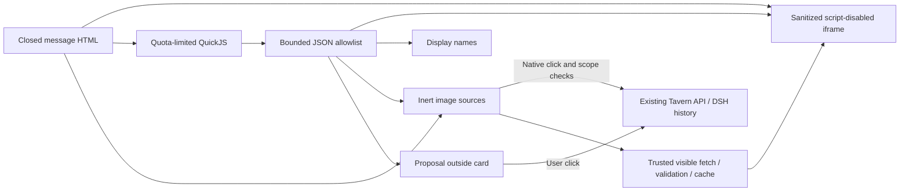
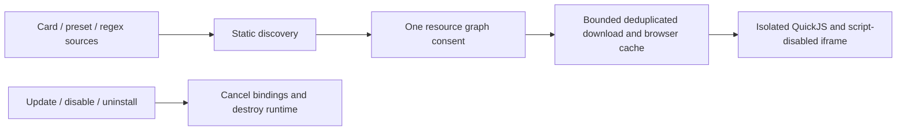

# Math, avatars, message bubbles and restricted interactive cards

[中文](CONVERSATION_PRESENTATION.md) · [Usage](USAGE_en.md) · [API](API_en.md) · [Security](../SECURITY_en.md)

The 2.5.1 contract targets DSH `0.2.0-rc.2`. Public UI services and slots embed Tavern in the Web/desktop document. No separate browser is needed. DSH history remains authoritative; these features store presentation metadata only.

RP displays concrete DSH session/turn errors in place. An active-write-handle error can mean another web or desktop instance holds that session in the shared data directory; finish its work and close that instance before reopening the session. Static message stylesheets and inline styles both use Shadow DOM and an outer paint boundary, preventing fixed-position content from covering the Host UI.

## Math

RP messages, greetings, display edits and static HTML exports share Markdown → KaTeX MathML → DOMPurify. Math is enabled by default without a conversation-settings field or dedicated toggle; DSH source messages, prompts and JSONL remain unchanged. Use `$…$` / `\(…\)` inline and `$$…$$` / `\[…\]` for display math, with multiline delimiters on separate lines. Fractions, roots, integrals, matrices and aligned equations use KaTeX syntax and native browser MathML, without remote fonts or scripts.

Delimiters are recognized in Markdown text. Code, HTML attributes/comments, raw HTML blocks, complete document templates and interactive-card interiors keep their existing semantics. Inline HTML text and Markdown in `<details>` bodies/summaries can contain math. Common prices remain literal, while literal `$x$` requires escaping or code. Markdown emphasis does not consume TeX `*` / `_`; formula styles are scoped to Tavern, and ordinary math does not introduce a shadow root for the whole message. Wide display equations scroll horizontally; streams render closed expressions and unchanged history retains its DOM.

Each formula is limited to 4096 characters, 200 macro expansions and a maximum user-specified size of 10 em. Macros are not shared between formulas; invalid or unsupported TeX falls back to source. KaTeX uses `trust: false` to disable external-resource and HTML extension commands within formulas that require explicit authorization. This setting does not affect ordinary Markdown links, images or existing HTML rendering. Formula output is still sanitized: MathML and text `annotation` are allowed, while `annotation-xml` is forbidden. This is not a full LaTeX document runtime, browser layout still has a resource cost, and a modern MathML-capable browser is required. See [usage](USAGE_en.md#markdown-html-and-template-styles) for escaping and composition rules.

## Avatars

In **DT → User**, upload PNG/JPEG/WebP and save the resource. The browser accepts up to 8 MiB and 8192 pixels per side, center-cropping to 256×256 WebP. The API accepts raster data URIs up to 128 KiB, checking MIME, base64 and image signature; SVG, external URLs and file paths are rejected.

The default user image comes from the user bound to the playthrough root session. The character image uses the bound card's existing PNG endpoint, with a placeholder when absent. Names/descriptions enter prompt assembly; avatars do not.

Message avatars sit beyond the composer's outer edges: character on the left, user on the right, with message bodies and actions in the center. Bubbles shrink to their content and wrap at the center column's maximum width; user bubbles and text align right. Layout follows the Host composer width variable and scopes composer side clearance through public slots to the Session displaying Tavern; leaving the Tavern view restores the Host clearance. Settings previews share the bubble layout and update action sizes from the draft; Apply and save persists the changes.

Click a conversation avatar to upload a replacement for one message or every user/character avatar in this playthrough:

The fixed identity-page adapter accepts only the registered wrapper and HTML digests. Generic fixed IIFE loaders also check lexical selector bindings: local `$` or `jQuery` bindings cannot impersonate the global loader. The original wrapper does not run, and the final opening becomes a message proposal for confirmation outside the card. The adapter's `getCurrentChatId()` is an opaque card-draft namespace; `getCurrentMessageId()` is the bound variable message ID or null. Neither is a general ST/DSH session identity. Drafts are isolated by source, owner and card scope: at most 32 keys, 64 KiB UTF-8 per value and 128 KiB serialized JSON, with a raw-size check before parsing stored data.

Only an opening selection that needs additional world-book entries fetches one registered inert text snapshot through the trusted page. It uses a separate IndexedDB namespace, exact URL/digest, an 8 MiB download bound and a 15-second deadline, and never enters a module graph or executes. Cold restoration rechecks its digest and charges the shared code/data byte budget. Proposal preparation uses the trusted current character, zero-based greeting index and original text digest before macro/regex expansion, independently of the draft ID. The Host statically verifies complete registry entries; a separate button outside the card confirms a CAS commit with a stable operation ID. Identity selection continues only after a real receipt. Empty selections verify their binding and skip writing. Cancellation, switching and disposal revoke pending requests; downloading grants neither world-book nor MVU writes.

The registered identity page next submits an untrusted concrete replacement packet, bounded to 128 KiB UTF-8. A pinned, finite data interpreter verifies the complete transformation for the selected opening and perks. The trusted renderer independently captures the live resource's `currentRevision`, preserves its authoritative schema, and previews both the raw input and expected server-normalized result. It derives the exact unsent message from the normalized identity using the pinned pure builder. A schema that changes the frozen opening, perks or identity controls rejects the proposal; ordinary text dependencies such as a name may still normalize once. Confirmation outside the card checks the native event timestamp in the same time origin and requires an age below 1500ms; missing, future or expired timestamps cannot be replaced with handler time. It consumes one immutable ticket and directly uses the existing source grant, scope binding, manager policy and card-write primitive. It never lends user-interaction provenance to a VM Promise, timer or callback. The ordinary script receipt replaces the page's original duplicate write and send completion.

The renderer retains this POST's operation-specific result separately from newer polling snapshots. Cancellation before admission writes nothing; cancellation after submission may leave a committed or unknown outcome. Unknown transport results can retry only the same immutable operation ID while the original authorization remains current. A known commit with failed message presentation offers message-only retry, without repeating the variable write. New selection, edit, source, scope or grant changes invalidate pending authority. A late message cannot replace a newer proposal or alter the native input draft; sending still requires its separate confirmation. Previously committed world-book entries are not rolled back. Tickets and receipts are local to the mounted renderer and are not persisted across disposal.


- Single-message user overrides use QA node ID; character overrides use QA node ID + variant ID + output segment index. Greetings use greeting index; imports use import position. Edit streaming messages after settlement.
- Replace-all covers existing and future messages for that role and clears its single-message overrides. The other role is unchanged.
- Restore inheritance deletes only that message override. Restore resource defaults clears all overrides for that role in the playthrough.
- Editing a shared user resource changes all playthroughs inheriting its default image. Editing inside a conversation never changes source resources or another playthrough.
- Ordinary new playthroughs start from resource defaults. A branch into a new playthrough copies the current display metadata, then persists independently. Imported-position overrides remain attached to that position after replacing imported content; reset them if needed.

User JSON imports/exports include optional `avatar`. Overrides use the existing timeline's `ext.pmpDshTavern.appearance`, with `schemaVersion:1`, optional `user`/`assistant`, and `messages`. At most 500 message keys and 512K UTF-16 code units of serialized appearance metadata; the existing 1 MiB timeline limit still applies. Existing workspace revision/CAS writes persist changes atomically without modifying DSH logs. Rejected limits/conflicts preserve the previous file.

## Bubble style v1

Open **DT → Conversation settings**. Choose Soft, Paper or Midnight, or edit colors, radius, spacing and font; preview, then apply. Advanced JSON editing and file import/export are available. Import changes the preview only. One custom style is retained with the global settings; exported files can form a personal style library.

[Complete example](examples/bubble-paper.json):

```json
{
  "format": "tavern-bubble", "version": 1, "name": "Paper",
  "radius": 4, "padding": 20, "borderWidth": 1, "font": "serif",
  "user": {"background":"#f4ecd9","text":"#483923","border":"#d5c6a9"},
  "assistant": {"background":"#fffaf0","text":"#40392d","border":"#ded3bd"}
}
```

Name: 1–80 characters. Colors: six-digit `#RRGGBB`. Integer pixels: radius 0–32, padding 8–24, border 0–3. Font: `sans|serif|mono`. Files are limited to 16 KiB. Unknown fields, versions and invalid values fail explicitly. There are no CSS, HTML, JS, URL or privileged-code fields.

`PUT /v1/conversation-settings` accepts optional `bubbleStyle` (the complete document above) and boolean `interactiveCards`, alongside existing `textScale/actionScale`. Omission restores defaults; DELETE resets everything. The existing `conversation-settings.json` persists global presentation settings without changing DSH native styles.

## Three boundaries and implementation choice

1. **Static content:** Markdown passes DOMPurify, with Shadow DOM and paint containment for styles. Live `img` and CSS `background` / `background-image` (including image custom properties) use the demand media controller below. Importing does not download galleries; static HTML exports do not load remote images. srcset/poster are removed. Fonts, other external CSS resources, `@import`, image/image-set/src functions and escapes remain blocked. Layout, colors, gradients, variables, media queries and animations work. External links require a click and use `noopener noreferrer`.
2. **Script execution:** closed `html` fences, unlabelled fences beginning with `<body>`/`<html>` or containing a complete `<head>…</head><body>…</body>` document, and complete `<html>…</html>`/`<body>…</body>` documents containing controls/scripts are recognized. Unlabelled complete documents may include an HTML doctype and comments; incomplete head/body fragments and fences explicitly labelled with another code language remain text. Static DOM is presented in an iframe with `sandbox="allow-same-origin"` and no `allow-scripts`. CSP denies connections, external images, scripts, child frames and form submissions. Card JS runs in a separate QuickJS WASM interpreter, never in the iframe or parent browser realm. Neither iframe nor Shadow DOM alone is the full security boundary.
3. **Capabilities:** a bounded JSON bridge permits card-local DOM operations, copied display names, and message proposals. There is no generic RPC, Host API, credential, filesystem, network, parent-page or native eval handle. Modules resolve only from resource-scoped downloaded content maps. Proposals require an explicit click on the Tavern button outside the card. The controlled ST input adapter below also accepts a real user click within a card in direct mode, through the existing user-message API.

The [versioned DSH sandbox](https://github.com/deepseek-ai/deepseek-harness/blob/dsh-v0.2.0-rc.2/packages/sandbox/sandbox/README.md) isolates subprocesses/files, not browser message JavaScript. The [official desktop forwarder](https://github.com/deepseek-ai/deepseek-harness/blob/dsh-v0.2.0-rc.2/apps/desktop/src/web-document.ts) strips Origin; the [request token](API_en.md#desktop-request-token) handles this difference without disabling webSecurity.

[Tavern Helper documentation](https://n0vi028.github.io/JS-Slash-Runner-Doc/guide/基本用法/渲染器.html) and its [fixed source](https://github.com/N0VI028/JS-Slash-Runner/blob/519599bc68247d8e759cc844a983f8f5252941a8/src/panel/render/Iframe.vue) use srcdoc/blob iframes, injecting public interfaces, external libraries and avatar paths; some helpers bridge to the parent. This implementation borrows the display idea without copying that authority model or claiming full compatibility. A disableable Tavern module reuses existing playthrough/component lifecycles. A separate plugin currently adds cross-plugin lifecycle and permission negotiation without an independent host capability need; reconsider extraction if independently authorized capabilities are added.



### Remote images on demand

Media is separate from the script/import/`.loadHTML` dependency graph and its download progress. The trusted parent fetches images according to the actual viewport, collapsed/hidden content, iframe and document visibility. Media status separately counts visible, ready, loading and unavailable images. Closing, disabling, variant/session switching and unmounting release DOM images and cancel unused queued/in-flight requests; old generations cannot update a new view. URLs are deduplicated in a page-local LRU memory cache, without Host/resource writes, persistent browser storage or image URL logs.

Static PNG/JPEG/WebP/GIF and bounded data URIs are supported. SVG, APNG/animated WebP/multiframe GIF, audio/video, fonts and general file/canvas access are unsupported. Remote sources require absolute HTTPS named URLs without credentials or nondefault ports; IPs, local/private hostname forms, relative URLs and other protocols are rejected. URL checks do not verify DNS resolution and cannot guarantee protection against DNS rebinding. Browser CORS, `credentials: omit`, `referrerPolicy: no-referrer`, `redirect: error` and `cache: no-store` remain enabled. Login-dependent, redirecting or non-CORS image services produce placeholders. Servers can still see the client's IP and full requested URL, including query parameters.

The page shares limits of 4 concurrent requests, 32 visible image leases, 64 cache entries and 32 MiB charged for data strings plus decoded pixels. Each source image is limited to 3 MiB, 4194304 pixels, 8192 per edge and 15 seconds. Streamed bytes and headers/dimensions are checked before decoding; decoded dimensions are verified and pixels are reencoded as PNG. Output and CSS variable text are capped at 1 MiB characters; bounded resizing preserves aspect ratio and alpha and prevents browsers from silently ignoring large CSS values. Backgrounds count as displayed only after native CSS readback succeeds and the computed background contains the decoded raster. Assignment or cascade failures report `IMAGE_CSS` and release their leases. Limit/format/network failures show placeholders with a fixed, URL-free `data-dtv-image-error` code; visible images waiting for the global quota retry when it is released. img elements without dimensions use a 160×90 placeholder layout. These budgets do not fully cover temporary browser decoding, layout or engine vulnerabilities.

Cards can express displayed images through their limited DOM, but cannot call generic fetch or read HTTP responses. The iframe retains `img-src data:` and `connect-src 'none'`; QuickJS/Worker receives no arbitrary network, Host or credential authority. Only the trusted parent injects validated raster pixels into the view. CSS image URLs become inert placeholders and fetch only when used in an actual background; unused custom properties do not download. html/body root backgrounds are discovered too. Pseudo-elements require an empty host without child content or another generated box, generated content, visible display/visibility/opacity and a measurable, untransformed box contained on a fully visible host; unknown geometry fails closed. Hidden/generated-content and viewport changes release their leases. Inert templates may retain sanitized SUOT data markers, which are unwrapped outside templates; template scripts/event attributes never execute.


### Selecting one photo

With card scripts enabled, a sanitized `input[type=file]` can receive one user-selected static PNG/JPEG/WebP. A card button may open that input only during a fresh trusted click and browser user activation; synthetic clicks/changes cannot acquire authority. The trusted renderer reads only the selected File, checks 8 MiB, 8388608 pixels and 8192 per edge before decoding, then strips metadata and produces a JPEG with longest edge at most 640 and a data URI at most 65536 characters. Decoding is serialized, with at most four queued selections. A new selection, disabling, source change or unmount invalidates pending results; invalid formats/limits show a separate photo error.

The VM receives a synthetic `selected-photo.jpg` descriptor and the bounded JPEG. A narrow FileReader/Image/canvas facade supports reading this selection, its natural dimensions, and the existing `drawImage(image,0,0,width,height)` → `toDataURL('image/jpeg',0.82)` sequence; it returns the already processed JPEG. It has no general canvas, native File, path, original filename, arbitrary image fetch or Host access. Photo changes carry no composer/send authority. Persistence remains the caller's bounded, separately authorized storage contract; selecting a photo does not increase storage quotas or grant a write. The input remains single-file with a raster accept list, and `hidden` plus the explicit `data-opening-choice`/`data-opening-perk` attributes survive sanitization.
## Controlled ST input compatibility

SUOT option cards use a narrow virtual `window.parent` / `window.top` facade. These objects contain interpreter-owned proxies, never the parent page or a native Window. Inert `<template>` data preserves `<SUOT>` markers; template fragments expose plain text, and the virtual window receives `DOMContentLoaded`. Scripts and active attributes remain sanitized.

| Interface | Supported request |
| --- | --- |
| `parent.document.getElementById('send_textarea')` | A detached virtual textarea; its value setter and input/change events request a draft replacement of at most 4000 characters |
| `textarea.focus()` | The public DSH editor insertion selects the inserted text; no parent DOM focus handle is provided |
| `SillyTavern.getContext().generate()` / virtual `send_but.click()` | Request submission of this click's filled draft, in explicit direct mode; acceptance is not model completion |
| `extensionSettings.XiaJin.directSend` / `saveSettingsDebounced()` | Only this boolean; a local preference keyed by source, rendered scope and card position, bounded to 128 records, with no saved write permission |
| `parent.document.querySelectorAll('iframe')` | Only this card's frame proxy; `remove()` closes it only after its accepted send |
| `parent.postMessage({type:'resizeIframe',height}, '*')` | Request resizing only this frame within 100–800 px; fixed-height panels retain Host-managed sizing |

The trusted receiver binds requests to a runtime nonce, monotonically increasing request ID and a fresh native click. Synthetic events, timers, duplicate actions and requests after task completion cannot claim that click. Fill-only mode never submits a message. Sending requires the same event's filled text and unchanged draft revision, then uses the existing session-bound user-message API. Concurrent or repeated sends are refused; draft clearing after acceptance preserves newer user edits. Busy, structured-chip or attachment drafts reject replacement. Switching the session/source, disabling or unmounting disposes pending requests; an accepted request cannot be rolled back. A timeout reports an unknown send outcome rather than retrying. Rejected input/settings/send requests remain visible and cannot close the card. Historical transition surfaces receive no writable composer. Acceptance does not renew the original click’s 1500ms authority. A late accepted receipt permits this card’s one accepted close only; it grants no new variable-write, photo-selection or opening-selection activation.

An opening dock or opening layout remains mounted until its sending click closes the card or finishes its task, so the first-message transition does not remove the receipt receiver prematurely. A session or input-shell replacement still revokes it immediately; other cards cannot release its private request lease. Events during startup enter a bounded queue and retain the original click expiry check.

Historical source text stays unchanged. A historical card displayed again in the current session receives a new instance binding; a new trusted user click may fill the input or request a send. An old instance or pending click cannot continue submitting. These input requests are independent of MVU initial-variable write authorization.

## Supported interfaces and limitations

Scripts default off; enable them in conversation settings. Start with the [counter example](examples/interactive-counter.html), placing the file in an `html` fence. Remounting, switching playthroughs or changing source creates a fresh runtime. Ordinary parent rerenders preserve state. Streaming content does not execute scripts, while historical cards retain state during other messages' streaming updates. Card variables are memory-only and reset on refresh/remount.

| Interface | Scope |
| --- | --- |
| `document.body`, `getElementById`, `querySelector`, `querySelectorAll` | Card body only; facade objects, never native DOM handles. Sanitization may remove reserved DOM names |
| Element `textContent`, `innerHTML`, `value`, `checked` | innerHTML is sanitized on every write; inserted scripts never activate |
| `createElement`, `appendChild`, `remove` | Allowlisted HTML; script/iframe/style/img/input creation denied. Existing restricted inputs remain interactive |
| `setAttribute/getAttribute`, `classList`, `style.setProperty` | Attribute writes limited to id/class/title/disabled/aria-label/data-action; CSS remains inside iframe/CSP |
| `addEventListener` | click/input/change; document only supports synchronous DOMContentLoaded. No timers, animation callbacks, network or browser libraries |
| `TavernUI.version`, `getContext()` | v1; role and userName/characterName captured at mount, copied JSON without session IDs or credentials |
| `TavernUI.proposeMessage(text)` | Up to 4000 characters; visible proposal, never automatic sending |

External script sources and ES modules use the resource download lifecycle below. Missing dependencies and inline on* handlers disable all scripts in the card. External sources, Helper scripts and JSX use a dedicated Worker running QuickJS with linkedom. Fixed official jQuery 3.6.0, React 18.3.1 and Vue 3.5.13 fixtures cover DOM insertion, click events and state changes. This does not establish full browser compatibility: bounded card-local layout reads are provided below; mutable CSSOM, canvas, parent-page and system APIs remain unavailable. The controlled ST input subset below is the only chat submission interface; general world-book/chat/model-generation APIs are unavailable. Variable writes use the separately authorized MVU bridge described below. Missing runtime APIs fail visibly and dispose the runtime; no silent success. Static HTML export does not execute scripts or export in-memory card state.

The table above describes the small inline facade. Its limits per card are 128K UTF-16 code units of source, 8 MiB interpreter heap, 256 KiB stack; each entry has a 60 ms deadline and 500-interrupt ceiling, 1000 bridge operations and 100 Promise jobs. At most 2048 DOM handles and 256 listeners, with height clamped to 100–800 px. Limits produce visible errors. Browser layout/image decoding, WASM engine defects and expensive CSS denial of service are not completely covered by interpreter quotas; this is not an absolute security guarantee. Existing display RegExp backtracking risks remain.

See [TESTING](TESTING_en.md). Maintainer acceptance of the actual official desktop distribution, real character cards and provider integrations remains necessary before using a real profile.

## Interpreter dependency

`quickjs-emscripten-core` and `@jitl/quickjs-singlefile-browser-release-sync` are pinned to `0.31.0`. The browser variant embeds WASM in the client bundle (embedded in the generated client bundle), with no CDN or external script loader. MIT notices for the wrapper and engine are included in the generated bundle and [source notices](../packages/presentation/THIRD_PARTY_NOTICES.txt). The small inline interpreter initializes lazily; external cards each own a terminable Worker and runtime. The Worker bundles linkedom 0.18.12 and a separate QuickJS context containing fixed @babel/standalone 7.26.10. JSX uses only the React preset with no card-supplied compiler plugins. Acorn 8.15.0 with acorn-jsx 5.3.2 parses dependencies. Additional notices are in [virtual DOM notices](../packages/presentation/VIRTUAL_DOM_NOTICES.txt). Dependency upgrades require the quota and isolation regression tests. [Upstream release](https://github.com/justjake/quickjs-emscripten/releases/tag/v0.31.0).

The style toolbar has Import JSON, Export JSON and Create style at the top. Body font size is part of the previewed style (`fontSize`, optional integer 8–48 px), controlled by a slider or numeric input and saved with Apply. Older v1 files without the field remain accepted and inherit the legacy text scale; the editor converts it to pixels when applying. Unsupported-script notices are localized and deduplicated by cause (external files, modules, other script types or inline event attributes). The master script toggle does not download missing external dependencies.


## Unified settings and external dependencies

The External code tab groups card scripts, external dependencies and related actions. Its single **Allow card scripts to run** switch retains the existing global execution gate, including inline message scripts. Left checkboxes save ordinary per-source choices through conversation settings, initially inheriting imported enabled/disabled values; **Restore source default** removes an override. Expanding an entry reveals complete inert source in a bounded scroll area. Long addresses stay within the panel; ⓘ buttons use the Host tooltip for hover, keyboard focus and touch. Download progress, paused state and errors remain visible. The download graph follows saved source and URL choices; variable-write permission remains separate. See the [settings API](API_en.md) for identity, reset and persistence rules.

**DT → Conversation settings** contains Appearance, Regex replacements and External code tabs. Tab switches preserve style and regex drafts; closing, Escape and menu navigation check unsaved changes. A binding change retains the old regex draft but disables saving; export it or discard it and reload. The separate regex menu is consolidated here.

Discovery accepts character/preset `extensions.tavern_helper` as `{scripts,variables}` or legacy key-value pair arrays, including direct scripts, type/value entries and nested scripts/children. It reads scripts only; MVU owns variable semantics. Greetings, alternate greetings and global/preset/character regex replacements contribute script src, ES import/export/import() and literal `.load()` dependencies, with resource/field provenance. JavaScript dependency discovery uses an AST: multiline import/export and literal dynamic import are recognized; comments and strings do not create dependencies. Computed dynamic imports and syntax failures block the graph with a visible reason.

1. Importing a character or preset lists selected direct dependencies of enabled sources and asks once to download their static transitive graph. Existing resources have a **Download resource dependencies** action. Inline Helpers need no content approval: source defaults, saved choices and the master switch control execution. Download consent grants neither Host access nor variable writes.
2. The trusted UI downloads static HTTPS text with browser CORS, omitted credentials, rejected redirects and no-referrer. Each file is limited to 8 MiB and 15 seconds. URL deduplication converges automatically within 128 files, 8 levels and 24 MiB. Normalized direct URLs are deduplicated before the budget and appear as `0/n` before acquisition. Recursive acquisition shows fetched/discovered counts with an unknown final total; only a complete graph shows a completion ratio. Limits preserve omitted counts; discovery metadata retains at most 4096 unique identities and labels larger counts as `n+` lower bounds. Depth is the shortest number of edges from an owner’s currently selected declared entries to a URL, with directly declared URLs at zero. Convergent paths and cycles do not incur a longer DFS-path limit. Acquired records retain minimum depth. Source or URL choice changes invalidate the runtime graph; an unselected entry cannot lend a shortcut. Legacy records without depth are recalculated from execution entries during preparation, with owner-specific enablement, source and content-conflict checks. Cache and preparation reject ready dependencies beyond eight levels. The Worker receives only the prepared closed module set and retains its count, bytes, heap, stack and watchdog limits. Cycles do not repeat downloads; computed/unresolved references, network failures and limits have explicit states. The inventory does not acquire img/srcset, CSS URLs, fonts, video or image catalogs stored as ordinary script strings; media is outside the code acquisition budget. URL syntax checks do not verify DNS results or guarantee public-only networking.
3. Each resource shows progress and failed items, complete expandable code, download-again and uninstall actions. Downloading again replaces selected graph bytes and retains unselected source as browseable inert cache. Cancel/uninstall abort requests and ignore late results. Acquisition and uninstall advance a resource generation in shared storage transactions; publication atomically checks that generation. Uninstall retains only a code-free generation tombstone, preventing late downloads from restoring old graphs. Cross-tab messages only trigger storage rereads. After asynchronous source preparation, restoration rechecks generation and publication state inside a read transaction before installing code, so a delayed old snapshot cannot restore uninstalled code. Unfinished downloads can be taken over. Source bytes with the same exact URL and content digest are stored once within the current Host origin and reused by a new owner; simultaneous first acquisitions in one frontend share a missing source request. Enablement, adapter mode, graph roots/depths and installed records are validated independently for each owner and never inherit execution or write permissions. Explicit redownload fetches fresh bytes while owners retain their own versions. Uninstall releases only that owner’s references; bytes are deleted after the final reference is released. Conflicting bytes for a shared URL in one card are rejected.
4. Graphs and source fingerprints persist in this browser's Host-origin IndexedDB. Reload restores cache without networking. Source, enablement or adapter-mode changes revoke the old runtime graph and request an update of selected dependencies; other owners’ cache is preserved. Uninstall deletes the resource cache and invalidates other same-origin tabs; plugin disposal destroys current runtimes but retains browser cache for reinstall. Digests identify bytes, not authors. Cards cannot access or modify the cache. Older per-owner source copies migrate to shared byte references while preserving fingerprints and generation tombstones; only the origin’s browser cache changes, never Host resources. Older clients cannot read the new format; rollback requires a compatible client or explicit removal of this cache.
5. A narrow `$('body').load('https://…')` / jQuery wrapper reads downloaded HTML; relative scripts/modules resolve against the original URL. Parameters, callbacks, selector suffixes and nested wrappers remain unsupported. Workers gain no networking. Disabling, graph replacement, session/variant changes and disposal cancel bindings and destroy runtimes/subscriptions. Missing dependencies retain static content and a reason; “Downloaded” does not claim successful execution.



The executable cache is limited to 512 entries. Executable sources, unselected source and fixed read-only opening data share a 64 MiB byte budget within one trusted frontend runtime. Cold restoration waits for other cache initialization and atomically accounts for this origin’s complete stored inventory; an empty opening cache releases its temporary reservation before executable restoration. Bytes with the same exact URL and content count once across owners and active/inactive references. Overflow preserves old reservations and grants no execution permission. Failed initialization blocks new acquisition, staging and installation while preserving the stored cache. After releasing budget or explicitly uninstalling an owner, a complete inventory must be successfully reaccounted before continuing. A failed shared initialization remains blocking until the same task is explicitly retried successfully. This accounting is not a global disk-write lock across tabs or databases. Each card loads at most 128 URLs, 24M UTF-16 code units and 8 levels. Input HTML remains limited to 128K characters and expanded remote HTML to 1 MiB. Helpers run before the card's HTML scripts, are not independent background tasks, and do not imply arbitrary MVU bundle compatibility.

External Workers allow four concurrent cards, each with a 192 MiB interpreter heap and 1 MiB stack (768 MiB aggregate interpreter cap, excluding browser/Worker overhead). Initialization has a 15-second outer watchdog, individual initial evaluations 2 seconds, later entries 120 ms and a 1.5-second outer response watchdog. Limits include 200 Promise jobs per entry, 10,000 bridge calls, 128 timers, 8,192 DOM nodes, 1 MiB output, 256 outbound messages/second and 128 input events/second. Timers run at 16–60,000 ms; animation callbacks use timers rather than a native layout clock. The display iframe has no script permission and a network-denying CSP. Third-party code receives only virtual DOM objects inside QuickJS, never native Worker/browser handles.

Controlled draft-storage IPC suspension credits its actual waiting time once to the current interpreter entry, at most one second per request. Validation, dispatch and serialization before suspension, and JavaScript after resumption, remain charged to the original execution budget. Credit does not reset elapsed computation, bridge calls or Promise jobs. The one-second storage reply, 1.5-second response and 15-second startup watchdogs, trusted-click timestamps and source/session authority deadlines still use real wall time. Cancellation, timeout or late replies cannot revive a disposed card. Layout, timers, variable writes and opening confirmation receive no storage-wait credit.

Interpreter entry failures report a fixed diagnostic code: `CARD_EXECUTION_TIME` when the interrupt handler actually reaches the deadline, otherwise `CARD_EXECUTION_JS`. They also report a fixed phase, entry wall time, time spent awaiting controlled draft-storage replies and time actually credited. Wall time is not CPU time. Diagnostics do not read or output guest exception text, variables, storage keys or private source.

Before changing the iframe or reading layout, the trusted display/measurement receiver independently validates the view types, 1 MiB size and an 8,192-node budget for the sanitized fragment (including the body, text and comments, excluding the receiver's fixed style node). Inert HTML parsing itself remains bounded by input size; this check does not make browser parsing or layout preemptible. The receiver builds a unique node map from the accepted fragment. Only an explicit documentElement request uses the root ID; other targets need a valid matching marker and must remain mounted in this card. Missing, duplicate, removed or sanitized-away targets fail explicitly.

Click/input/change/key/pointer events are copied into virtual events; output is sanitized before display. Focus, selection and scroll are restored across snapshots. This is not a full DOM diff. Missing APIs fail visibly; zero-valued geometry is not fabricated. Cards do not add start, restart or pause buttons or a runtime-source entry. The original text remains available through message editing; conversation settings retain execution and authorization controls. Cards and ordinary text in one message share a rounded container using the Host theme surface, without additional card padding. Authored static HTML retains its own surface; ordinary prose between these boundaries retains the selected bubble style. The iframe base root matches the embedding color scheme at load so a transparent card canvas does not acquire an opaque browser background. Source styles may override the base rule.

| Extension interface | Supported subset |
| --- | --- |
| `$` / `jQuery` | Card-local selection, ready callbacks, text/html/val/on; independent implementation, no AJAX, plugins or native DOM handles |
| `TavernUI.getVariables(options?)` / `getVariables` | No options or `{type:'message'}`; returns the entire variables object including stat_data/schema/display_data/delta_data and MVU-defined fields, as a read-only JSON copy |
| `getAllVariables()` | The same bound message snapshot, without invented global/chat merging |
| `TavernUI.onVariables(callback)` | Returns an unsubscribe function; committed `{version,scope,revision,variables,status}` snapshots, at most 64 subscriptions; not an upstream mutable before-update event |

Trusted historical playthrough/session/node/variant/endEventId coordinates (plus existing format version) bind variables and are revalidated by the service. Script options cannot select another scope. An empty greeting can request the explicit `{mode:'initial',playthroughId,sessionId,characterId}` scope only for its resolved root session and selected character. The source validates empty durable history and closes this scope permanently after the first turn starts. Leaving, switching character/session or remounting destroys the old binding and grant. Imported and streaming messages without verifiable coordinates receive no binding. Unavailable MVU reads fail explicitly and never fall back to the focused session. MVU owns read-only polling and commit semantics; write operations use a separate Host capability and never inherit model-tool permissions. Sending proposals still requires confirmation outside the card, independently of model tool permissions.

## Separately authorized variable writes

The external-code settings tab lists each mounted card's complete execution bundle (HTML, scripts, modules, source owners and fixed scope). First review its full source and SHA-256; then separately allow variable writes for that exact binding. Both steps default off. The Host recomputes the bundle hash and issues a memory-only, 30-minute grant; changing code, source trust, scope, revoking or unmounting removes permission. No code or grants are saved to card files. The Host stores only the identity/scope and expiry, not uploaded code.

The renderer supports the observed `Mvu.getMvuData(options?)` whole-object read, `Mvu.updateVariablesWith(JSONPatchArray)` and `await Mvu.replaceMvuData(wholeVariables, options?)` forms. Callback overloads are not claimed. Options may only address this bound message; global/chat/character, latest or numeric aliases do not silently redirect a historical bubble. `eventOn(Mvu.events.VARIABLE_UPDATE_ENDED, callback)` provides a no-argument callback after a newer committed revision of this binding. It does not claim upstream event payloads or mutable before-update semantics.

An enabled write grant is necessary but insufficient: the MVU service verifies the current writable resource/head, scope, CAS revision, idempotent operation ID, authority lease and manager policy. Missing integration, historical scopes and denied policy fail explicitly. The renderer generates the operation ID and preserves the revision of the snapshot delivered to the Worker (not a newer lazily created write binding); the VM supplies only operation/value and constrained options. Revocation cancels a writable binding and restores read-only observation. Committed changes use `card_variable_update`, never a fabricated assistant-message event.

The trusted main thread recognizes browser `isTrusted` input, and the native Worker carries a private task ID only during that event's evaluation. The VM never receives this ID. Native timers label interval activity separately; programmatic clicks and initial code are `script`. This prevents a card from choosing its cause. The Host service relies on the existing trusted UI dispatcher for browser-event evidence; it cannot independently or cryptographically prove a human click. Grant creation and revocation additionally require DSH connection admission before reading the request body; the existing local Origin/media-type/desktop-token fence remains. Missing admission closes the write endpoint. An admitted dispatcher is trusted, not a cryptographic proof of human input. Grant IDs and MVU capabilities never enter the interpreter.


Built-in MVU compatibility automatically matches the exact URLs and SHA-256 identities in `mvu-builtins.js` and checks every selected invocation form. Supported side-effect imports and plain script initialization fetch only the root for byte verification, then omit the original provider graph. A complete Helper schema is first checked by the shared bounded schema DSL interpreter. Byte or invocation mismatches show unsupported status; fetching the original graph requires choosing original-code mode. `renderingAdapters` stores owner-scoped mode overrides only, without approvals, digests or write grants. Compatibility records preserve the original bundle identity and scoped facade version; the original bundle is not executed. Side-effect imports and plain script initialization are supported; named exports, dynamic runtime registration and arbitrary Zod objects are not. A complete schema Helper is omitted from VM execution only when an available authoritative snapshot contains `variables.mvu_schema` with `mvuSchema:1`, `interpreterVersion:1`, and an exact full-source match. The displayed `source-registered` result is a local confirmation derived from that snapshot, not a registration API. Unavailable state, unknown versions or a source mismatch fail visibly.

Before transfer and again in the Worker, expanded initialization is bounded to 128 runs, 128 module entries and 24 MiB UTF-8 total, including repeated code; context/variables are limited to 256 KiB. The startup deadline remains active even if an early timer emits idle. The four-runtime limit remains; execution settings and view/unmount lifecycle still terminate the owned runtimes. Native pending writes are limited to 32 with monotonic IDs; a trusted input task attributes at most one write. A write has a 30-second deadline. An uncertain outcome or failed result transfer terminates the runtime and shows its operation ID for receipt investigation; it does not retry under a new ID. Local revocation stops writes immediately; failed server revocations remain visible with a retry action even after the card unmounts.


## Card-local layout reads

External Workers use pinned QuickJS Asyncify 0.31.0 so `getBoundingClientRect()`, scrollHeight/scrollWidth, offsetHeight/offsetWidth/offsetTop/offsetLeft, clientHeight/clientWidth and `getComputedStyle()` can synchronously return real layout to the script. Each read submits the current sanitized virtual DOM snapshot and measures only that card's script-disabled iframe. It cannot select the Host page, another card or an external window. Computed style is a snapshot with ordinary properties and `getPropertyValue`, not a live mutable CSSOM. Unrendered nodes cannot fabricate layout. Parent-page, canvas, network, model-tool and system permissions remain unavailable.

Events, timers, variable notifications and Promise jobs enter the interpreter serially. A task allows at most 16 layout requests, each with a one-second deadline and the existing overall execution/startup deadlines. Requests bind a Worker nonce, monotonic ID and current iframe generation. Switching, revocation, unmount or timeout cancels pending measurements and terminates the Worker; late responses cannot resume old tasks. Results are bounded JSON. Geometry is not replaced with zeroes, and Promise semantics are not rewritten as synchronous code. Deadlines are task watchdogs and cannot preempt a synchronous browser layout already running on the main thread; DOM and source-size limits remain necessary.

`quickjs-async-jobs.js` is a pinned internal-API compatibility seam. The public synchronous job wrapper in 0.31.0 is unsuitable for suspended Asyncify jobs; this seam uses an explicitly asynchronous C wrapper and waits before releasing output pointers and value handles. Builds require both core and variant version 0.31.0, and runtime checks require the needed symbols. Unknown versions or missing symbols disable the capability without falling back to the synchronous wrapper. QuickJS upgrades require renewed verification of this internal coupling, nested Promises, errors, cancellation, deadlines and exactly-once releases.

The card viewport provides readonly `innerWidth/innerHeight` and their global aliases from this iframe's actual content dimensions. It does not supply Host DOM, screen or arbitrary Window APIs. The Host observes this card, coalesces changes and dispatches the window `resize` event through the existing serial interpreter queue. Resize has a script cause and does not acquire user-click authority. Switching, disabling, revocation and unmount disconnect observers and pending callbacks. html/body class and inline style, including CSS variables, cross as bounded presentation data; other root attributes are outside this interface. Pages containing fixed positioning or `vh/dvh/svh/lvh` height units use a `clamp(362px,75dvh,800px)` card panel. Height units and script dimensions inside the iframe refer to this panel; the panel owns sizing and script resize requests cannot overwrite it. Responsive widths or fonts using only `vw` do not select this panel. Ordinary flow uses content-height sizing; the base body flow contains child margins in measurement without additional Host padding.

In the opening dock, only a single viewport card inside the explicitly marked container uses the embedded layout: the panel is `clamp(392px,75dvh,800px)` high and the iframe fills its grid area. Media status or errors reserve space when present; there is no runtime control bar. Scripts still read the iframe's actual dimensions. A separate taller iframe is no longer placed inside the old `45dvh` scrolling window. Ordinary opening text, multiple-card layouts and the native Host window retain their layout. On narrow screens the source page can scroll within its own scroll area; this interface does not rewrite its minimum heights or responsive rules.
