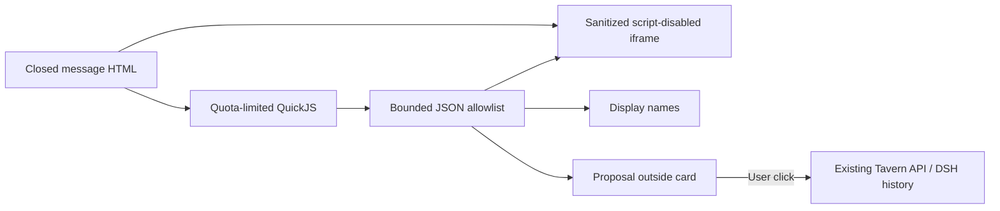
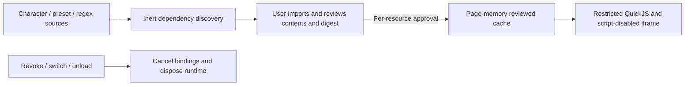

# Math, avatars, message bubbles and restricted interactive cards

[中文](CONVERSATION_PRESENTATION.md) · [Usage](USAGE_en.md) · [API](API_en.md) · [Security](../SECURITY_en.md)

The 2.5.1 contract targets DSH `0.2.0-rc.2`. Public UI services and slots embed Tavern in the Web/desktop document. No separate browser is needed. DSH history remains authoritative; these features store presentation metadata only.

RP displays concrete DSH session/turn errors in place. An active-write-handle error can mean another web or desktop instance holds that session in the shared data directory; finish its work and close that instance before reopening the session. Static message stylesheets and inline styles both use Shadow DOM and an outer paint boundary, preventing fixed-position content from covering the Host UI.

## Math

RP messages, greetings, display edits and static HTML exports share Markdown → KaTeX MathML → DOMPurify. Math is enabled by default without a conversation-settings field or dedicated toggle; DSH source messages, prompts and JSONL remain unchanged. Use `$…$` / `\(…\)` inline and `$$…$$` / `\[…\]` for display math, with multiline delimiters on separate lines. Fractions, roots, integrals, matrices and aligned equations use KaTeX syntax and native browser MathML, without remote fonts or scripts.

Delimiters are recognized in Markdown text. Code, HTML attributes/comments, raw HTML blocks, complete document templates and interactive-card interiors keep their existing semantics. Inline HTML text and Markdown in `<details>` bodies/summaries can contain math. Common prices remain literal, while literal `$x$` requires escaping or code. Markdown emphasis does not consume TeX `*` / `_`; formula styles are scoped to Tavern, and ordinary math does not introduce a shadow root for the whole message. Wide display equations scroll horizontally; streams render closed expressions and unchanged history retains its DOM.

Each formula is limited to 4096 characters, 200 macro expansions and a maximum user-specified size of 10 em. Macros are not shared between formulas; invalid or unsupported TeX falls back to source. KaTeX uses `trust: false` to disable external-resource and HTML extension commands within formulas that require explicit authorization. This setting does not affect ordinary Markdown links, images or existing HTML rendering. Formula output is still sanitized: MathML and text `annotation` are allowed, while `annotation-xml` is forbidden. This is not a full LaTeX document runtime, browser layout still has a resource cost, and a modern MathML-capable browser is required. See [usage](USAGE_en.md#markdown-html-and-template-styles) for escaping and composition rules.

## Avatars

In **DT → User**, upload PNG/JPEG/WebP and save the resource. The browser accepts up to 8 MiB and 8192 pixels per side, center-cropping to 256×256 WebP. The API accepts raster data URIs up to 128 KiB, checking MIME, base64 and image signature; SVG, external URLs and file paths are rejected.

The default user image comes from the user bound to the playthrough root session. The character image uses the bound card's existing PNG endpoint, with a placeholder when absent. Names/descriptions enter prompt assembly; avatars do not.

Message avatars sit beyond the composer's outer edges: character on the left, user on the right, with message bodies and actions in the center. Bubbles shrink to their content and wrap at the center column's maximum width; user bubbles and text align right. Layout follows the Host composer width variable and scopes composer side clearance through public slots to the Session displaying Tavern; leaving the Tavern view restores the Host clearance. Settings previews share the bubble layout and update action sizes from the draft; Apply and save persists the changes.

Click a conversation avatar to upload a replacement for one message or every user/character avatar in this playthrough:


- Single-message user overrides use QA node ID; character overrides use QA node ID + variant ID + output segment index. Greetings use greeting index; imports use import position. Edit streaming messages after settlement.
- Replace-all covers existing and future messages for that role and clears its single-message overrides. The other role is unchanged.
- Restore inheritance deletes only that message override. Restore resource defaults clears all overrides for that role in the playthrough.
- Editing a shared user resource changes all playthroughs inheriting its default image. Editing inside a conversation never changes source resources or another playthrough.
- Ordinary new playthroughs start from resource defaults. A branch into a new playthrough copies the current display metadata, then persists independently. Imported-position overrides remain attached to that position after replacing imported content; reset them if needed.

User JSON imports/exports include optional `avatar`. Overrides use the existing timeline's `ext.pmpDshTavern.appearance`, with `schemaVersion:1`, optional `user`/`assistant`, and `messages`. At most 500 message keys and 512K UTF-16 code units of serialized appearance metadata; the existing 1 MiB timeline limit still applies. Existing workspace revision/CAS writes persist changes atomically without modifying DSH logs. Rejected limits/conflicts preserve the previous file.

## Bubble style v1

Open **DT → Conversation settings**. Choose Soft, Paper or Midnight, or edit colors, radius, spacing and font; preview, then apply. Advanced JSON editing and file import/export are available. Import changes the preview only. One custom style is retained with the global settings; exported files can form a personal style library.

[Complete example](examples/bubble-paper.json):

```json
{
  "format": "tavern-bubble", "version": 1, "name": "Paper",
  "radius": 4, "padding": 20, "borderWidth": 1, "font": "serif",
  "user": {"background":"#f4ecd9","text":"#483923","border":"#d5c6a9"},
  "assistant": {"background":"#fffaf0","text":"#40392d","border":"#ded3bd"}
}
```

Name: 1–80 characters. Colors: six-digit `#RRGGBB`. Integer pixels: radius 0–32, padding 8–24, border 0–3. Font: `sans|serif|mono`. Files are limited to 16 KiB. Unknown fields, versions and invalid values fail explicitly. There are no CSS, HTML, JS, URL or privileged-code fields.

`PUT /v1/conversation-settings` accepts optional `bubbleStyle` (the complete document above) and boolean `interactiveCards`, alongside existing `textScale/actionScale`. Omission restores defaults; DELETE resets everything. The existing `conversation-settings.json` persists global presentation settings without changing DSH native styles.

## Three boundaries and implementation choice

1. **Static content:** Markdown passes DOMPurify, with Shadow DOM and paint containment for styles. Automatic external resources are disabled: images require bounded raster data URIs; srcset/poster and similar attributes are removed. CSS blocks/inline styles containing resource functions (url/image/image-set/src), `@import`, or escapes are dropped entirely. Layout, colors, gradients, variables, media queries and animations work. External links require an explicit user click and use `noopener noreferrer`.
2. **Script execution:** closed `html` fences, unlabelled fences beginning with `<body>`/`<html>`, and complete `<html>…</html>`/`<body>…</body>` documents containing controls/scripts are recognized. Static DOM is presented in an iframe with `sandbox="allow-same-origin"` and no `allow-scripts`. CSP denies connections, external images, scripts, child frames and form submissions. Card JS runs in a separate QuickJS WASM interpreter, never in the iframe or parent browser realm. Neither iframe nor Shadow DOM alone is the full security boundary.
3. **Capabilities:** a bounded JSON bridge permits card-local DOM operations, copied display names, and message proposals. There is no generic RPC, Host API, credential, filesystem, network, parent-page or native eval handle. Modules resolve only from individually reviewed local content maps. Only an explicit click on the Tavern button outside the card sends a proposal through the existing user-message API.

The [versioned DSH sandbox](https://github.com/deepseek-ai/deepseek-harness/blob/dsh-v0.2.0-rc.2/packages/sandbox/sandbox/README.md) isolates subprocesses/files, not browser message JavaScript. The [official desktop forwarder](https://github.com/deepseek-ai/deepseek-harness/blob/dsh-v0.2.0-rc.2/apps/desktop/src/web-document.ts) strips Origin; the [request token](API_en.md#desktop-request-token) handles this difference without disabling webSecurity.

[Tavern Helper documentation](https://n0vi028.github.io/JS-Slash-Runner-Doc/guide/基本用法/渲染器.html) and its [fixed source](https://github.com/N0VI028/JS-Slash-Runner/blob/519599bc68247d8e759cc844a983f8f5252941a8/src/panel/render/Iframe.vue) use srcdoc/blob iframes, injecting public interfaces, external libraries and avatar paths; some helpers bridge to the parent. This implementation borrows the display idea without copying that authority model or claiming full compatibility. A disableable Tavern module reuses existing playthrough/component lifecycles. A separate plugin currently adds cross-plugin lifecycle and permission negotiation without an independent host capability need; reconsider extraction if independently authorized capabilities are added.



## Supported interfaces and limitations

Scripts default off; enable them in conversation settings. Start with the [counter example](examples/interactive-counter.html), placing the file in an `html` fence. Remounting, switching playthroughs or changing source creates a fresh runtime. Ordinary parent rerenders preserve state. Streaming content does not execute scripts, while historical cards retain state during other messages' streaming updates. Card variables are memory-only and reset on refresh/remount.

| Interface | Scope |
| --- | --- |
| `document.body`, `getElementById`, `querySelector`, `querySelectorAll` | Card body only; facade objects, never native DOM handles. Sanitization may remove reserved DOM names |
| Element `textContent`, `innerHTML`, `value`, `checked` | innerHTML is sanitized on every write; inserted scripts never activate |
| `createElement`, `appendChild`, `remove` | Allowlisted HTML; script/iframe/style/img/input creation denied. Existing restricted inputs remain interactive |
| `setAttribute/getAttribute`, `classList`, `style.setProperty` | Attribute writes limited to id/class/title/disabled/aria-label/data-action; CSS remains inside iframe/CSP |
| `addEventListener` | click/input/change; document only supports synchronous DOMContentLoaded. No timers, animation callbacks, network or browser libraries |
| `TavernUI.version`, `getContext()` | v1; role and userName/characterName captured at mount, copied JSON without session IDs or credentials |
| `TavernUI.proposeMessage(text)` | Up to 4000 characters; visible proposal, never automatic sending |

External script sources and ES modules require the individual review described below. Unapproved dependencies and inline on* handlers disable all scripts in the card. External sources, Helper scripts and JSX use a dedicated Worker running QuickJS with linkedom. Fixed official jQuery 3.6.0, React 18.3.1 and Vue 3.5.13 fixtures cover DOM insertion, click events and state changes. This does not establish full browser compatibility: synchronous layout, computedStyle, CSSOM, canvas, parent-page and system APIs remain unavailable. Helper variable writes/world-book/chat/generation APIs are not supplied by this renderer. Missing runtime APIs fail visibly and dispose the runtime; no silent success. Static HTML export does not execute scripts or export in-memory card state.

The table above describes the small inline facade. Its limits per card are 128K UTF-16 code units of source, 8 MiB interpreter heap, 256 KiB stack; each entry has a 60 ms deadline and 500-interrupt ceiling, 1000 bridge operations and 100 Promise jobs. At most 2048 DOM handles and 256 listeners, with height clamped to 100–800 px. Limits produce visible errors. Browser layout/image decoding, WASM engine defects and expensive CSS denial of service are not completely covered by interpreter quotas; this is not an absolute security guarantee. Existing display RegExp backtracking risks remain.

See [TESTING](TESTING_en.md). Maintainer acceptance of the actual official desktop distribution, real character cards and provider integrations remains necessary before using a real profile.

## Interpreter dependency

`quickjs-emscripten-core` and `@jitl/quickjs-singlefile-browser-release-sync` are pinned to `0.31.0`. The browser variant embeds WASM in the client bundle (embedded in the generated client bundle), with no CDN or external script loader. MIT notices for the wrapper and engine are included in the generated bundle and [source notices](../packages/presentation/THIRD_PARTY_NOTICES.txt). The small inline interpreter initializes lazily; external cards each own a terminable Worker and runtime. The Worker bundles linkedom 0.18.12 and a separate QuickJS context containing fixed @babel/standalone 7.26.10. JSX uses only the React preset with no card-supplied compiler plugins. Acorn 8.15.0 with acorn-jsx 5.3.2 parses dependencies. Additional notices are in [virtual DOM notices](../packages/presentation/VIRTUAL_DOM_NOTICES.txt). Dependency upgrades require the quota and isolation regression tests. [Upstream release](https://github.com/justjake/quickjs-emscripten/releases/tag/v0.31.0).

The style toolbar has Import JSON, Export JSON and Create style at the top. Body font size is part of the previewed style (`fontSize`, optional integer 8–48 px), controlled by a slider or numeric input and saved with Apply. Older v1 files without the field remain accepted and inherit the legacy text scale; the editor converts it to pixels when applying. Unsupported-script notices are localized and deduplicated by cause (external files, modules, other script types or inline event attributes). The master script toggle does not replace per-source approval.


## Unified settings and external source review

**DT → Conversation settings** contains Appearance, Regex replacements and External code tabs. Tab switches preserve style and regex drafts; closing, Escape and menu navigation check unsaved changes. A binding change retains the old regex draft but disables saving; export it or discard it and reload. The separate regex menu is consolidated here.

Discovery accepts character/preset `extensions.tavern_helper` as `{scripts,variables}` or legacy key-value pair arrays, including direct scripts, type/value entries and nested scripts/children. It reads scripts only; MVU owns variable semantics. Greetings, alternate greetings and global/preset/character regex replacements contribute script src, ES import/export/import() and literal `.load()` dependencies, with resource/field provenance. JavaScript dependency discovery uses an AST: multiline import/export and literal dynamic import are recognized; comments and strings do not create dependencies. Computed dynamic imports and syntax failures block the graph with a visible reason.

1. No remote code is downloaded automatically and no Host proxy is added. The trusted settings page can download an explicit URL using browser CORS, omitted credentials, rejected redirects and no-referrer, with a 8 MiB streaming limit and 15-second timeout. Cancel/switch aborts reading. Download only stages review and never executes content; CORS failures retain local-file import. External references require HTTPS public-form addresses without credentials or non-default ports. HTTP, local names, IP literals and relative references without a base are blocked. The local cache makes no DNS or network requests. This is URL syntax validation: browser fetching cannot verify whether DNS resolves to a private address and does not establish a public-only network guarantee.
2. Download or import a source file for the URL, or stage inline Helper text. Review its complete contents and SHA-256. Import alone never authorizes execution.
3. Click **Content reviewed: allow restricted execution**. Approval binds resource identity, exact URL/field and content digest. Replacing content revokes approval. The hash pins the reviewed bytes; it does not authenticate the author claimed by the URL.
4. Import/review nested dependencies individually. A narrow `$('body').load('https://…')` or jQuery wrapper reads reviewed HTML without a request. Relative scripts/modules resolve against its original URL. Request parameters, callbacks, selector suffixes and nested load wrappers are unsupported, as are other network APIs.
5. Revocation, replacement, disabling, session/variant switches and disposal cancel bindings and destroy runtimes/subscriptions. Cache and approvals live only in page memory and clear on reload/plugin disposal; they are never restored from cards, workspace files or localStorage. Blocked cards show static content and a reason. “Content approved” is not an execution success claim; errors appear outside the card.



Reviewed assets are limited to 8 MiB, the cache to 64 entries / 64 MiB, and a graph to 24 URLs / 24M UTF-16 code units / eight module levels. Each owner must approve the entire transitive closure; identical URLs with different reviewed content are rejected. HTML remains limited to 128K input characters (1 MiB resolved HTML). Cards cannot access cache management. Helper scripts run before HTML scripts in their card, with no standalone background task or claim that arbitrary MVU bundles are compatible.

External Workers allow four concurrent cards, each with a 192 MiB interpreter heap and 1 MiB stack (768 MiB aggregate interpreter cap, excluding browser/Worker overhead). Initialization has a 15-second outer watchdog, individual initial evaluations 2 seconds, later entries 120 ms and a 1.5-second outer response watchdog. Limits include 200 Promise jobs per entry, 10,000 bridge calls, 128 timers, 8,192 DOM nodes, 1 MiB output, 256 outbound messages/second and 128 input events/second. Timers run at 16–60,000 ms; animation callbacks use timers rather than a native layout clock. The display iframe has no script permission and a network-denying CSP. Third-party code receives only virtual DOM objects inside QuickJS, never native Worker/browser handles.

Click/input/change/key/pointer events are copied into virtual events; output is sanitized before display. Focus, selection and scroll are restored across snapshots. This is not a full DOM diff or synchronous layout bridge. Missing APIs fail visibly; zero-valued geometry is not fabricated. Runtime evidence outside the card records source hashes, fixed compiler version, JSX input/output hashes, cold-start time and a sampled heap snapshot (not a measurement of peak process memory).

| Extension interface | Supported subset |
| --- | --- |
| `$` / `jQuery` | Card-local selection, ready callbacks, text/html/val/on; independent implementation, no AJAX, plugins or native DOM handles |
| `TavernUI.getVariables(options?)` / `getVariables` | No options or `{type:'message'}`; returns the entire variables object including stat_data/schema/display_data/delta_data and MVU-defined fields, as a read-only JSON copy |
| `getAllVariables()` | The same bound message snapshot, without invented global/chat merging |
| `TavernUI.onVariables(callback)` | Returns an unsubscribe function; committed `{version,scope,revision,variables,status}` snapshots, at most 64 subscriptions; not an upstream mutable before-update event |

Trusted historical playthrough/session/node/variant/endEventId coordinates (plus existing format version) bind variables and are revalidated by the service. Script options cannot select another scope. Greetings, imports and streaming messages without verifiable historical coordinates receive no binding. Unavailable MVU reads fail explicitly and never fall back to the focused session. MVU owns read-only polling and commit semantics; cards receive no write operation. Sending proposals still requires confirmation outside the card, independently of model tool permissions.
