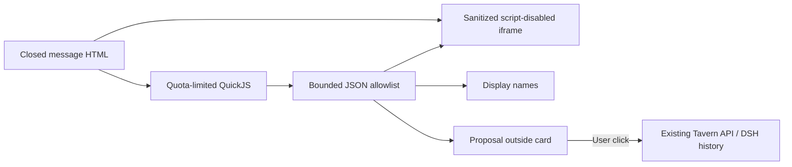

# Avatars, message bubbles and restricted interactive cards

[中文](CONVERSATION_PRESENTATION.md) · [Usage](USAGE_en.md) · [API](API_en.md) · [Security](../SECURITY_en.md)

The 2.5.0 contract targets DSH `0.2.0-rc.2`. Public UI services and slots embed Tavern in the Web/desktop document. No separate browser is needed. DSH history remains authoritative; these features store presentation metadata only.

RP displays concrete DSH session/turn errors in place. An active-write-handle error can mean another web or desktop instance holds that session in the shared data directory; finish its work and close that instance before reopening the session. Static message stylesheets and inline styles both use Shadow DOM and an outer paint boundary, preventing fixed-position content from covering the Host UI.

## Avatars

In **DT → User**, upload PNG/JPEG/WebP and save the resource. The browser accepts up to 8 MiB and 8192 pixels per side, center-cropping to 256×256 WebP. The API accepts raster data URIs up to 128 KiB, checking MIME, base64 and image signature; SVG, external URLs and file paths are rejected.

The default user image comes from the user bound to the playthrough root session. The character image uses the bound card's existing PNG endpoint, with a placeholder when absent. Names/descriptions enter prompt assembly; avatars do not.

Message avatars sit beyond the composer's outer edges: character on the left, user on the right, with message bodies and actions in the center. Bubbles shrink to their content and wrap at the center column's maximum width; user bubbles and text align right. Layout follows the Host composer width variable and scopes composer side clearance through public slots to the Session displaying Tavern; leaving the Tavern view restores the Host clearance. Settings previews share the bubble layout and update action sizes from the draft; Apply and save persists the changes.

Click a conversation avatar to upload a replacement for one message or every user/character avatar in this playthrough:


- Single-message user overrides use QA node ID; character overrides use QA node ID + variant ID + output segment index. Greetings use greeting index; imports use import position. Edit streaming messages after settlement.
- Replace-all covers existing and future messages for that role and clears its single-message overrides. The other role is unchanged.
- Restore inheritance deletes only that message override. Restore resource defaults clears all overrides for that role in the playthrough.
- Editing a shared user resource changes all playthroughs inheriting its default image. Editing inside a conversation never changes source resources or another playthrough.
- Ordinary new playthroughs start from resource defaults. A branch into a new playthrough copies the current display metadata, then persists independently. Imported-position overrides remain attached to that position after replacing imported content; reset them if needed.

User JSON imports/exports include optional `avatar`. Overrides use the existing timeline's `ext.pmpDshTavern.appearance`, with `schemaVersion:1`, optional `user`/`assistant`, and `messages`. At most 500 message keys and 512K UTF-16 code units of serialized appearance metadata; the existing 1 MiB timeline limit still applies. Existing workspace revision/CAS writes persist changes atomically without modifying DSH logs. Rejected limits/conflicts preserve the previous file.

## Bubble style v1

Open **DT → Conversation settings**. Choose Soft, Paper or Midnight, or edit colors, radius, spacing and font; preview, then apply. Advanced JSON editing and file import/export are available. Import changes the preview only. One custom style is retained with the global settings; exported files can form a personal style library.

[Complete example](examples/bubble-paper.json):

```json
{
  "format": "tavern-bubble", "version": 1, "name": "Paper",
  "radius": 4, "padding": 20, "borderWidth": 1, "font": "serif",
  "user": {"background":"#f4ecd9","text":"#483923","border":"#d5c6a9"},
  "assistant": {"background":"#fffaf0","text":"#40392d","border":"#ded3bd"}
}
```

Name: 1–80 characters. Colors: six-digit `#RRGGBB`. Integer pixels: radius 0–32, padding 8–24, border 0–3. Font: `sans|serif|mono`. Files are limited to 16 KiB. Unknown fields, versions and invalid values fail explicitly. There are no CSS, HTML, JS, URL or privileged-code fields.

`PUT /v1/conversation-settings` accepts optional `bubbleStyle` (the complete document above) and boolean `interactiveCards`, alongside existing `textScale/actionScale`. Omission restores defaults; DELETE resets everything. The existing `conversation-settings.json` persists global presentation settings without changing DSH native styles.

## Three boundaries and implementation choice

1. **Static content:** Markdown passes DOMPurify, with Shadow DOM and paint containment for styles. Automatic external resources are disabled: images require bounded raster data URIs; srcset/poster and similar attributes are removed. CSS blocks/inline styles containing resource functions (url/image/image-set/src), `@import`, or escapes are dropped entirely. Layout, colors, gradients, variables, media queries and animations work. External links require an explicit user click and use `noopener noreferrer`.
2. **Script execution:** only closed `html` fences or complete `<html>…</html>` documents containing scripts/controls are recognized. Static DOM is presented in an iframe with `sandbox="allow-same-origin"` and no `allow-scripts`. CSP denies connections, external images, scripts, child frames and form submissions. Card JS runs in a separate QuickJS WASM interpreter, never in the iframe or parent browser realm. Neither iframe nor Shadow DOM alone is the full security boundary.
3. **Capabilities:** a bounded JSON bridge permits card-local DOM operations, copied display names, and message proposals. There is no generic RPC, Host API, credential, filesystem, network, parent-page, module-loading or native eval handle. Only an explicit click on the Tavern button outside the card sends a proposal through the existing user-message API.

The [versioned DSH sandbox](https://github.com/deepseek-ai/deepseek-harness/blob/dsh-v0.2.0-rc.2/packages/sandbox/sandbox/README.md) isolates subprocesses/files, not browser message JavaScript. The [official desktop forwarder](https://github.com/deepseek-ai/deepseek-harness/blob/dsh-v0.2.0-rc.2/apps/desktop/src/web-document.ts) strips Origin; the [request token](API_en.md#desktop-request-token) handles this difference without disabling webSecurity.

[Tavern Helper documentation](https://n0vi028.github.io/JS-Slash-Runner-Doc/guide/基本用法/渲染器.html) and its [fixed source](https://github.com/N0VI028/JS-Slash-Runner/blob/519599bc68247d8e759cc844a983f8f5252941a8/src/panel/render/Iframe.vue) use srcdoc/blob iframes, injecting public interfaces, external libraries and avatar paths; some helpers bridge to the parent. This implementation borrows the display idea without copying that authority model or claiming full compatibility. A disableable Tavern module reuses existing playthrough/component lifecycles. A separate plugin currently adds cross-plugin lifecycle and permission negotiation without an independent host capability need; reconsider extraction if independently authorized capabilities are added.



## Supported interfaces and limitations

Scripts default off; enable them in conversation settings. Start with the [counter example](examples/interactive-counter.html), placing the file in an `html` fence. Remounting, switching playthroughs or changing source creates a fresh runtime. Ordinary parent rerenders preserve state. Streaming content does not execute scripts, while historical cards retain state during other messages' streaming updates. Card variables are memory-only and reset on refresh/remount.

| Interface | Scope |
| --- | --- |
| `document.body`, `getElementById`, `querySelector`, `querySelectorAll` | Card body only; facade objects, never native DOM handles. Sanitization may remove reserved DOM names |
| Element `textContent`, `innerHTML`, `value`, `checked` | innerHTML is sanitized on every write; inserted scripts never activate |
| `createElement`, `appendChild`, `remove` | Allowlisted HTML; script/iframe/style/img/input creation denied. Existing restricted inputs remain interactive |
| `setAttribute/getAttribute`, `classList`, `style.setProperty` | Attribute writes limited to id/class/title/disabled/aria-label/data-action; CSS remains inside iframe/CSP |
| `addEventListener` | click/input/change; document only supports synchronous DOMContentLoaded. No timers, animation callbacks, network or browser libraries |
| `TavernUI.version`, `getContext()` | v1; role and userName/characterName captured at mount, copied JSON without session IDs or credentials |
| `TavernUI.proposeMessage(text)` | Up to 4000 characters; visible proposal, never automatic sending |

External script sources, modules, inline on* handlers, jQuery/Vue/React, Tavern Helper variable/world-book/chat/generation APIs, MVU, parent-page and system APIs are unsupported. External scripts/modules/on* attributes report errors and disable all scripts in that card. Missing runtime APIs fail visibly and dispose the runtime; no silent success. Static HTML export does not execute scripts or export in-memory card state.

Limits per card: 128K UTF-16 code units of source, 8 MiB interpreter heap, 256 KiB stack; each entry has a 60 ms deadline and 500-interrupt ceiling, 1000 bridge operations and 100 Promise jobs. At most 2048 DOM handles and 256 listeners, with height clamped to 100–800 px. Limits produce visible errors. Browser layout/image decoding, WASM engine defects and expensive CSS denial of service are not completely covered by interpreter quotas; this is not an absolute security guarantee. Existing display RegExp backtracking risks remain.

See [TESTING](TESTING_en.md). Maintainer acceptance of the actual official desktop distribution, real character cards and provider integrations remains necessary before using a real profile.

## Interpreter dependency

`quickjs-emscripten-core` and `@jitl/quickjs-singlefile-browser-release-sync` are pinned to `0.31.0`. The browser variant embeds WASM in the client bundle (about 1.6 MiB unminified overall), with no CDN or external script loader. MIT notices for the wrapper and engine are included in the generated bundle and [source notices](../packages/presentation/THIRD_PARTY_NOTICES.txt). Interpreter initialization is lazy and shared; each card receives a separate runtime. Dependency upgrades require the quota and isolation regression tests. [Upstream release](https://github.com/justjake/quickjs-emscripten/releases/tag/v0.31.0).

The style toolbar has Import JSON, Export JSON and Create style at the top. Body font size is part of the previewed style (`fontSize`, optional integer 8–48 px), controlled by a slider or numeric input and saved with Apply. Older v1 files without the field remain accepted and inherit the legacy text scale; the editor converts it to pixels when applying. Unsupported-script notices are localized and deduplicated by cause (external files, modules, other script types or inline event attributes). Enabling scripts does not enable those capabilities.
