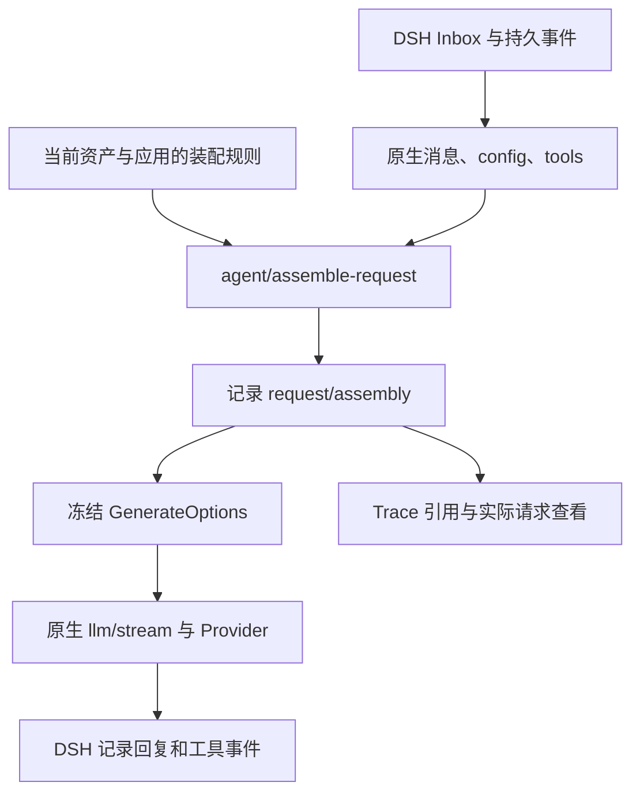

# 提示词装配策略

[English](REQUEST_ASSEMBLY_en.md)

请求装配器在 DSH 原生消息已经准备好、请求冻结之前，排列原生输入与 Tavern 资源。Provider、工具执行、Inbox、会话分支和原生历史仍由 DSH 管理。装配策略按会话及前端模式保存：魔丸默认启用 ST 兼容，灵珠默认关闭。已有显式选择保留；关闭时使用 DSH 默认装配，不再通过旧 loader 重复注入 Tavern 正文。未安装核心扩展的原生模式仍兼容旧 loader。

## 页面与预设

悬浮球菜单的「提示词装配策略」打开完整设置页。页面按导入/导出/创建、选择、保存、应用、预览、规则列表排列。浏览和保存不改变会话；应用会保存独立的规则快照。后续编辑资源预设需再次应用，运行中的会话拒绝切换。子会话继承父会话的应用快照。

通用规则控制官方基础指令、预设正文、角色、用户、世界书、原生历史、本步输入、PHI 和任意自定义内容。可拖拽整个模块调整顺序；桌面端卡片摘要显示稳定性、保留方式和消息角色，手机端在展开详情后查看；原生模块可以独立关闭，但不改写其角色；关闭只排除后续请求中的相应内容，不删除持久历史。全部关闭并添加自定义内容，即可让同一会话每次请求使用全新输入。工具调用和结果仍需完整。展开预览显示应用资产后的实际节点、引用锁定和消息顺序。实际请求按钮读取最近的已记录请求，不重新求值宏。

左侧色条按插件身份区分（DSH、DSH Tavern、其他明确提供身份的插件），同一插件的资源使用同色；展开项显示资源标识、稳定性、保留方式、插件依赖和卸载后的行为。DSH 原生模块保留原始 source；官方 section 名称不等于贡献插件的身份，未提供身份时不猜测。

| 内置预设 | 行为与取舍 |
| --- | --- |
| ST 兼容 | 使用已支持的 marker、角色和深度；引用占用位置并锁定，减少默认模块重复注入 |
| 缓存友好 | 稳定资产在前，历史与本步输入随后，当前世界书与 PHI 在后；实际缓存命中仍取决于 provider |
| 追加快照 | 世界书变化时保留新快照，旧快照固定在最初的历史锚点；内容消失时追加失效说明 |

ST 兼容不等于运行完整 SillyTavern。支持 character/persona/world-info/history marker，`description`、`personality`、`scenario`、`mesexamples`、`persona`、`user`、`char`、最近消息、变量与现有随机宏；内容中的 `chatHistory/history/input/worldInfoBefore/worldInfoAfter/worldInfo` 引用可占用原生模块。未支持的宏/marker、世界书 outlet 与近似位置显示诊断。对话示例保留文本，不模拟 ST 的完整示例消息解析、token 裁剪或第三方脚本宏。

深度 0 表示请求末尾，正数从原生非 system 消息末尾计数；工具调用和对应结果不可拆开，落入中间的位置向后调整并记录原因。拖动历史/输入是移动完整模块，不重写其内部次序。非法工具拓扑会阻止发送。

内置默认策略为 ST 兼容，不能改名或删除；编辑内置规则后保存会创建副本。「应用默认装配策略」同时应用并选中 ST 兼容，未保存的修改会先提醒。悬浮球只显示当前策略名称和绑定绿灯；点击进入设置页后选择、关闭或应用策略。预览及实际请求按钮与通用规则并排。

PHI 可来自角色卡的后置指令字段、预设的 Post-History Instructions / jailbreak，以及策略 PHI 模块展开后的追加文本。前两者在对应资产编辑器修改，追加文本只属于该策略。预览优先显示资产条目名称及已知字段的中文名，原始标识仍在展开详情中。

## 生命周期与可解释性



「仅本次请求」每次求值；「追加快照」在同一规则节点内容变化时新增，后续请求沿原锚点复用。快照包括每条规则/世界书条目的身份，深度规则同样遵守保留方式。更换为请求型规则或关闭模块后，旧快照不再进入后续请求；记录仍保留。若历史裁剪删除了锚点，该快照不再插入并产生诊断。

所有实际装配结果作为 log-only `request/assembly` 事件进入 DSH 日志。它们不是 `deriveMessages()` 的消息节点；记录轨迹与进入未来模型上下文是两回事。Tavern Trace 只存事件引用与哈希，正文按需从 DSH 读取。随机宏冻结在该事件中，查看历史不会重新运行宏。每次请求都会记录完整消息快照，因此日志体积随请求历史增长；额外装配正文受现有 `maxProfileBytes` 限制。

卸载 Tavern 后，原生用户消息、回复和工具结果仍可继续使用；请求型正文和 Tavern 保留快照不再注入。已记录的正文仍存在日志中。恢复官方核心时，`request/assembly` 的 `ignorable:true` 使其可被旧解析器保留但不参与投影。仅移除核心扩展、却保留已应用的装配规则时会明确报错；先关闭策略即可继续。

预览只使用当前资产与可读持久历史，不含未发送输入。官方基础指令重新调用当前官方装配流程生成，不复用混有旧 loader 正文的历史 system；世界书命中也可能与下一步实际输入不同。实际请求是冻结结果的权威证据。

## 核心扩展和安装边界

官方 DSH `0.2.0-rc.2` 没有此请求装配接口。`scripts/prepare-request-assembly.mjs` 从固定 rc.2 核心源码（脚本内以两份源码树 SHA-256 校验） 生成独立核心构建；不修改源码 checkout 或任何安装目录，不适用于其他版本。

此功能位于本地候选分支 `codex/prompt-assembler`，已发布的 `v2.5.1` tag 不含装配器。请使用维护者提供的候选源码/工作树，不假设远端已有该分支。在包含此文档和准备脚本的候选目录执行下列命令，再把根包安装到隔离 profile；稳定版 tag 的安装步骤不会获得新界面。

```sh
npm ci
npm run build
node scripts/prepare-request-assembly.mjs /path/to/dsh-source /path/to/prepared-core
node scripts/install.mjs --dsh-home /path/to/test-home --profile web --skip-build
```

输出含 `session/src`、`agent-loop/src` 的可审源码、各自 `lib/index.js` 与 `lib/invariant.js`、source maps 和 `receipt.json`。在停止的隔离 DSH rc.2 测试运行时中，备份 `@deepseek-ai/dsh-session/lib` 和 `@deepseek-ai/dsh-agent-loop/lib`，将两个输出 `lib/` 中的构建文件复制到对应包后重启。只替换这两个包，Provider 包无需修改；回滚时恢复两个备份。此构建流程目前产出运行时 JS，不发布上游 npm 包或替换其声明文件。其他插件若需要类型声明，应在 DSH 源码构建中合入输出的 `request-assembly.ts` 与事件声明。

新接口 `agent/assemble-request(payload,next)` 使用 Cordis waterfall；payload 含 `agent/turn/step/messages/tools/config/signal`，结果为 `{messages,metadata}`，metadata 为 JSON。无监听器时透传原生消息。核心先持久化结果再冻结、发送，配套 invariant 同时验证消息快照与原生 config/tools。`agentLoop.requestAssemblyVersion === 1` 是明确的能力探测。

## HTTP 原语

前缀 `/pmp-dsh-tavern/api/v1/assembly-presets`，复用现有 Host 认证、同源和 desktop 安全边界。请求体上限 2 MiB。

| 方法与路径 | 输入/输出 |
| --- | --- |
| `GET /?sessionId=…` | 内置/用户预设、已应用快照、核心 capability |
| `POST /` | 导入或创建独立预设 |
| `GET/PUT/DELETE /:id` | 读取、编辑、删除；内置只读，应用中的预设不可删除 |
| `PUT /selection` | `{sessionId,id}`；`id:null` 关闭当前模式下的策略（扩展核心使用 DSH 默认装配）；`id:"builtin-st"` 应用默认 ST 策略 |
| `POST /preview` | `{sessionId,preset}` 或 `{sessionId,presetId}`，不应用、不运行 Agent |

导出直接序列化预设 JSON；预设格式 `dsh-tavern-request-assembly`、version 1，每条 rule 有 `id/kind/enabled/role/lifetime/depth/text/name`。不接受任意可执行脚本。`assembly-presets.json` 原子持久化，包含用户预设和应用快照，上限 8 MiB。实际请求复用 v3 assemblies detail 的 `requestAssembly`，没有第二套历史查询接口。


## 统一内容来源 API（协议 1）

Host 服务 `tavernRequestSources` 提供 `version`、`register(definition)` 和 `list()`。包入口为 `pmp-dsh-tavern/request-assembler`，附带 TypeScript 声明。原生指令、历史、本步输入、预设、角色、用户、世界书、PHI、自定义文本全部通过相同的 `register` 注册；引擎不按这些来源名称分发特殊装配路径。旧规则的 `kind` 保留为来源 ID，外部来源使用自己的命名空间，例如 `example.memory/recalled`。

插件注册只是声明可选来源，不会自动修改用户策略或启用内容。设置页的「添加内容来源」读取同一目录；名称、颜色、稳定性、角色、保留方式和深度限制均来自注册描述。缺失插件的规则可以导入和保存，显示缺失状态；实际请求跳过其内容及旧保留快照，并记录 `ASSEMBLY_SOURCE_UNAVAILABLE`。插件返回错误或非法内容会使本次装配失败，不发送半成品。无关、未启用且未被依赖的来源不会解析。

```js
import { ASSEMBLY_SERVICE } from 'pmp-dsh-tavern/request-assembler'
export const inject = [ASSEMBLY_SERVICE, 'myMemoryStore']
export function apply(ctx) {
  const sources = ctx.get(ASSEMBLY_SERVICE)
  if (!sources || sources.version !== 1) throw new Error('Unsupported source protocol')
  ctx.effect(() => sources.register({
    id: 'example.memory/recalled',
    pluginId: 'example.memory',
    name: '检索记忆',
    stability: 'conversation',
    async resolve(context) {
      // 插件拥有存储；装配阶段只读。预览也调用这里，不得触发记忆写入。
      const rows = await ctx.get('myMemoryStore').search({
        sessionId: context.sessionId,
        messages: context.nativeMessages,
        inputIds: context.inputIds,
        signal: context.signal,
      })
      return { blocks: rows.map(row => ({
        type: 'text', id: row.id, name: row.title, text: row.text,
        role: 'system', source: { resourceId: row.id, field: 'text' },
      })) }
    },
  }))
}
```

示例中的 `myMemoryStore` 是接入方自己的服务，不由 Tavern 提供。`ctx.effect` 负责随插件卸载注销；已开始的请求固定使用当时的注册集合。插件 ID 是提供方声明的来源身份，不是安全隔离或签名认证。

`resolve(context, rule)` 可以同步或异步，必须只读，并响应/传递 `signal`。上下文为分离且深冻结的数据：`sessionId`、`turn`、`step`、`preview`、`preset`、`assets`、`nativeMessages`、`inputIds`；不暴露可写 Agent/会话对象。预览的 turn/step 为 null，不含未发送输入。`assets` 是当前 Tavern 资产快照（preset、character、user、characterSelection、loreEntries、officialSections 及诊断）；它不是历史来源原文查询接口。宏上下文只包含公开字符串值。来源可自行读取自己的状态，但 MVU 更新、记忆写入和分支状态维护应跟随原生持久事件，不能在解析或预览中提交。

描述字段：`id/pluginId/name` 必填；`version` 默认 1，`stability` 默认 conversation；`dependencies` 声明解析与引用所需来源，循环依赖拒绝；`multiple` 默认 false；`roles` 默认 preserve/system/user/assistant，`lifetimes` 默认 request/snapshot，`depth` 默认 true。原生来源使用 preserve/request 且禁用深度，预设来源只允许 request；这些限制也通过公开描述声明。规则结构校验与来源能力校验分开：可以保存缺失来源，但装配时必须满足已注册来源的能力。

返回 `{blocks, macros?, diagnostics?}`。单个来源输出上限 8 MiB、10,000 个内容块，最终额外输入仍受 `maxProfileBytes` 限制。块 ID 在本来源的一条规则内必须稳定且唯一：

| 块类型 | 字段与用途 |
| --- | --- |
| `text` | `id/text` 必填；可附 name、role、stability、source.resourceId/field；正文使用统一宏展开、角色、深度和保留流程 |
| `native` | `id/messageIds` 引用本次原生消息，不复制或重写工具事务；原生来源也使用此类型 |
| `reference` | `id/sourceId`，可用 blockIds 或 group 筛选；占据引用位置并锁定，避免目标回退块重复；被引用来源须在 dependencies 中声明 |

`macros` 将宏名映射到本来源的 text 块 ID（如 `{recalled:'memory'}`）；使用 `{{recalled}}` 会生成来源子项并抑制原位置的回退块。重复宏名拒绝。块的 `referenceOnly:true` 表示只供引用，不独立输出。reference 默认遵守目标启用状态、保留目标规则；`honorEnabled:false` 允许显式资产引用，`useOwnerRule:true` 使用引用方规则，`lock:false` 可声明无需锁定。`claims:[{sourceId,blockId}]` 表示正文已包含/覆盖某个字段，`targetSourceId` 将正文送到已启用的目标模块位置；ST 的角色覆盖、PHI 与 marker 也使用这些公共原语。跨来源引用与宏会在列表放置之前确定，工具拓扑在最终输出统一校验。

预览与实际请求都调用同一个来源注册表及装配引擎，不依赖 HTTP 回调执行动态插件。当前规则与来源目录通过既有 `GET /assembly-presets?sessionId=…` 返回（新增 `sources` 和 `sourceProtocolVersion`）；v3 capabilities 分别报告 `composerRegistry`、`sourceProtocolVersion`、`requestAssembly` 与 `arbitraryMessageDepth`，后两项取决于核心扩展。实际请求元数据保留来源描述和上游装配 metadata，历史查看不重新解析插件。

### 触发范围与旧 loader 迁移

钩子在 Agent 每次构建请求时执行：初次发送、工具后续步骤、运行中追加输入、子代理完成通知唤醒后的请求，以及同一宿主内子 Agent 的请求。子会话按 parentSession 继承应用快照。重试也可能再次装配；解析器不可假定每轮只运行一次。已冻结的请求不会被中途修改。直接调用 `llm.stream` 的标题等辅助任务不经过 Agent 钩子；其他进程/远端 provider 运行的子代理，只有其宿主同样安装扩展和插件才受此策略控制。

保留原来的资源 CRUD、selection 和 `/active` 作为兼容接口；`/active` 仍是资产/配置摘要，不代表最终请求。旧 loader 在新版路径只做资产解析、世界书激活及参数适配，正文通过注册来源进入统一装配。旧的 `compileTavernProfile`/`compilePresetForDsh` 导出保留作兼容工具；它们不是动态来源接入口，未安装核心扩展时的旧 loader 回退不具备新版策略能力。第三方应使用上述来源 API，不依赖 `store.requestAssembler` 等内部对象。

## 验证

```sh
node --test test/request-assembler.test.mjs test/request-assembly-api.test.mjs
DSH_TAVERN_ASSEMBLY_CORE_ROOT=/path/to/extended-runtime node --test test/request-assembly-host.test.mjs
npm run check
npm run verify:2.0
```

Host 检查验证三轮发送、请求冻结、durable 快照、Trace 引用恢复及卸载后的原生会话。完整 UI、真实 provider 与旧数据验收使用隔离副本；凭据、正文、截图及运行证据仅留在 `.local/`。
