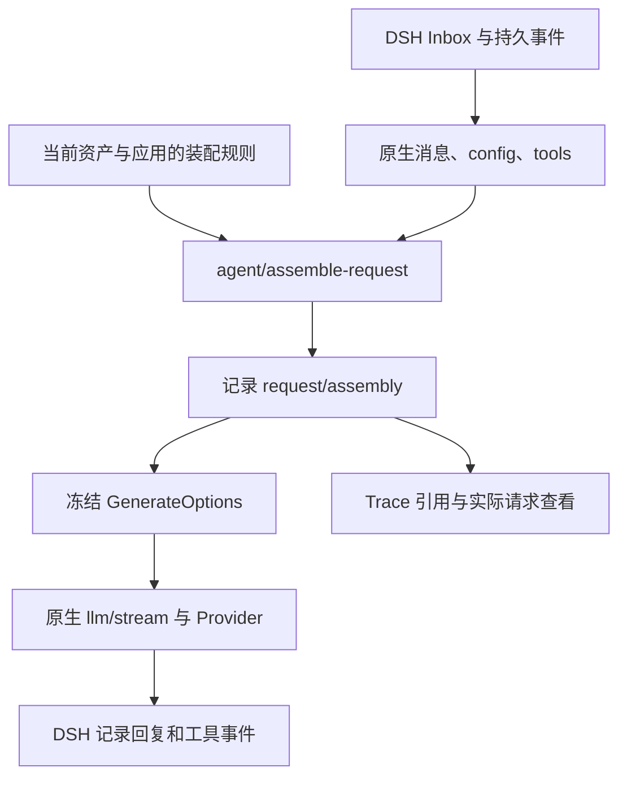

# 提示词装配策略

[English](REQUEST_ASSEMBLY_en.md)

标准版新增“预设身份优先”和“预设插槽优先”。前者保留预设条目的 system/user，按原生投递区域排序；后者识别历史/输入引用，将历史前内容适配为 system、历史后内容适配为 user，通过 pre-step 夹住历史或本步输入。预览逐条标注角色调整，没有引用时退回身份优先。user 贡献会进入历史；原生块内部顺序保持不变。选择策略后需显式应用，既有会话不自动迁移。详见 [Assembler 后端规则](https://github.com/Player-MINEPIG/dsh-prompt-assembler/blob/main/docs/BACKENDS.md)。

标准 assembler 通过 stock rc.2 的公开 sections/context/pre-step 接口工作，Tavern 正常依赖它；Manager 可选。可选 core addon 保留已验证的协议 1 进阶后端。两种后端共享策略、来源与 UI，旧策略缺 backend 仍为 core。明确 session 选择（含 null）不随灵珠/魔丸视图变化；独立新会话无默认，新 Tavern 开场默认标准预设插槽优先，安装 addon 不改变默认方案。

## 标准策略

标准模式保留历史→本步输入，不允许关闭两者或重排块内对话。官方基础指令可在当前 system 内容中关闭/排序；预设、用户设定、角色、世界书和 PHI 可作为历史前 system，或在历史后作为 user。system 更新仍由 DSH 的 head/in-history 路由处理，不任意移动。

user context 在本步输入后，变化时写原生快照；user pre-step 可在输入前/后，在实际步骤写消息。输入后为 context→pre-step，相同区域内可排序；相反布局明确拒绝。两者都进入历史，关闭来源停止新增，旧正文保留。标准版没有任意 depth/assistant/进阶 snapshot，不静默转换旧策略。

Tavern 提供以下互有区别的参考方案，编辑后可另存为自己的策略：

| 内置策略 | 效果 |
| --- | --- |
| 预设插槽优先（标准） `builtin-native-slots` | RP 默认。按预设插槽安排引用内容，身份适配原生历史/输入边界；无插槽时按身份回退。 |
| 身份优先（标准） `builtin-native-roles` | 保留预设与世界书的条目身份；在合法投递区域内按预设插槽、条目顺序、模块顺序排列。 |
| 预设插槽优先（进阶） `builtin-st` | 保留支持的预设插槽、原角色与消息级深度；要求 core addon，仍受模型能力约束。 |

拖拽的位置作为自定义定位，始终覆盖自动规则；点击“跟随资源位置”恢复自动定位。自动优先级默认是预设插槽→资源原位置→默认顺序，可拖动调整。允许按位置适配时，手动后置的内容先定位，再转换为对应身份和投递位置。配置页自动同步可确定的位置，分散或空类别保留配置顺序。内置目录不再单列 PHI 后置、世界书与 PHI 后置或追加快照；位置与保留方式仍可自行配置。旧“ST 风格（原生）”也已撤出，避免将统一 system 误称为 ST。

小贴士：如果模型出现掉格式、不遵循指令等问题，可以尝试将相关的格式要求或行为指令后置，并通过装配结果确认实际位置。

新 RP 会话与“应用默认装配策略”使用标准插槽方案，即使安装了进阶 addon 也不自动切换。已应用的旧内置快照、自定义策略和关闭状态不会被替换；旧四项优先级读取时移除用户排列项，保留三条自动规则的相对顺序，已有手动位置也采用自定义覆盖语义；重新选择并应用才采用新定义。独立 DSH 会话没有隐式 RP 策略。

末尾 user 提醒的角色优先级仍是 user；缓存和遵循效果取决于模型。标准版 Trace 核对 DSH 持久 system/context 引用，不创建 request/assembly 或另一套历史。完整冻结请求按钮仅展示进阶记录，标准模式明确说明证据范围。

## 进阶策略合同

以下 ST slot、depth、request/snapshot 与完整 system 投影属于显式 core addon 路径；缺 addon 或协议 1 时应用返回 409。标准策略遵循上一节边界。

## 页面与预设

悬浮球菜单的「提示词装配策略」打开完整设置页。页面按导入/导出/创建、选择、保存、应用、预览、规则列表排列。浏览和保存不改变会话；应用会保存独立的规则快照。后续编辑资源预设需再次应用，运行中的会话拒绝切换。子会话继承父会话的应用快照。

通用规则控制官方基础指令、预设正文、角色、用户、世界书、原生历史、本步输入、PHI 和任意自定义内容。可拖拽整个模块调整顺序；桌面端卡片摘要显示稳定性、保留方式和消息角色，手机端在展开详情后查看；原生模块可以独立关闭，但不改写其角色；关闭只排除后续请求中的相应内容，不删除持久历史。全部关闭并添加自定义内容，即可让同一会话每次请求使用全新输入。工具调用和结果仍需完整。展开预览显示应用资产后的实际节点、引用锁定和消息顺序。实际请求按钮读取最近的已记录请求，不重新求值宏。

左侧色条按插件身份区分（DSH、DSH Tavern、其他明确提供身份的插件），同一插件的资源使用同色；展开项显示资源标识、稳定性、保留方式、插件依赖和卸载后的行为。DSH 原生模块保留原始 source；官方 section 名称不等于贡献插件的身份，未提供身份时不猜测。


ST 兼容不等于运行完整 SillyTavern。支持 character/persona/world-info/history marker，`description`、`personality`、`scenario`、`mesexamples`、`persona`、`user`、`char`、最近消息、变量与现有随机宏；内容中的 `chatHistory/history/input/worldInfoBefore/worldInfoAfter/worldInfo` 引用可占用原生模块。未支持的宏/marker、世界书 outlet 与近似位置显示诊断。对话示例保留文本，不模拟 ST 的完整示例消息解析、token 裁剪或第三方脚本宏。

深度 0 表示请求末尾，正数从原生非 system 消息末尾计数；工具调用和对应结果不可拆开，落入中间的位置向后调整并记录原因。拖动历史/输入是移动完整模块，不重写其内部次序。非法工具拓扑会阻止发送。

未显式设置角色深度时，首轮角色开场白作为请求内的 assistant 引用放在原生对话之前，即使预设的 `chatHistory` marker 已占用本步输入位置，也不会排在输入之后。显式深度保持原值；若开场白位于本步输入之后，装配报告 `GREETING_AFTER_INPUT`，后续 system 更新仍可能被模型适配器拒绝。它不写入原生历史；后置世界书仍保留各自的角色、深度与顺序。

### 系统段落与 DSH 完整快照

来源返回的 system 文本是有序贡献，DSH 的 system 消息则表示完整有效指令。运行时和预览在逻辑装配后、官方请求冻结前统一转换：相邻 system 贡献合成一个完整快照，不跨越 user、assistant、developer 或 tool 消息。每个后续快照包含本次请求到该位置的来源贡献；原生 system 更新只替换原生基础指令，保留基础指令在贡献列表中的位置，不拼接过时的原生正文。每条原生 system 都保留相对已启用原生对话的边界，包括空头部被过滤后才出现的第一条可见 system；重排历史/输入导致该边界不可保留时，装配明确拒绝。

每次请求从该次原生输入与已解析来源重新计算，不累积上一请求的投影全文。来源的「累积快照」仍按下文保留旧原文、锚点与失效说明，和 DSH 完整指令替换是两种语义。关闭来源、清空原生基础指令或更换为请求型规则，不会从旧投影恢复内容。

只有官方已解析模型能力 `systemPromptUpdate: in-history` 支持非前置 system。缺少该能力时，后置或深度 system 在本地以 `ASSEMBLY_SYSTEM_UPDATES_UNSUPPORTED` 拒绝；不会将其偷偷移到开头或改为 user。预览不准备下一次模型调用，能力标为 `unverified`，遇后置 system 给出 `SYSTEM_UPDATE_CAPABILITY_UNVERIFIED`；实际发送使用本次官方 `request/context` 再检查。

`assembleRequest` / `assembleRequestAsync` 是逻辑段落装配原语；Host 运行时负责上述完整快照转换。最终 `request/assembly.messages` 与实际发送数组一致。metadata 的 `systemProjection` 记录原消息 ID、派生载体 ID、有序贡献与已替换原生 ID。逻辑 nodes 保留来源原文/哈希，`inputMessageIds` 保留投影前的原始消息 ID，`requestMessageIds` 指向最终载体；多段可共享一条 system 消息，原始 ID 可用于关联后续快照重复包含的贡献。旧记录可能缺少 `inputMessageIds`，不得通过正文或私有哈希规则猜测。`start/count` 是位置摘要；保留快照使节点消息不连续时，应使用精确 ID 列表。`limits.maxProfileBytes` 限制投影前的逻辑新增正文（默认 512 KiB，最高 2 MiB）；完整快照的物理展开另受固定 2 MiB 新增字节上限约束。每条载体都按实际序列化 UTF-8 字节计费，包括后续快照重复携带的有效贡献；未修改的原生历史不计入新增开销。实际发送和预览使用相同的两阶段限制，任一超限都拒绝装配，不截断或去重来源。metadata 的 `logicalExtraBytes` 保留逻辑计费，`extraBytes` 为投影后的物理计费，`systemProjection.maxBytes` 为物理上限；旧记录可能没有新增字段。

RP 内置默认策略为标准预设插槽优先；内置项不能改名或删除；编辑内置规则后保存会创建副本。「应用默认装配策略」同时应用并选中标准预设插槽优先，未保存的修改会先提醒。悬浮球只显示当前策略名称和绑定绿灯；点击进入设置页后选择、关闭或应用策略。预览及实际请求按钮与通用规则并排。

PHI 可来自角色卡的后置指令字段、预设的 Post-History Instructions / jailbreak，以及策略 PHI 模块展开后的追加文本。前两者在对应资产编辑器修改，追加文本只属于该策略。预览优先显示资产条目名称及已知字段的中文名，原始标识仍在展开详情中。

## 生命周期与可解释性



「每次重新装配」（wire 值 `request`）每次求值；「累积快照供后续请求使用」（wire 值 `snapshot`）在同一规则节点内容变化时新增，后续请求沿原锚点复用。快照包括每条规则/世界书条目的身份，深度规则同样遵守保留方式。更换为请求型规则或关闭模块后，旧快照不再进入后续请求；记录仍保留。若历史裁剪删除了锚点，该快照不再插入并产生诊断。

例如同一条记忆先为“位置：旅馆”，下一轮变为“位置：码头”：

| 请求轮次 | 每次重新装配 | 累积快照 |
| --- | --- | --- |
| 第 1 轮 | 旅馆 | 旅馆 |
| 第 2 轮，内容变化 | 码头 | 旅馆、码头 |
| 第 3 轮，内容未变化 | 码头 | 旅馆、码头（不再新增） |

快照保留的是原文，不会自动把旧版本改写为过去式。记忆来源应自行写明时间或当前/历史状态，避免模型把旧位置理解为仍然有效。

进阶实际装配结果作为 log-only `request/assembly` 事件进入 DSH 日志。它们不是 `deriveMessages()` 的消息节点；记录轨迹与进入未来模型上下文是两回事。Tavern Trace 只存事件引用与哈希，正文按需从 DSH 读取。随机宏冻结在该事件中，查看历史不会重新运行宏。每次请求都会记录完整消息快照，因此日志体积随请求历史增长；逻辑新增正文受 `limits.maxProfileBytes` 限制，投影后的新增物理正文另受 2 MiB 上限限制。

卸载 Tavern 后，原生用户消息、回复和工具结果仍可继续使用；请求型正文和 Tavern 保留快照不再注入。已记录的正文仍存在日志中。恢复官方核心时，`request/assembly` 的 `ignorable:true` 使其可被旧解析器保留但不参与投影。仅移除核心扩展、却保留已应用的装配规则时会明确报错；先关闭策略即可继续。

预览只使用当前资产与可读持久历史，不含未发送输入。官方基础指令重新调用当前官方装配流程生成，不复用混有旧 loader 正文的历史 system；世界书命中也可能与下一步实际输入不同。冷会话使用独立 Session 的待选模型投影、最近请求头或官方默认模型 metadata 为原生变量提供 provider/model，不恢复 Agent、不准备模型调用、不修改选择。Host 在本次装配期间将官方读取的独立 Session 共享给 scope catalog 和状态依赖读取，不加入 live Session store。每次预览隔离；读取租约在完成、卸载、live Session 替换或相关选择、成员关系、策略变化时失效，不能用于写事务。不存在的会话返回 HTTP 404；来源范围或管理策略拒绝仍拒绝预览。没有可用模型 metadata 且原生指令引用这些变量时，预览返回 `NATIVE_PREVIEW_VARIABLE_UNAVAILABLE`（HTTP 409），不生成假的装配结果。实际请求是冻结结果的权威证据。

尚未初始化或需要修复的 MVU 状态返回 `MVU_PREVIEW_STATE_UNAVAILABLE`（HTTP 409）；预览不会隐式创建实例、修复状态或写入账本。

## 核心扩展和安装边界

官方 DSH `0.2.0-rc.2` 没有此请求装配接口。`scripts/prepare-request-assembly.mjs` 从固定 rc.2 核心源码（脚本内以两份源码树 SHA-256 校验） 生成独立核心构建；不修改源码 checkout 或任何安装目录，不适用于其他版本。

当前源码需要按[独立 assembler 接入](ASSEMBLER_INTEGRATION.md)显式启用两个 bundle。历史 `v2.5.1` tag 不含该组合接入。请求协议 1 是独立的宿主能力前提；下列工具仅生成可审阅的独立构建，不在插件安装中修改 DSH 核心。实际运行环境的核心替换需要另行授权。

```sh
npm ci
npm run build
node scripts/prepare-request-assembly.mjs /path/to/dsh-source /path/to/prepared-core
node scripts/install.mjs --dsh-home /path/to/test-home --profile web --skip-build
```

输出含 `session/src`、`agent-loop/src` 的可审源码、各自 `lib/index.js` 与 `lib/invariant.js`、source maps 和 `receipt.json`。在停止的隔离 DSH rc.2 测试运行时中，备份 `@deepseek-ai/dsh-session/lib` 和 `@deepseek-ai/dsh-agent-loop/lib`，将两个输出 `lib/` 中的构建文件复制到对应包后重启。只替换这两个包，Provider 包无需修改；回滚时恢复两个备份。此构建流程目前产出运行时 JS，不发布上游 npm 包或替换其声明文件。其他插件若需要类型声明，应在 DSH 源码构建中合入输出的 `request-assembly.ts` 与事件声明。

新接口 `agent/assemble-request(payload,next)` 使用 Cordis waterfall；payload 含 `agent/turn/step/messages/tools/config/signal`，结果为 `{messages,metadata}`，metadata 为 JSON。无监听器时透传原生消息。核心先持久化结果再冻结、发送，配套 invariant 同时验证消息快照与原生 config/tools。`agentLoop.requestAssemblyVersion === 1` 是明确的能力探测。

## HTTP 原语

独立插件前缀 `/dsh-prompt-assembler/api/v1/assembly-presets`，使用 Host 认证、同源和 desktop 令牌保护。Tavern 的旧 `/pmp-dsh-tavern/api/v1/assembly-presets` 路径继续转发相同 store/runtime。请求体上限 2 MiB。

| 方法与路径 | 输入/输出 |
| --- | --- |
| `GET /?sessionId=…` | 内置/用户预设、已应用快照、核心 capability |
| `POST /` | 导入或创建独立预设 |
| `GET/PUT/DELETE /:id` | 读取、编辑、删除；内置只读，应用中的预设不可删除 |
| `PUT /selection` | `{sessionId,id}`；`id:null` 关闭当前会话的策略（扩展核心使用 DSH 默认装配）；`id:"builtin-native-slots"` 应用 RP 默认插槽策略 |
| `POST /preview` | `{sessionId,preset}` 或 `{sessionId,presetId}`，不应用、不运行 Agent |

导出直接序列化预设 JSON；预设格式 `dsh-tavern-request-assembly`、version 1，每条 rule 有 `id/kind/enabled/role/lifetime/depth/text/name`。不接受任意可执行脚本。`assembly-presets.json` 原子持久化，包含用户预设和应用快照，上限 8 MiB。独立界面通过 `GET /actual?sessionId=…` 只读获取最近的实际请求，标准版同样可用：优先读取 DSH 的冻结 `request/assembly`，普通原生宿主使用 Tavern 在 `llm/stream` 保存的历史边界与整组消息哈希，公共 Session detached replay 恢复后必须核验相同哈希。后续回复、资源修改不会进入该次结果。旧原生记录没有完整请求证据时明确不可用；更新后下一次发送会保存读取所需的引用。Tavern v3 detail 的 `requestAssembly` 继续可用，原生详情提供 `nativeRequest`；都从 DSH 历史读取正文，不建立额外历史。

实际请求视图按实际消息顺序展示当时记录的来源段落，不重新求值当前预设。新原生请求的 `nativeSourceRefs` 保存 version 1、条目名称、来源字段/资源标识及消息哈希和 UTF-16 范围；system、context、pre-step PHI 和可唯一核验的嵌套引用均可关联。正文只从 DSH 历史读取。旧记录可利用已核验段落引用恢复来源标识；缺少历史名称的预设条目按记录中的预设 ID 与条目 ID 查询当前名称，并标明“名称来自当前预设；正文来自当时请求”。当前名称不会覆盖已保存的历史名称，也不参与正文恢复；条目已删除时显示可读的序号标签，来源 ID 保留在详情中。无法核验的区间显示“来源未记录”，不将合并的 system 全文标为官方基础指令。


## 独立 assembler 与 adapter

实现现位于独立 dsh-prompt-assembler 包。Tavern 单向依赖该包，复用独立 Host 插件的 store、registry、runtime，保留旧包入口、服务别名和 HTTP 转发；旧存储非破坏迁移。adapter 在 assembler 仓库维护，来源状态和解析服务仍由来源拥有。DSH 目录新增 dsh.text 自定义文本；提供 parseText 的来源显示用户手填解析模式，其他来源继续提供资源内容。第三方正文使用自己的 parser/renderer，不再自动解释 ST 语法。见[拆分与接入指南](ASSEMBLER_INTEGRATION.md)。

## 统一内容来源 API（协议 1）

Host 服务 `dshPromptSources`（兼容别名 `tavernRequestSources`）提供 `version`、`register(definition)` 和 `list()`。独立包入口为 `dsh-prompt-assembler`，旧 `pmp-dsh-tavern/request-assembler` 为兼容转发，附带 TypeScript 声明。原生指令、历史、本步输入、预设、角色、用户、世界书、PHI、自定义文本全部通过相同的 `register` 注册；引擎不按这些来源名称分发特殊装配路径。旧规则的 `kind` 保留为来源 ID，外部来源使用自己的命名空间，例如 `example.memory/recalled`。

插件注册只是声明可选来源，不会自动修改用户策略或启用内容。设置页的「添加来自于 [来源] 的自定义内容」读取同一目录；名称、颜色、稳定性、角色、保留方式和深度限制均来自注册描述。缺失插件的规则可以导入和保存，显示缺失状态；实际请求跳过其内容及旧保留快照，并记录 `ASSEMBLY_SOURCE_UNAVAILABLE`。插件返回错误或非法内容会使本次装配失败，不发送半成品。无关、未启用且未被依赖的来源不会解析。

```js
import { ASSEMBLY_SERVICE } from 'pmp-dsh-tavern/request-assembler'
export const inject = [ASSEMBLY_SERVICE, 'myMemoryStore']
export function apply(ctx) {
  const sources = ctx.get(ASSEMBLY_SERVICE)
  if (!sources || sources.version !== 1) throw new Error('Unsupported source protocol')
  ctx.effect(() => sources.register({
    id: 'example.memory/recalled',
    pluginId: 'example.memory',
    name: '检索记忆',
    stability: 'conversation',
    async resolve(context) {
      // 插件拥有存储；装配阶段只读。预览也调用这里，不得触发记忆写入。
      const rows = await ctx.get('myMemoryStore').search({
        sessionId: context.sessionId,
        messages: context.nativeMessages,
        inputIds: context.inputIds,
        signal: context.signal,
      })
      return { blocks: rows.map(row => ({
        type: 'text', id: row.id, name: row.title, text: row.text,
        role: 'system', source: { resourceId: row.id, field: 'text' },
      })) }
    },
  }))
}
```

示例中的 `myMemoryStore` 是接入方自己的服务，不由 Tavern 提供。`ctx.effect` 负责随插件卸载注销；已开始的请求固定使用当时的注册集合。插件 ID 是提供方声明的来源身份，不是安全隔离或签名认证。

`resolve(context, rule)` 可以同步或异步，必须只读，并响应/传递 `signal`。上下文为分离且深冻结的数据：`sessionId`、`turn`、`step`、`preview`、`preset`、`assets`、`nativeMessages`、`inputIds`；不暴露可写 Agent/会话对象。预览的 turn/step 为 null，不含未发送输入。`assets` 是当前 Tavern 资产快照（preset、character、user、characterSelection、loreEntries、officialSections 及诊断）；它不是历史来源原文查询接口。宏上下文只包含公开字符串值。来源可自行读取自己的状态，但 MVU 更新、记忆写入和分支状态维护应跟随原生持久事件，不能在解析或预览中提交。

描述字段：`id/pluginId/name` 必填；`version` 默认 1，`stability` 默认 conversation；`dependencies` 声明解析与引用所需来源，循环依赖拒绝；`multiple` 默认 false；`roles` 默认 preserve/system/user/assistant，`lifetimes` 默认 request/snapshot，`depth` 默认 true。原生来源使用 preserve/request 且禁用深度，预设来源只允许 request；这些限制也通过公开描述声明。规则结构校验与来源能力校验分开：可以保存缺失来源，但装配时必须满足已注册来源的能力。

返回 `{blocks, macros?, diagnostics?}`。单个来源输出上限 8 MiB、10,000 个内容块，逻辑新增输入仍受 `limits.maxProfileBytes` 限制，完整快照展开另受 2 MiB 物理上限限制。块 ID 在本来源的一条规则内必须稳定且唯一：

| 块类型 | 字段与用途 |
| --- | --- |
| `text` | `id/text` 必填；可附 name、role、stability、source.resourceId/field；正文使用来源自己的 renderer，统一管理角色、深度和保留流程 |
| `native` | `id/messageIds` 引用本次原生消息，不复制或重写工具事务；原生来源也使用此类型 |
| `reference` | `id/sourceId`，可用 blockIds 或 group 筛选；占据引用位置并锁定，避免目标回退块重复；被引用来源须在 dependencies 中声明 |

text 块可选 `literalMacros:{宏名:字符串}`，由可信来源提供已验证的数据文本；它在普通宏展开完成后插入，保留多行缩进，不递归解释数据中的宏。该字段不读取资源、不授予来源权限；世界书变量宏仍先经过 MVU 自己的绑定、策略与版本租约。

`macros` 将宏名映射到本来源的 text 块 ID（如 `{recalled:'memory'}`）；使用 `{{recalled}}` 会生成来源子项并抑制原位置的回退块。重复宏名拒绝。块的 `referenceOnly:true` 表示只供引用，不独立输出。reference 默认遵守目标启用状态、保留目标规则；`honorEnabled:false` 允许显式资产引用，`useOwnerRule:true` 使用引用方规则，`lock:false` 可声明无需锁定。`claims:[{sourceId,blockId}]` 表示正文已包含/覆盖某个字段，`targetSourceId` 将正文送到已启用的目标模块位置；ST 的角色覆盖、PHI 与 marker 也使用这些公共原语。跨来源引用与宏会在列表放置之前确定，工具拓扑在最终输出统一校验。

预览与实际请求都调用同一个来源注册表及装配引擎，不依赖 HTTP 回调执行动态插件。当前规则与来源目录通过既有 `GET /assembly-presets?sessionId=…` 返回（新增 `sources` 和 `sourceProtocolVersion`）；v3 capabilities 分别报告 `composerRegistry`、`sourceProtocolVersion`、`requestAssembly` 与 `arbitraryMessageDepth`，后两项取决于核心扩展。实际请求元数据保留来源描述和上游装配 metadata，历史查看不重新解析插件。

### 触发范围与旧 loader 迁移

钩子在 Agent 每次构建请求时执行：初次发送、工具后续步骤、运行中追加输入、子代理完成通知唤醒后的请求，以及同一宿主内子 Agent 的请求。子会话按 parentSession 继承应用快照。重试也可能再次装配；解析器不可假定每轮只运行一次。已冻结的请求不会被中途修改。直接调用 `llm.stream` 的标题等辅助任务不经过 Agent 钩子；其他进程/远端 provider 运行的子代理，只有其宿主同样安装扩展和插件才受此策略控制。

保留原来的资源 CRUD、selection 和 `/active` 作为兼容接口；`/active` 仍是资产/配置摘要，不代表最终请求。旧 loader 在新版路径只做资产解析、世界书激活及参数适配，正文通过注册来源进入统一装配。旧的 `compileTavernProfile`/`compilePresetForDsh` 导出保留作兼容工具；它们不是动态来源接入口，未安装核心扩展时的旧 loader 回退不具备新版策略能力。第三方应使用上述来源 API，不依赖 `store.requestAssembler` 等内部对象。

## 验证

```sh
node --test test/request-assembler.test.mjs test/request-assembly-api.test.mjs
DSH_TAVERN_ASSEMBLY_CORE_ROOT=/path/to/extended-runtime node --test test/request-assembly-host.test.mjs
npm run check
npm run verify:2.0
```

Host 检查验证三轮发送、请求冻结、durable 快照、Trace 引用恢复及卸载后的原生会话。完整 UI、真实 provider 与旧数据验收使用隔离副本；凭据、正文、截图及运行证据仅留在 `.local/`。

### 自定义内容、只读预览与消息角色

装配页占据会话标题和标签栏下方的对话区域。它与资源/设置侧栏独立保持打开，侧栏显示在其上方，两边可同时编辑而不丢失草稿；关闭装配页本身时才检查其未保存修改。仅通用规则支持拖拽，当前配置预览与实际请求均只读，并显示每项的历史深度；未指定深度时显示按列表位置。ST marker 在界面称为「预设插槽」，是预设列表中独立的有序条目，用于插入角色、世界书或历史等内容。它与写在正文内的 `{{description}}` 等宏不同，后者在消息正文位置展开。

前端可以创建自定义文本并使用受支持的宏，不需要编写插件。动态读取 MVU 或记忆系统等数据仍需插件注册解析器；前端只能通过来源声明的 parseText 解析手填内容，不能伪造来源身份。已注册第三方来源可接收规则的名称和文本，如何解释由其解析器决定。

「添加来源」保存所选解析器的 `kind`，不是把所有选择转换成自定义文本。提示词模板、MVU 和管理器来源从自己的资源生成正文，默认不读取此装配规则的名称/正文输入；界面因此显示对应来源说明，保留角色、位置、保留方式与删除操作。自定义内容及其他第三方来源仍可编辑规则文本。

来源解析先运行，再由各来源的 renderer 处理 text 块语法。Tavern 来源明确使用 ST renderer；第三方未声明 renderer 时保持原文。来源可以注册文本引用宏（例如角色的 `{{description}}`、`{{personality}}`、`{{scenario}}`、`{{mesexamples}}` 和用户的 `{{persona}}`）；普通文本支持 `{{user}}`、`{{char}}`、最近用户/助手消息、`trim`、注释、`random::`、`roll`，以及仅在本次装配中使用的 `setvar/getvar`。这些 `getvar` 不读取持久 MVU。提示词模板先通过独立受限 EJS 解析器展开 `<%…%>`，其只读 `getvar(path)` 才使用模板绑定的变量快照；世界书的 `{{format_message_variable::stat_data}}` 由来源先取得 MVU 使用许可并格式化，数据作为字面值插入。管理器按自己的检索策略提供文本，MVU 来源提供状态及更新指令；选择它们不会让任意 EJS 或脚本自动执行。未知普通宏会产生诊断，不建立额外兼容能力。

自定义文本必须选择明确的 `user/system/assistant` 角色，新建默认 `user`。旧自定义规则的 `preserve` 按原先实际语义归一为 `system`，不会悄悄改成用户消息。只保留自定义内容时至少设置一条非空用户消息：DeepSeek 将纯系统内容移入独立 `system` 字段，只有系统指令会导致线上的 `messages` 为空。预览对此给出诊断；完全空的装配在本地阻止执行。关闭原生历史和本步输入不会删掉 DSH 保存的原生消息，也不会由装配器偷偷补回请求。

[提示词模板与可管理来源](PROMPT_TEMPLATE.md)

## 列表控制与来源文本

按模块列表放置时，策略中明确列出的来源控制输出位置与深度；插槽和正文来源宏不能搬走或重新启用它。删除来源规则后，其位置交给正文引用。未列出的来源只有被其他来源声明为依赖时才解析，注册不会自动注入。仅供引用的字段（如角色 PHI）仍由 PHI 引用方使用。ST 放置继续遵循正文插槽与深度。同深度的预设 injection_order 按升序执行；这不等于完整 ST 角色分组或 token 预算。Tavern 手填文本与预设正文使用同一套 history/input/world-info 引用解析。策略可以不列出原生模块，持久历史保持不变。
