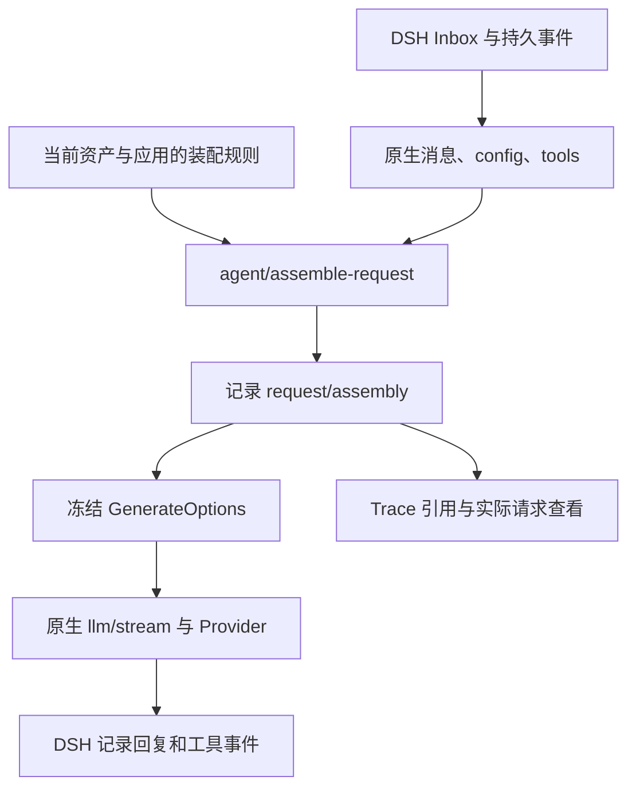

# 请求装配器

[English](REQUEST_ASSEMBLY_en.md)

请求装配器在 DSH 原生消息已经准备好、请求冻结之前，排列原生输入与 Tavern 资源。Provider、工具执行、Inbox、会话分支和原生历史仍由 DSH 管理。新装配预设须显式应用到会话；未应用的旧会话继续使用原有 loader。

## 页面与预设

悬浮球菜单的「提示词装配」打开完整设置页。页面按导入/导出/创建、选择、保存、应用、预览、规则列表排列。浏览和保存不改变会话；应用会保存独立的规则快照。后续编辑资源预设需再次应用，运行中的会话拒绝切换。子会话继承父会话的应用快照。

通用规则控制官方基础指令、预设正文、角色、用户、世界书、原生历史、本步输入、PHI 和任意自定义内容。可拖拽整个模块，也可用上下按钮调整；原生模块不能禁用或改写角色。展开预览显示应用资产后的实际节点、引用锁定和消息顺序。实际请求按钮读取最近的已记录请求，不重新求值宏。

左侧色条区分来源类别；展开项显示资源标识、稳定性、保留方式、插件依赖和卸载后的行为。DSH 原生模块保留原始 source；官方 section 名称不等于贡献插件的身份，未提供身份时不猜测。

| 内置预设 | 行为与取舍 |
| --- | --- |
| ST 兼容 | 使用已支持的 marker、角色和深度；引用占用位置并锁定，减少默认模块重复注入 |
| 缓存友好 | 稳定资产在前，历史与本步输入随后，当前世界书与 PHI 在后；实际缓存命中仍取决于 provider |
| 追加快照 | 世界书变化时保留新快照，旧快照固定在最初的历史锚点；内容消失时追加失效说明 |

ST 兼容不等于运行完整 SillyTavern。支持 character/persona/world-info/history marker，`description`、`personality`、`scenario`、`mesexamples`、`persona`、`user`、`char`、最近消息、变量与现有随机宏；内容中的 `chatHistory/history/input/worldInfoBefore/worldInfoAfter/worldInfo` 引用可占用原生模块。未支持的宏/marker、世界书 outlet 与近似位置显示诊断。对话示例保留文本，不模拟 ST 的完整示例消息解析、token 裁剪或第三方脚本宏。

深度 0 表示请求末尾，正数从原生非 system 消息末尾计数；工具调用和对应结果不可拆开，落入中间的位置向后调整并记录原因。拖动历史/输入是移动完整模块，不重写其内部次序。非法工具拓扑会阻止发送。

## 生命周期与可解释性



「仅本次请求」每次求值；「追加快照」在同一规则节点内容变化时新增，后续请求沿原锚点复用。快照包括每条规则/世界书条目的身份，深度规则同样遵守保留方式。更换为请求型规则或关闭模块后，旧快照不再进入后续请求；记录仍保留。若历史裁剪删除了锚点，该快照不再插入并产生诊断。

所有实际装配结果作为 log-only `request/assembly` 事件进入 DSH 日志。它们不是 `deriveMessages()` 的消息节点；记录轨迹与进入未来模型上下文是两回事。Tavern Trace 只存事件引用与哈希，正文按需从 DSH 读取。随机宏冻结在该事件中，查看历史不会重新运行宏。每次请求都会记录完整消息快照，因此日志体积随请求历史增长；额外装配正文受现有 `maxProfileBytes` 限制。

卸载 Tavern 后，原生用户消息、回复和工具结果仍可继续使用；请求型正文和 Tavern 保留快照不再注入。已记录的正文仍存在日志中。恢复官方核心时，`request/assembly` 的 `ignorable:true` 使其可被旧解析器保留但不参与投影。仅移除核心扩展、却保留已应用的装配规则时会明确报错；先恢复默认装配即可继续。

预览只使用当前资产与可读持久历史，不含未发送输入。官方基础指令来自已有原生投影，空会话尚未运行时可能为空；世界书命中也可能与下一步实际输入不同。实际请求是冻结结果的权威证据。

## 核心扩展和安装边界

官方 DSH `0.2.0-rc.2` 没有此请求装配接口。`scripts/prepare-request-assembly.mjs` 从固定 rc.2 核心源码（脚本内以两份源码树 SHA-256 校验） 生成独立核心构建；不修改源码 checkout 或任何安装目录，不适用于其他版本。

此功能位于本地候选分支 `codex/prompt-assembler`，已发布的 `v2.5.1` tag 不含装配器。请使用维护者提供的候选源码/工作树，不假设远端已有该分支。在包含此文档和准备脚本的候选目录执行下列命令，再把根包安装到隔离 profile；稳定版 tag 的安装步骤不会获得新界面。

```sh
npm ci
npm run build
node scripts/prepare-request-assembly.mjs /path/to/dsh-source /path/to/prepared-core
node scripts/install.mjs --dsh-home /path/to/test-home --profile web --skip-build
```

输出含 `session/src`、`agent-loop/src` 的可审源码、各自 `lib/index.js` 与 `lib/invariant.js`、source maps 和 `receipt.json`。在停止的隔离 DSH rc.2 测试运行时中，备份 `@deepseek-ai/dsh-session/lib` 和 `@deepseek-ai/dsh-agent-loop/lib`，将两个输出 `lib/` 中的构建文件复制到对应包后重启。只替换这两个包，Provider 包无需修改；回滚时恢复两个备份。此构建流程目前产出运行时 JS，不发布上游 npm 包或替换其声明文件。其他插件若需要类型声明，应在 DSH 源码构建中合入输出的 `request-assembly.ts` 与事件声明。

新接口 `agent/assemble-request(payload,next)` 使用 Cordis waterfall；payload 含 `agent/turn/step/messages/tools/config/signal`，结果为 `{messages,metadata}`，metadata 为 JSON。无监听器时透传原生消息。核心先持久化结果再冻结、发送，配套 invariant 同时验证消息快照与原生 config/tools。`agentLoop.requestAssemblyVersion === 1` 是明确的能力探测。

## HTTP 原语

前缀 `/pmp-dsh-tavern/api/v1/assembly-presets`，复用现有 Host 认证、同源和 desktop 安全边界。请求体上限 2 MiB。

| 方法与路径 | 输入/输出 |
| --- | --- |
| `GET /?sessionId=…` | 内置/用户预设、已应用快照、核心 capability |
| `POST /` | 导入或创建独立预设 |
| `GET/PUT/DELETE /:id` | 读取、编辑、删除；内置只读，应用中的预设不可删除 |
| `PUT /selection` | `{sessionId,id}`；`id:null` 恢复默认 loader |
| `POST /preview` | `{sessionId,preset}` 或 `{sessionId,presetId}`，不应用、不运行 Agent |

导出直接序列化预设 JSON；预设格式 `dsh-tavern-request-assembly`、version 1，每条 rule 有 `id/kind/enabled/role/lifetime/depth/text/name`。不接受任意可执行脚本。`assembly-presets.json` 原子持久化，包含用户预设和应用快照，上限 8 MiB。实际请求复用 v3 assemblies detail 的 `requestAssembly`，没有第二套历史查询接口。

## 验证

```sh
node --test test/request-assembler.test.mjs test/request-assembly-api.test.mjs
DSH_TAVERN_ASSEMBLY_CORE_ROOT=/path/to/extended-runtime node --test test/request-assembly-host.test.mjs
npm run check
npm run verify:2.0
```

Host 检查验证三轮发送、请求冻结、durable 快照、Trace 引用恢复及卸载后的原生会话。完整 UI、真实 provider 与旧数据验收使用隔离副本；凭据、正文、截图及运行证据仅留在 `.local/`。
