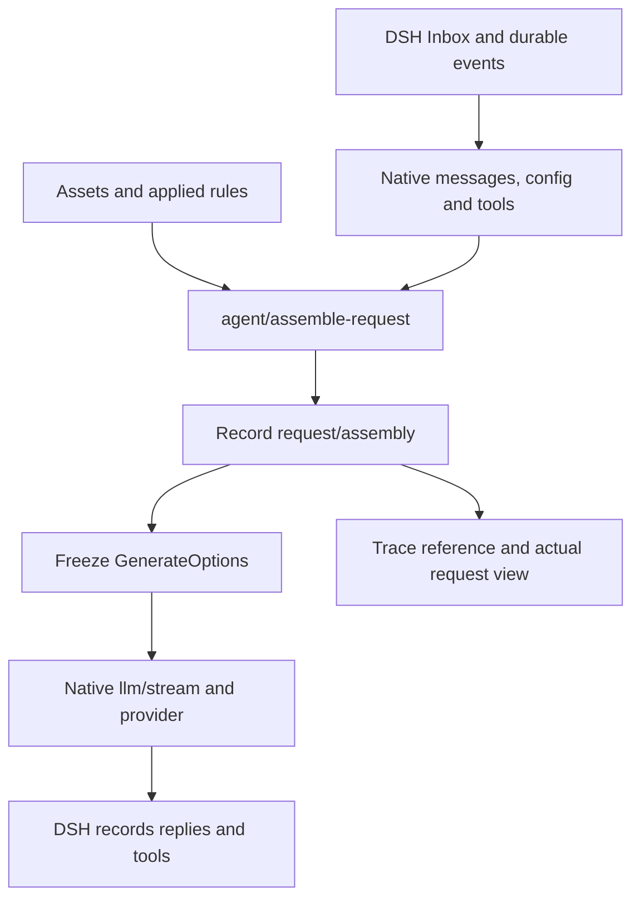

# Prompt assembly strategies

[中文](REQUEST_ASSEMBLY.md)

The assembler arranges native DSH inputs and Tavern resources after native messages are prepared and before the request is frozen. DSH continues to own providers, tool execution, Inbox, branches and native history. Strategies are stored per session and frontend mode: play defaults to ST compatible; native defaults to disabled. Existing explicit choices are retained. Disabling uses native DSH assembly without injecting Tavern bodies through the old loader. Stock hosts without the core extension retain the legacy loader in native mode.

## Page and presets

The launcher's **Prompt assembly strategy** item opens a full settings page: import/export/create, selection, save, apply, preview, then rules. Browsing and saving do not change a session. Apply stores an independent rules snapshot; later preset edits need another apply. Running sessions reject selection changes. Child sessions inherit the parent's applied snapshot.

Rules cover native instructions, preset content, character, persona, world books, history, current input, PHI and custom content. Drag whole modules to reorder. Desktop cards summarize stability, retention and role; on mobile these remain in the expanded details. Native modules can be disabled independently while retaining their roles. Disabling excludes content from future requests without deleting durable history. Disable all three and add custom content for fresh input on every request; tool transactions must remain complete. Expanded preview shows resolved assets, locked references and message order. **View latest actual request** reads the recorded snapshot without reevaluating macros.

Source stripes identify plugins (DSH, DSH Tavern, and other explicitly identified plugins); resources from the same plugin share a color. Expanded items expose resource identity, stability, retention, plugin dependency and removal behavior. Native messages retain their original source. A native section name is not necessarily its contributing plugin's identity; missing ownership information is not guessed.

| Built-in | Behavior and tradeoff |
| --- | --- |
| ST compatible | Supported markers, roles and depths own positions and suppress duplicate fallback injection |
| Cache friendly | Stable assets precede history/input, followed by current lore and PHI; cache hits still depend on the provider |
| Append snapshots | Changed lore adds a snapshot; older snapshots retain their original history anchors; disappearance adds an expiry notice |

ST compatibility does not run all of SillyTavern. Supported references include character/persona/world-info/history markers, character fields, `user`, `char`, recent messages and the existing variable/random macros. Content references `chatHistory/history/input/worldInfoBefore/worldInfoAfter/worldInfo` can claim native modules. Unsupported macros/markers, world-book outlets and approximate positions produce diagnostics. Dialogue examples remain text; full ST example-message parsing, token trimming and third-party script macros are not emulated.

Depth zero means request end; positive depths count backward through native non-system messages. Tool calls and results remain indivisible: insertion inside a transaction moves after it and records the adjustment. Moving history/input moves complete modules, preserving internal order. Invalid tool topology prevents sending.

ST compatible is the protected default: built-ins cannot be renamed or deleted. Saving modified built-in rules creates a copy. **Apply default strategy** applies and selects ST compatible, with a reminder before discarding unsaved changes. The launcher only shows the active strategy and binding indicator; selection, disabling and application happen in the settings page. Preview and actual-request controls sit beside Rules.

PHI comes from character post-history instructions, preset Post-History Instructions / jailbreak, and optional additional text in the strategy PHI module. Edit asset fields in their respective editors; additional text belongs to the strategy. Preview uses authored names and translated known fields, retaining raw identifiers in details.

## Lifecycle and evidence



Request-only rules reevaluate each time. Snapshot rules append when an individual rule node changes and reuse prior snapshots at their original anchors. Every custom rule and world-book entry has a separate identity; depth rules obey the same retention semantics. Disabling a module or switching to request-only excludes its old snapshots from future requests, while preserving records. If history compaction removes an anchor, the corresponding snapshot is omitted with a diagnostic.

Every result is stored as a log-only `request/assembly` DSH event. It does not enter `deriveMessages()`; recording evidence and contributing future context are distinct. Tavern Trace stores only the event reference and hash, resolving bodies from DSH on demand. Random macros are frozen in that event. Complete request snapshots increase log size with request history; extra assembled bodies remain bounded by `maxProfileBytes`.

After removing Tavern, native user messages, replies and tool results remain usable. Request-only content and retained Tavern snapshots stop being injected, but recorded bodies remain in the log. The event's `ignorable:true` permits the stock core to retain it without projecting it. Removing only the core extension while retaining an applied layout fails explicitly; disable the strategy first.

Preview uses current assets and readable durable history, excluding unsent input. Native instructions are freshly assembled by the core instead of reusing historical system messages containing old loader bodies. World-book matches can differ from the next real input. Frozen actual requests remain authoritative.

## Core extension and installation boundary

Stock DSH `0.2.0-rc.2` does not expose this seam. `scripts/prepare-request-assembly.mjs` produces a separate build from the pinned rc.2 source (both source trees are verified against SHA-256 digests in the script). It never edits the source checkout or an installed runtime and rejects other revisions.

This feature is in the local candidate branch `codex/prompt-assembler`, not the published `v2.5.1` tag. Use the candidate checkout supplied by the maintainer; the branch is not assumed to exist on the remote. From that directory, run the following commands before installing its root package into an isolated profile. The stable-tag installation instructions do not include the assembler.

```sh
npm ci
npm run build
node scripts/prepare-request-assembly.mjs /path/to/dsh-source /path/to/prepared-core
node scripts/install.mjs --dsh-home /path/to/test-home --profile web --skip-build
```

Output includes reviewable `session/src` and `agent-loop/src`, their `lib/index.js` and `lib/invariant.js` builds, source maps and `receipt.json`. Stop an isolated rc.2 runtime, back up `@deepseek-ai/dsh-session/lib` and `@deepseek-ai/dsh-agent-loop/lib`, copy the corresponding output `lib/` files into those packages, then restart. Providers need no changes. Restore both backups to roll back. The script builds runtime JS; it does not publish upstream npm packages or replace published declarations. Plugins needing declarations should incorporate the output `request-assembly.ts` and event types into a DSH source build.

The Cordis waterfall `agent/assemble-request(payload,next)` receives `agent/turn/step/messages/tools/config/signal` and returns `{messages,metadata}` with JSON metadata. No listener means native passthrough. The core persists the result before freezing and sending it; the companion invariant verifies both the recorded messages and original config/tools. Capability is explicitly detected through `agentLoop.requestAssemblyVersion === 1`.

## HTTP primitives

Prefix: `/pmp-dsh-tavern/api/v1/assembly-presets`. Existing Host authentication, same-origin and desktop request security apply. Request bodies are limited to 2 MiB.

| Method/path | Input or result |
| --- | --- |
| `GET /?sessionId=…` | Built-ins, user presets, applied snapshot and core capability |
| `POST /` | Import or create an independent preset |
| `GET/PUT/DELETE /:id` | Read/edit/delete; built-ins are immutable and applied presets cannot be deleted |
| `PUT /selection` | `{sessionId,id}`; `id:null` disables the strategy for this mode (native assembly on extended core); `id:"builtin-st"` applies the default ST strategy |
| `POST /preview` | `{sessionId,preset}` or `{sessionId,presetId}`; no apply or Agent run |

Export serializes preset JSON directly. Format is `dsh-tavern-request-assembly`, version 1; each rule has `id/kind/enabled/role/lifetime/depth/text/name`. Executable scripts are not accepted. `assembly-presets.json` atomically stores presets and applied snapshots, limited to 8 MiB. Actual request bodies use `requestAssembly` on existing v3 assembly details rather than another history API.

## Verification

```sh
node --test test/request-assembler.test.mjs test/request-assembly-api.test.mjs
DSH_TAVERN_ASSEMBLY_CORE_ROOT=/path/to/extended-runtime node --test test/request-assembly-host.test.mjs
npm run check
npm run verify:2.0
```

Host checks cover three requests, freezing, durable snapshots, Trace resolution and native continuation after unload. Full UI, real-provider and legacy-data acceptance use isolated copies; credentials, bodies, screenshots and run evidence stay under `.local/`.
