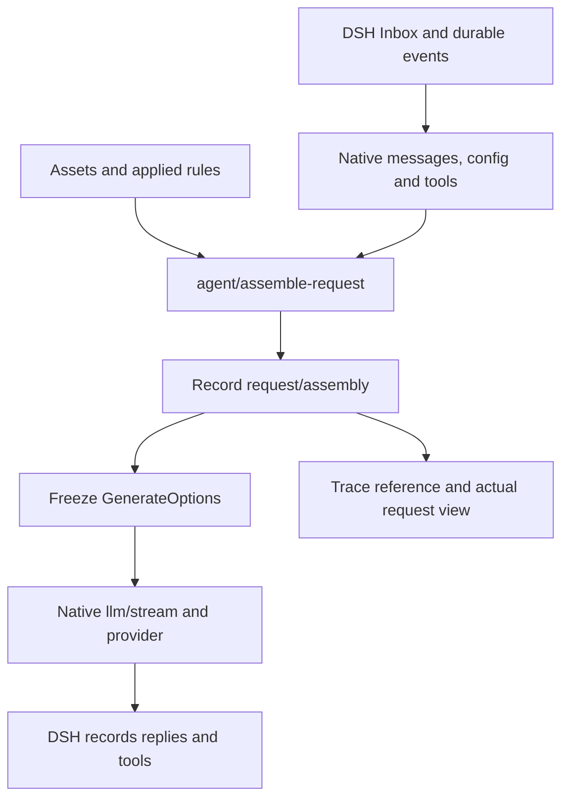

# Prompt assembly strategies

[中文](REQUEST_ASSEMBLY.md)

The standard assembler uses public DSH sections/context/pre-step on stock rc.2. Tavern normally depends on it; optional Manager supplies management and observations. The optional core addon retains the validated protocol-1 advanced backend. Both share strategies/registry/UI; legacy strategies without backend remain core. Native/play views cannot change explicit session selections, including null. New standalone sessions have no implicit strategy; new Tavern openings use native ST style unless an explicitly installed addon supplies the advanced default.

## Standard strategies

Native mode preserves history→current input and cannot disable either or reorder internal conversation messages. Official instructions can be disabled/reordered within current system content. Preset/persona/character/lore/PHI can contribute system before history or user after history. DSH retains its head/in-history update route.

User context follows current input, appending a native snapshot when text changes. User pre-step accepts messages before/after input at actual steps. After input, context precedes pre-step; contributions within one region can be reordered, while reversed layouts are refused. Both persist in history; removal stops future contributions and retains old bodies. No arbitrary depth, assistant contributions or advanced snapshot retention; legacy strategies are never silently converted.

| Standard built-in | Layout |
| --- | --- |
| builtin-native-st | Official/preset/persona/character/lore/PHI system assets → history → input; approximate ST order |
| builtin-native-cache | Stable systems → history → input → lore context → PHI pre-step |
| builtin-native-phi | System assets → history → input → PHI user reminder |

A final user reminder retains user priority. Cache hits and model adherence depend on the model. Native Trace verifies durable system/context references without creating request/assembly or a second history. The complete frozen-request view is limited to advanced evidence; standard mode reports this scope explicitly.

## Advanced contract

The following ST slots, depth, request/snapshot and complete-system projection belong to the explicitly installed core addon. Missing addon/protocol 1 refuses application with 409. Standard strategies follow the boundaries above.

## Page and presets

The launcher's **Prompt assembly strategy** item opens a full settings page: import/export/create, selection, save, apply, preview, then rules. Browsing and saving do not change a session. Apply stores an independent rules snapshot; later preset edits need another apply. Running sessions reject selection changes. Child sessions inherit the parent's applied snapshot.

Rules cover native instructions, preset content, character, persona, world books, history, current input, PHI and custom content. Drag whole modules to reorder. Desktop cards summarize stability, retention and role; on mobile these remain in the expanded details. Native modules can be disabled independently while retaining their roles. Disabling excludes content from future requests without deleting durable history. Disable all three and add custom content for fresh input on every request; tool transactions must remain complete. Expanded preview shows resolved assets, locked references and message order. **View latest actual request** reads the recorded snapshot without reevaluating macros.

Source stripes identify plugins (DSH, DSH Tavern, and other explicitly identified plugins); resources from the same plugin share a color. Expanded items expose resource identity, stability, retention, plugin dependency and removal behavior. Native messages retain their original source. A native section name is not necessarily its contributing plugin's identity; missing ownership information is not guessed.

| Built-in | Behavior and tradeoff |
| --- | --- |
| ST compatible | Supported markers, roles and depths own positions and suppress duplicate fallback injection |
| Cache friendly | Stable assets precede history/input, followed by current lore and PHI; cache hits still depend on the provider |
| Append snapshots | Changed lore adds a snapshot; older snapshots retain their original history anchors; disappearance adds an expiry notice |

ST compatibility does not run all of SillyTavern. Supported references include character/persona/world-info/history markers, character fields, `user`, `char`, recent messages and the existing variable/random macros. Content references `chatHistory/history/input/worldInfoBefore/worldInfoAfter/worldInfo` can claim native modules. Unsupported macros/markers, world-book outlets and approximate positions produce diagnostics. Dialogue examples remain text; full ST example-message parsing, token trimming and third-party script macros are not emulated.

Depth zero means request end; positive depths count backward through native non-system messages. Tool calls and results remain indivisible: insertion inside a transaction moves after it and records the adjustment. Moving history/input moves complete modules, preserving internal order. Invalid tool topology prevents sending.

Without an explicit character depth, the first-turn greeting is an assistant reference before the native conversation, including when a preset's `chatHistory` marker has claimed the current input. Explicit depth remains authoritative; a greeting after current input reports `GREETING_AFTER_INPUT`, and the model adapter may still reject following system updates. It is never written to native history. Trailing world-book entries retain their roles, depths and order.

### System contributions and complete DSH snapshots

Source system text is an ordered contribution; a DSH system message is the complete effective instruction snapshot. Runtime and preview convert logical assembly before the official request freezes. Adjacent systems become one complete snapshot without crossing a user, assistant, developer or tool message. Each later snapshot includes source contributions encountered so far in this request. A native update replaces only the native base in its original contribution slot, never concatenating obsolete native instructions. Every native system retains its boundary relative to enabled native conversation messages, including the first visible system after an empty head was filtered out; layouts that move history/input across those boundaries fail explicitly.

Each request recomputes from its current native input and resolved sources, never from prior projected bodies. Source snapshot retention still preserves earlier originals, anchors and expiry notices as described below; it is distinct from replacing the complete DSH instruction snapshot. Disabling a source, clearing the native base, or switching to request lifetime does not revive content from old projections.

Only the officially resolved model capability `systemPromptUpdate: in-history` permits nonleading system messages. Without it, trailing/depth systems fail locally with `ASSEMBLY_SYSTEM_UPDATES_UNSUPPORTED`; they are never silently moved to the front or converted to user messages. Preview does not prepare the next model call: capability is `unverified`, with `SYSTEM_UPDATE_CAPABILITY_UNVERIFIED` for later systems. Actual sending checks this request's official `request/context`.

`assembleRequest` / `assembleRequestAsync` remain logical contribution primitives; the Host runtime performs complete-snapshot conversion. Final `request/assembly.messages` equals the dispatched array. Metadata `systemProjection` maps input IDs to derived carrier IDs, ordered contributors and replaced native IDs. Logical nodes retain source text/hashes: `inputMessageIds` preserves their original messages before projection, while `requestMessageIds` identifies final carriers. Multiple nodes can share one system carrier; original IDs also identify contributions repeated in later snapshots. Older records may omit `inputMessageIds`; consumers must not infer them from text or private hash rules. `start/count` summarizes positions; use the exact ID list when retained snapshots make a node's messages noncontiguous. `limits.maxProfileBytes` bounds logical additional content before projection (512 KiB by default, at most 2 MiB). Complete snapshots have a separate fixed 2 MiB limit on additional physical bytes. Every carrier is charged for its serialized UTF-8 bytes, including active contributions repeated in later snapshots; unchanged native history is not plugin overhead. Runtime and preview use the same two limits and reject either excess without truncating or deduplicating sources. Metadata `logicalExtraBytes` preserves the logical charge, `extraBytes` is the projected physical charge, and `systemProjection.maxBytes` is the physical limit; older records may omit the added fields.

Advanced ST compatible is the protected advanced default: built-ins cannot be renamed or deleted. Saving modified built-in rules creates a copy. **Apply default strategy** applies and selects ST compatible, with a reminder before discarding unsaved changes. The launcher only shows the active strategy and binding indicator; selection, disabling and application happen in the settings page. Preview and actual-request controls sit beside Rules.

PHI comes from character post-history instructions, preset Post-History Instructions / jailbreak, and optional additional text in the strategy PHI module. Edit asset fields in their respective editors; additional text belongs to the strategy. Preview uses authored names and translated known fields, retaining raw identifiers in details.

## Lifecycle and evidence



Rebuild-each-request rules (wire value `request`) reevaluate each time. Retained-snapshot rules (wire value `snapshot`) append when an individual rule node changes and reuse prior snapshots at their original anchors. Every custom rule and world-book entry has a separate identity; depth rules obey the same retention semantics. Disabling a module or switching to request-only excludes its old snapshots from future requests, while preserving records. If history compaction removes an anchor, the corresponding snapshot is omitted with a diagnostic.

For example, one memory entry changes from “Location: inn” to “Location: dock”:

| Request | Rebuild each request | Retain snapshots |
| --- | --- | --- |
| 1 | Inn | Inn |
| 2, content changes | Dock | Inn, dock |
| 3, unchanged | Dock | Inn, dock (no new copy) |

Snapshots preserve original text; they do not rewrite older versions into the past tense. A memory source should include timestamps or current/historical status so the model does not mistake an old location for the current one.

Every result is stored as a log-only `request/assembly` DSH event. It does not enter `deriveMessages()`; recording evidence and contributing future context are distinct. Tavern Trace stores only the event reference and hash, resolving bodies from DSH on demand. Random macros are frozen in that event. Complete request snapshots increase log size with request history; logical additional bodies remain bounded by `limits.maxProfileBytes`, and projected additional physical bodies have a separate 2 MiB ceiling.

After removing Tavern, native user messages, replies and tool results remain usable. Request-only content and retained Tavern snapshots stop being injected, but recorded bodies remain in the log. The event's `ignorable:true` permits the stock core to retain it without projecting it. Removing only the core extension while retaining an applied layout fails explicitly; disable the strategy first.

Preview uses current assets and readable durable history, excluding unsent input. Native instructions are freshly assembled by the core instead of reusing historical system messages containing old loader bodies. World-book matches can differ from the next real input. A cold session supplies provider/model variables from its detached Session's pending model projection, latest request header, or official default model metadata, without resuming an Agent, preparing a model call, or changing selection. During that assembly, the Host shares the officially read detached Session with the scope catalog and state dependency readers without adding it to the live Session store. Each preview is isolated; read leases expire on completion, unload, live Session replacement, or relevant selection, membership or policy changes, and confer no transaction capability. Missing sessions return HTTP 404; source scope and management policy denials still reject preview. If model metadata is unavailable and native instructions reference these variables, preview returns `NATIVE_PREVIEW_VARIABLE_UNAVAILABLE` (HTTP 409) without an assembled result. Frozen actual requests remain authoritative.

Uninitialized MVU state or state requiring repair returns `MVU_PREVIEW_STATE_UNAVAILABLE` (HTTP 409). Preview does not implicitly allocate an instance, repair state, or write the ledger.

## Core extension and installation boundary

Stock DSH `0.2.0-rc.2` does not expose this seam. `scripts/prepare-request-assembly.mjs` produces a separate build from the pinned rc.2 source (both source trees are verified against SHA-256 digests in the script). It never edits the source checkout or an installed runtime and rejects other revisions.

Current source requires both bundles to be enabled as described in [standalone assembler integration](ASSEMBLER_INTEGRATION_en.md). The historical v2.5.1 tag predates this integration. Protocol 1 is a separate Host capability requirement. The preparation tool generates reviewable output, never patches core during plugin installation; any actual runtime replacement requires separate authorization.

```sh
npm ci
npm run build
node scripts/prepare-request-assembly.mjs /path/to/dsh-source /path/to/prepared-core
node scripts/install.mjs --dsh-home /path/to/test-home --profile web --skip-build
```

Output includes reviewable `session/src` and `agent-loop/src`, their `lib/index.js` and `lib/invariant.js` builds, source maps and `receipt.json`. Stop an isolated rc.2 runtime, back up `@deepseek-ai/dsh-session/lib` and `@deepseek-ai/dsh-agent-loop/lib`, copy the corresponding output `lib/` files into those packages, then restart. Providers need no changes. Restore both backups to roll back. The script builds runtime JS; it does not publish upstream npm packages or replace published declarations. Plugins needing declarations should incorporate the output `request-assembly.ts` and event types into a DSH source build.

The Cordis waterfall `agent/assemble-request(payload,next)` receives `agent/turn/step/messages/tools/config/signal` and returns `{messages,metadata}` with JSON metadata. No listener means native passthrough. The core persists the result before freezing and sending it; the companion invariant verifies both the recorded messages and original config/tools. Capability is explicitly detected through `agentLoop.requestAssemblyVersion === 1`.

## HTTP primitives

Prefix: `/dsh-prompt-assembler/api/v1/assembly-presets` (legacy Tavern routes forward to the same store/runtime). Existing Host authentication, same-origin and desktop request security apply. Request bodies are limited to 2 MiB.

| Method/path | Input or result |
| --- | --- |
| `GET /?sessionId=…` | Built-ins, user presets, applied snapshot and core capability |
| `POST /` | Import or create an independent preset |
| `GET/PUT/DELETE /:id` | Read/edit/delete; built-ins are immutable and applied presets cannot be deleted |
| `PUT /selection` | `{sessionId,id}`; `id:null` disables the strategy for this session (native assembly on extended core); `id:"builtin-st"` applies the default ST strategy |
| `POST /preview` | `{sessionId,preset}` or `{sessionId,presetId}`; no apply or Agent run |

Export serializes preset JSON directly. Format is `dsh-tavern-request-assembly`, version 1; each rule has `id/kind/enabled/role/lifetime/depth/text/name`. Executable scripts are not accepted. `assembly-presets.json` atomically stores presets and applied snapshots, limited to 8 MiB. The independent UI reads the latest actual request through `GET /actual?sessionId=…`, including standard strategies. It uses frozen DSH `request/assembly` records or Tavern’s native log cut and whole-message digest, verified through public detached Session replay. Older native records without complete evidence remain unavailable until a subsequent send captures a reference. v3 details expose verified `requestAssembly` or `nativeRequest`; no extra body history is created.

The actual request view follows actual message order and uses recorded provenance, without evaluating current presets. New native `nativeSourceRefs` retain version 1, item names, source field/resource identifiers, message hashes and UTF-16 ranges. They cover system contributions, context, pre-step PHI and uniquely verified nested references; bodies remain in DSH history. Older verified section references recover source identifiers. For preset items without recorded names, the recorded preset and item IDs resolve a current display name, explicitly labeled “Name from the current preset; body from the recorded request.” Current names never replace saved historical names or reconstruct bodies. Deleted items use readable ordinal labels, retaining source IDs in details. Unverified ranges show “Source not recorded”; a merged system body is not labeled as native base instructions.


## Independent assembler and adapters

The implementation now lives in the independent dsh-prompt-assembler package. Tavern shares the independent Host plugin’s store, registry and runtime, retaining legacy package exports, service aliases and HTTP forwarding while migrating prior storage non-destructively. Adapters belong to the assembler repository; source-owned state and parsing services stay with their source. The native DSH catalog now also includes dsh.text. Sources with parseText expose a user-authored text mode; other sources keep their resource-content mode. Third-party text uses its own parser/renderer rather than automatic ST expansion. See the [extraction and integration guide](ASSEMBLER_INTEGRATION_en.md).

## Unified content source API (protocol 1)

The Host service `dshPromptSources` (legacy alias `tavernRequestSources`) exposes `version`, `register(definition)` and `list()`. Import the SDK and TypeScript declarations from `dsh-prompt-assembler`; `pmp-dsh-tavern/request-assembler` forwards for compatibility. Native instructions, history, step input, presets, characters, personas, world books, PHI and custom text all use the same registration API. The engine does not dispatch special assembly paths by those source names. Existing rule `kind` values remain source IDs; external sources should use their own namespace, such as `example.memory/recalled`.

Registration makes a source selectable; it does not enable it or change a strategy. The settings source picker uses this registry for names, plugin colors, stability and supported roles, retention and depth. Missing sources remain importable and editable; their output and retained snapshots are omitted with `ASSEMBLY_SOURCE_UNAVAILABLE`. Resolver errors or invalid output fail the request rather than send partial content. Disabled sources without active dependents are not evaluated.

```js
import { ASSEMBLY_SERVICE } from 'pmp-dsh-tavern/request-assembler'
export const inject = [ASSEMBLY_SERVICE, 'myMemoryStore']
export function apply(ctx) {
  const sources = ctx.get(ASSEMBLY_SERVICE)
  if (!sources || sources.version !== 1) throw new Error('Unsupported source protocol')
  ctx.effect(() => sources.register({
    id: 'example.memory/recalled', pluginId: 'example.memory',
    name: 'Retrieved memory', stability: 'conversation',
    async resolve(context) {
      // Read-only in both preview and execution. The plugin owns this store.
      const rows = await ctx.get('myMemoryStore').search({
        sessionId: context.sessionId, messages: context.nativeMessages,
        inputIds: context.inputIds, signal: context.signal,
      })
      return { blocks: rows.map(row => ({
        type: 'text', id: row.id, name: row.title, text: row.text,
        role: 'system', source: { resourceId: row.id, field: 'text' },
      })) }
    },
  }))
}
```

`myMemoryStore` is an example consumer-owned service, not supplied by Tavern. `ctx.effect` unregisters on unload; an in-flight request uses its captured registrations. Plugin identity is declared provenance, not a security sandbox or authenticated signature.

`resolve(context, rule)` may be synchronous or asynchronous. It must remain read-only and honor/forward `signal`. The context is detached, deeply frozen data: `sessionId`, `turn`, `step`, `preview`, `preset`, `assets`, `nativeMessages` and `inputIds`. No mutable Agent or session is exposed. Preview turn/step are null and unsent input is absent. `assets` contains current Tavern resources (preset, character, user, characterSelection, loreEntries, officialSections and diagnostics), not historical source originals. Macro context contains only public strings. MVU changes, memory writes and branch-state management belong to plugin handling of durable native events, never resolver or preview evaluation.

Descriptor fields: required `id/pluginId/name`; `version` defaults to 1 and `stability` to conversation. `dependencies` declares sources needed for resolution/references; cycles fail. `multiple` defaults to false; `roles` defaults to preserve/system/user/assistant; `lifetimes` defaults to request/snapshot; `depth` defaults to true. Native adapters declare preserve/request without depth; the preset adapter declares request-only retention through the same public fields. Wire validation permits absent sources, while assembly validates registered source capabilities.

Return `{blocks, macros?, diagnostics?}`. Each source is limited to 8 MiB and 10,000 blocks; logical additional request content remains bounded by `limits.maxProfileBytes`, with a separate 2 MiB physical ceiling for complete-snapshot expansion. Block IDs must be stable and unique within one source rule.

| Block type | Fields and behavior |
| --- | --- |
| `text` | Required id/text; optional name, role, stability, source.resourceId/field; uses its source renderer, shared role, depth and retention handling |
| `native` | id/messageIds reference this request's native messages without rewriting tool transactions; native adapters use this type |
| `reference` | id/sourceId, optional blockIds or group filter; occupies and locks the reference position without duplicate fallback; declare the target in dependencies |

A text block may provide `literalMacros:{name:string}` for data validated by its trusted source. Values are inserted after ordinary macro expansion, preserving multiline indentation without recursively evaluating macros inside the data. This field performs no resource lookup or permission grant; world-book variable macros still pass MVU binding, policy and version leases.

`macros` maps names to this source's text block IDs, e.g. `{recalled:'memory'}`. `{{recalled}}` exposes a provenance child and suppresses the fallback block. Duplicate macro names fail. `referenceOnly:true` hides a block except when referenced. References honor target enablement and settings by default; `honorEnabled:false` permits explicit asset references, `useOwnerRule:true` uses the referring rule and `lock:false` leaves it unlocked. `claims:[{sourceId,blockId}]` declares an already included/overridden field; `targetSourceId` routes text to an enabled module's position. ST overrides, PHI and markers use these same primitives. Cross-source references/macros are resolved before placement; final tool topology is checked centrally.

Preview and execution use the same registry and engine; dynamic sources are Host code, not HTTP callbacks. The existing `GET /assembly-presets?sessionId=…` response adds `sources` and `sourceProtocolVersion`. v3 capabilities reports `composerRegistry`, `sourceProtocolVersion`, `requestAssembly` and `arbitraryMessageDepth`; the latter two require the core extension. Recorded metadata includes source descriptors and upstream assembly metadata; historical reads do not rerun sources.

### Trigger scope and loader migration

Assembly runs whenever the Agent builds a request: initial sends, tool continuations, input added during generation, requests awakened by subagent settlement notices, and child Agent requests on the same Host. Child sessions inherit the applied strategy through parentSession. Retries may resolve again; a resolver must not assume once-per-turn execution. Already frozen requests remain unchanged. Auxiliary direct `llm.stream` calls, such as title generation, bypass the Agent hook. Remote/out-of-process children require the extension and plugin on their own Host to use the strategy.

Resource CRUD, selection and `/active` remain compatible; `/active` is an asset/configuration summary, not a final request. On the new path the loader resolves assets, world-book activation and parameter mappings; all body content enters through registered sources. `compileTavernProfile`/`compilePresetForDsh` remain compatibility helpers, not dynamic source APIs. The legacy loader fallback on an unextended core does not support the new strategy system. Third parties should use the service above, not internal properties such as `store.requestAssembler`.

## Verification

```sh
node --test test/request-assembler.test.mjs test/request-assembly-api.test.mjs
DSH_TAVERN_ASSEMBLY_CORE_ROOT=/path/to/extended-runtime node --test test/request-assembly-host.test.mjs
npm run check
npm run verify:2.0
```

Host checks cover three requests, freezing, durable snapshots, Trace resolution and native continuation after unload. Full UI, real-provider and legacy-data acceptance use isolated copies; credentials, bodies, screenshots and run evidence stay under `.local/`.

### Custom content, read-only previews and roles

The strategy page occupies the conversation body below the session header and tabs. It stays mounted independently of resource/settings sidebars, which appear above it; users can edit both without discarding either draft. Closing the strategy itself asks for confirmation if it has unsaved changes. Only generic rules are draggable; configuration and actual-request previews are read-only and show history depth, or list placement when none is specified. ST markers are labeled preset slots: standalone ordered items that insert character, world-book or history content. They differ from text macros such as `{{description}}`, which expand inside an authored message.

Users can author custom text and supported macros in the frontend without a plugin. Dynamic MVU or memory retrieval needs a plugin-registered resolver; manually entered text cannot impersonate another plugin's provenance. Registered sources receive rule name and text; sources declaring parseText accept inputMode:text for user-authored content. Their parser determines how those fields are used.

Add a source preserves the selected resolver's `kind`; it does not convert every choice into custom text. Prompt templates, MVU and manager resources generate content from their own resources and ignore this rule's name/text inputs. Their editors therefore show source-specific guidance while retaining role, placement, retention and removal controls. Custom content and other third-party sources retain rule text editing.

Source resolution runs first, then each source renderer handles its text-block syntax. Tavern sources explicitly use the ST renderer; third-party text is preserved unless its source declares a renderer. Sources can register text-reference macros, such as character `{{description}}`, `{{personality}}`, `{{scenario}}`, `{{mesexamples}}` and persona `{{persona}}`. Ordinary text supports `{{user}}`, `{{char}}`, last user/assistant messages, trim, comments, random, roll, and `setvar/getvar` local to the current assembly; those `getvar` calls do not read durable MVU. Prompt templates first expand `<%…%>` through their separate restricted EJS parser; its read-only `getvar(path)` uses the template's bound variable snapshot. The world-book source authorizes and formats MVU for `{{format_message_variable::stat_data}}`, inserting the data literally. The manager provides text through its retrieval policies and the MVU source supplies state and update instructions; selecting them does not automatically execute arbitrary EJS or scripts. Unknown ordinary macros produce diagnostics without establishing additional compatibility.

Custom text uses an explicit `user/system/assistant` role and defaults to `user`. Legacy custom `preserve` normalizes to its previous effective role, `system`, without silently changing meaning. Custom-only requests should include a nonempty user message: DeepSeek moves pure system content into its separate `system` field, leaving wire `messages` empty. Preview reports this condition; completely empty assembly fails locally. Disabling native history and current input neither deletes durable native messages nor silently restores them to requests.


[Prompt templates and managed sources](PROMPT_TEMPLATE_en.md)


## List ownership and source text

In module-list placement, a source explicitly listed in the strategy owns its output position and depth; slots and inline source macros cannot move or re-enable it. Remove a source rule to leave its placement to authored references. A source not listed is only resolved when another source declares it as a dependency; registration does not inject it automatically. Reference-only fields (such as character PHI) remain available to the PHI owner. In ST placement, authored slots and depths remain authoritative. At equal depths, preset injection_order is applied in ascending order; this does not implement full ST role grouping or token budgeting. Tavern custom text uses the same history/input/world-info reference parser as preset text. Native modules may be absent from a strategy; durable history remains unchanged.
