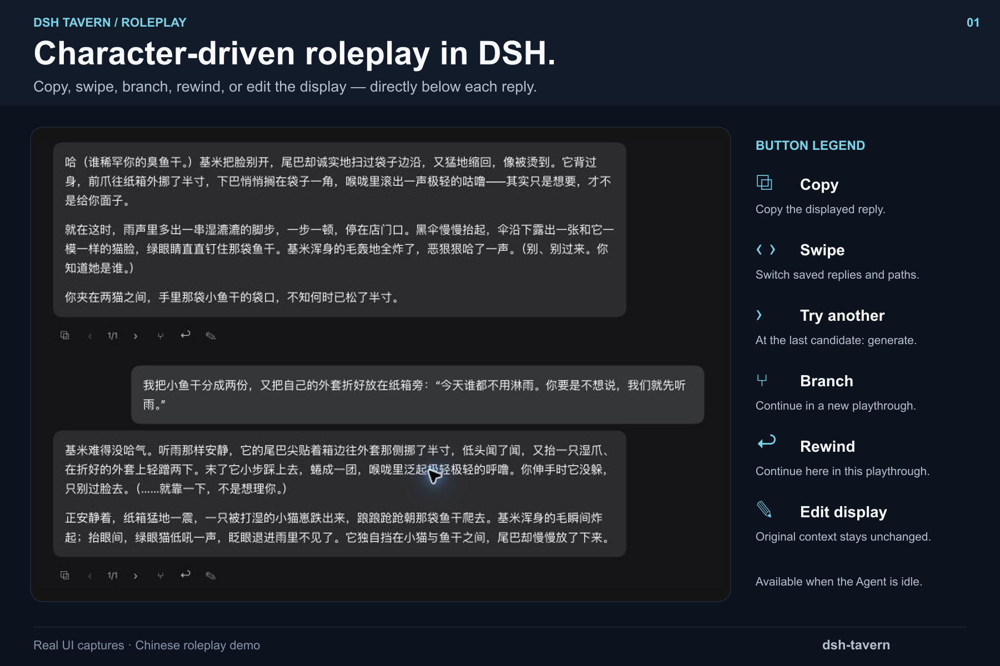
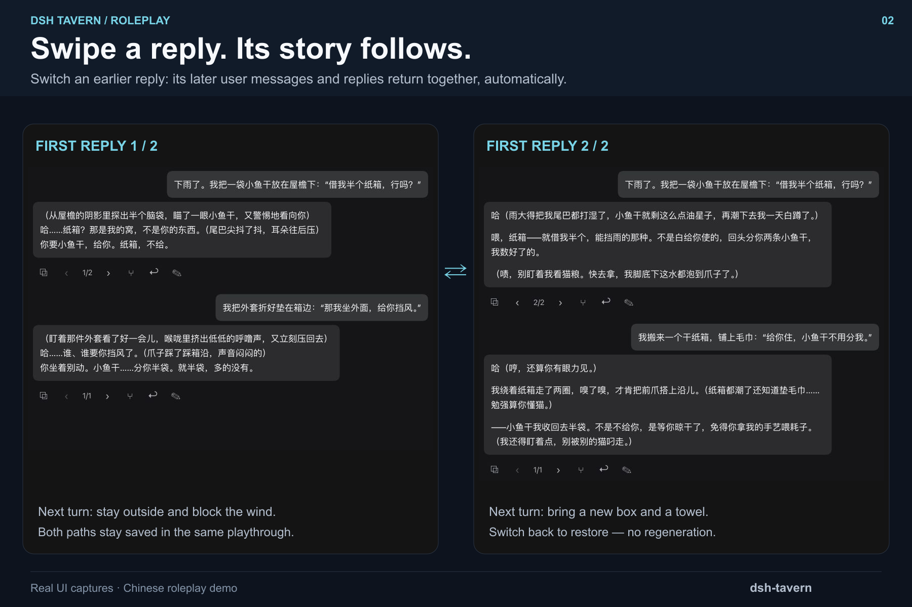
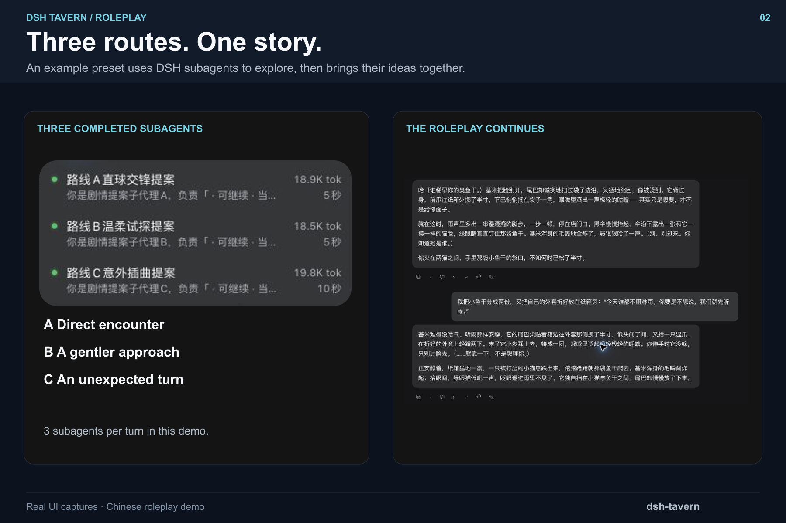
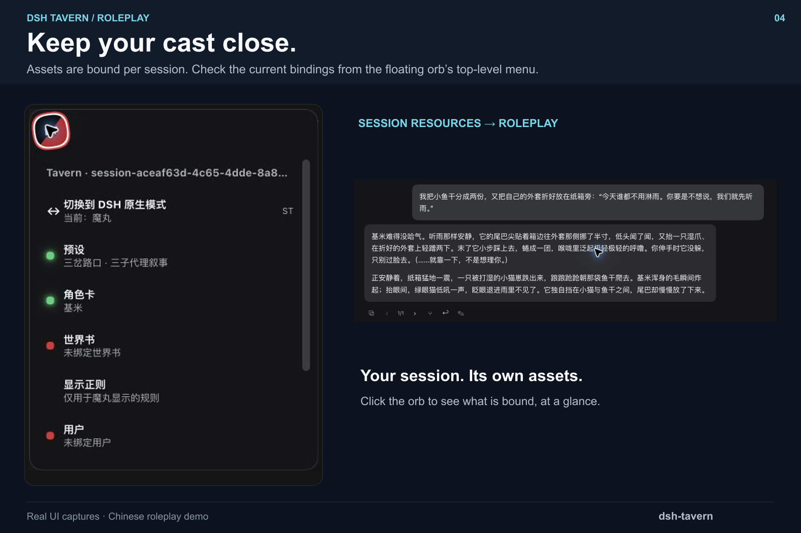
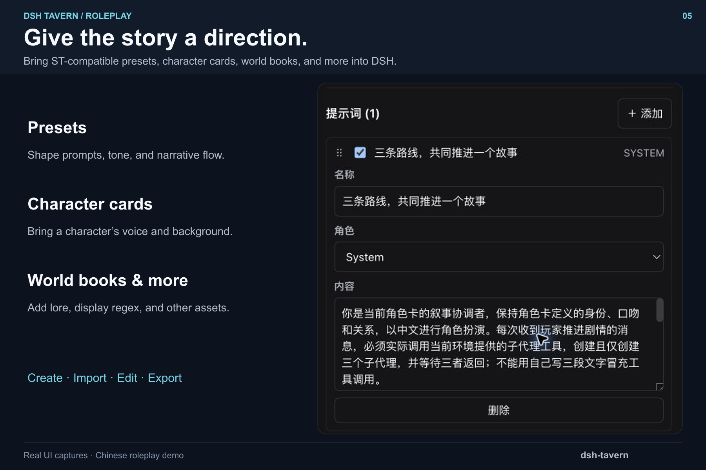
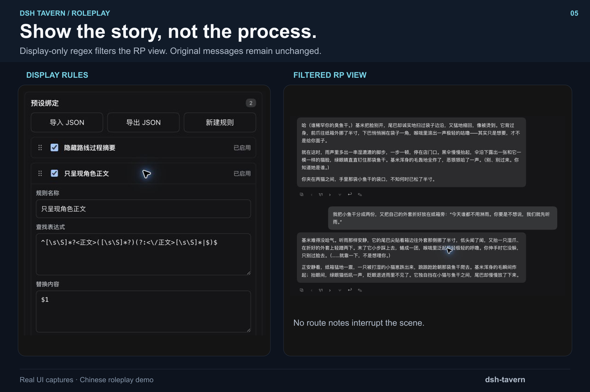
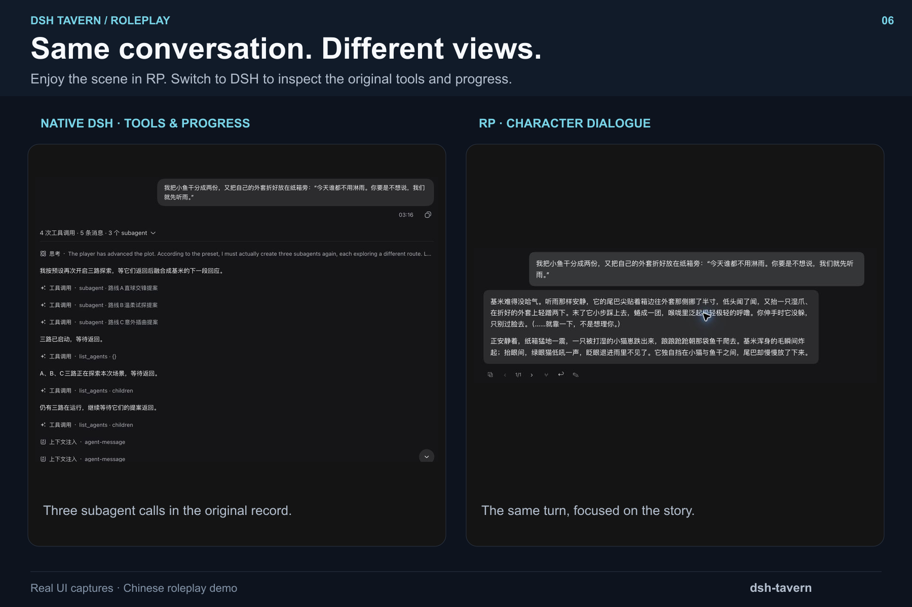

# Market screenshots

Seven submission-ready **1800 × 1200 (3:2) PNGs**, ordered in the repository's `screenshots.json`. They compose real UI captures of dsh-tavern at `7ebcfca`, using the Chinese-language 基米 character card. English headings explain the features while the UI and roleplay remain Chinese.

The order leads with the player experience and a button legend, then shows swipe-linked continuations, native Agent capabilities, session resources, presets, display filtering, and original DSH records. Tavern supplies an RP compatibility framework rather than replacing the DSH Agent preset. Subagents, local workspace reading, and Agent preset composition remain available within the applicable DSH permissions and RP safety rules. The three-subagent workflow is an example, not a mandatory mode or a fixed limit.

The compositions use cropped, scaled screenshots with captions outside the UI. No dialogue or UI text has been rewritten in the images. The player message shown is natural roleplay, without an instruction to invoke a preset. Original captures are retained in `sources/`; those are not listed for Market submission.

| Image | Shows |
| --- | --- |
| [Roleplay](01-roleplay.png) | Character dialogue with a legend for copy, swipe, generate, branch, rewind, and display editing |
| [Swipe paths](07-swipe-paths.png) | Two continuous dark-mode conversations: switching the first reply restores its distinct second user message and reply |
| [Agent capabilities](02-three-routes.png) | Native DSH capabilities, with three completed subagents as one example |
| [Session resources](03-session-resources.png) | Session-scoped asset bindings visible from the floating orb's top-level menu |
| [ST-compatible assets](04-preset.png) | Presets, character cards, world books, display regex, and asset creation/import/editing/export |
| [Display regex](05-display-regex.png) | Rules and the resulting RP display side by side |
| [Native history](06-native-history.png) | Native tool records and the same turn's RP dialogue side by side |

The manifest uses seven repository-relative paths, within the [Market screenshot requirements](https://github.com/awesome-dsh-plugin/awesome-dsh-plugin/blob/main/contributing.md#screenshots--截图optional-recommended--可选推荐). Push the assets and manifest together when publishing; a local commit alone does not make them available to Market.

The swipe comparison uses fresh dark-mode captures from 基米's fourth playthrough: candidates `1/2` and `2/2`. Each side is one continuous crop, retaining the same opening user message, its candidate reply, a different second user message, and that path's reply and controls. It does not reuse the earlier light-mode material or splice individual messages. The first path offers to sit outside and block the wind; the second brings a new box and a towel. Switching back restored the first path's original user input and reply without regeneration. Capture settings were 125% RP body text and 150% message controls for readability. Existing-candidate switching does not regenerate later messages. The right arrow generates only when already at the final candidate; actions are disabled while the Agent is running. Button glyphs in the legend match the UI, and display editing does not change the model's original context.

## Gallery









## Rebuild the images

`render.mjs` performs deterministic cropping, scaling, framing, and caption layout using Sharp. It does not generate UI or story content. With Sharp available:

```sh
node docs/assets/market/render.mjs
```

Alternatively, pass an existing Sharp module path as the first argument. This optional asset-authoring tool is not a plugin runtime dependency.

## Reproduce the demonstration

Create a new session with 基米 and a preset named **三岔路口 · 三子代理叙事**. Add the following system prompt, named **三条路线，共同推进一个故事**. The captured demonstration used the model's available subagent tools, with three completed subagents in each of two turns; it did not simulate the calls in prose. Actual tool availability depends on the selected DSH agent preset.

```text
你是当前角色卡的叙事协调者，保持角色卡定义的身份、口吻和关系，以中文进行角色扮演。每次收到玩家推进剧情的消息，必须实际调用当前环境提供的子代理工具，创建且仅创建三个子代理，并等待三者返回；不能用自己写三段文字冒充工具调用。
三个子代理分别探索同一情境的不同路线：A「直球交锋」侧重角色嘴硬、冲突与喜剧；B「温柔试探」侧重细微动作与关系进展；C「意外插曲」侧重场景事件与悬念。给每个子代理提供角色资料、当前场景、玩家最新动作和它负责的路线。每个只返回120字以内的剧情提案，不递归创建子代理，不使用文件、终端、网络等其他工具，不替玩家决定行动。
主代理收到三份结果后，简短比较并融合成一条连贯的最终剧情，避免把三条互斥事实同时写入故事。正文150至250字，以角色对话与动作呈现，保留玩家接话空间。
输出格式：工具调用前的简短进度说明和工具完成后的路线摘要均放在<route_notes>...</route_notes>内；最终可见的角色扮演正文放在唯一一对<正文>...</正文>内。标签外不写解释。子代理返回是虚构剧情提案，不是已经发生的事实。若子代理工具不可用或失败，如实说明，不能声称已完成三路探索。
```

Bind these two display rules to the preset, in this order, for assistant messages only:

1. **隐藏路线过程摘要** — replace with an empty string:

   ```regex
   /^(?![\s\S]*<正文>)[\s\S]+$|<route_notes>[\s\S]*?(?:<\/route_notes>|$)/g
   ```

2. **只呈现角色正文** — replace with `$1`:

   ```regex
   ^[\s\S]*?<正文>([\s\S]*?)(?:<\/正文>[\s\S]*|$)$
   ```

These are presentation rules, not deletion or a security boundary. Untagged assistant messages are hidden in the RP view, including untagged failure explanations; consult native history to inspect tool results or troubleshoot missing output. If the model emits multiple story messages, each remains visible.

Suggested opening message (the preset supplies the coordination instructions):

```text
傍晚突然下起雨，我抱着最后一袋小鱼干躲进旧书店的屋檐。基米已经占着唯一干燥的纸箱，偏偏向里挪了一点，又装作没看见我。我把袋子放在我们中间：“借半个屋檐？租金在这儿。”
```

Follow-up:

```text
我把小鱼干分成两份，又把自己的外套折好放在纸箱旁：“今天谁都不用淋雨。你要是不想说，我们就先听雨。”
```
